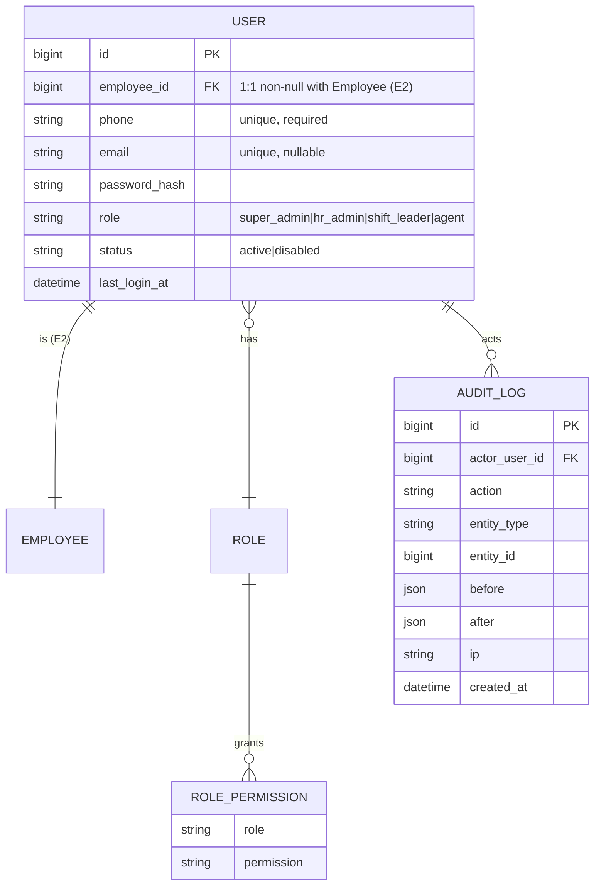
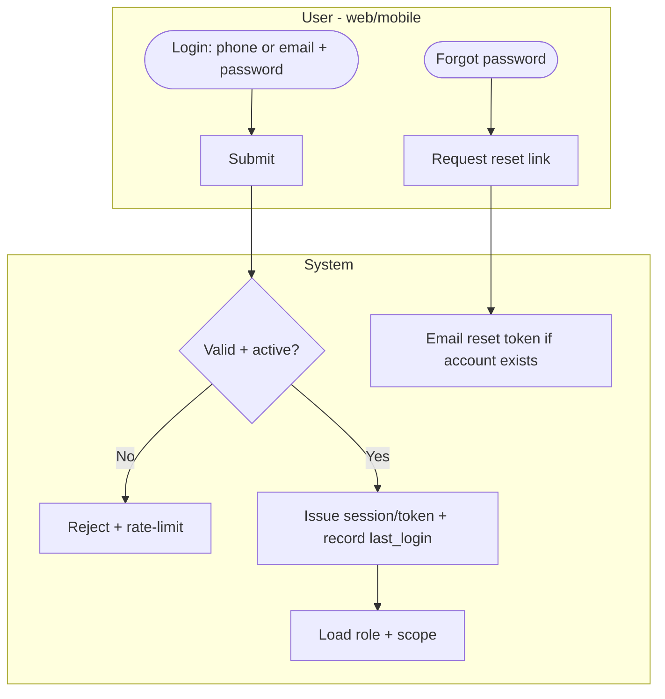
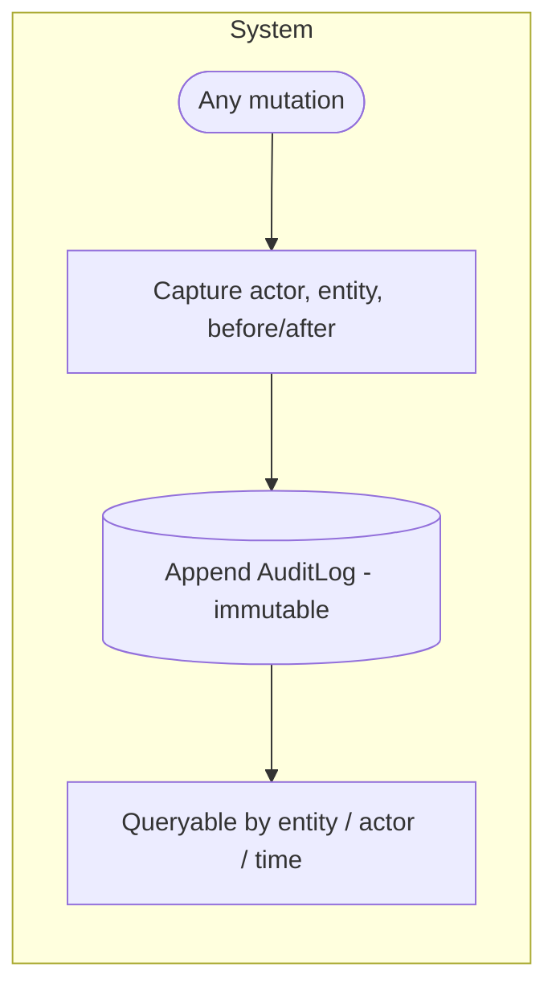
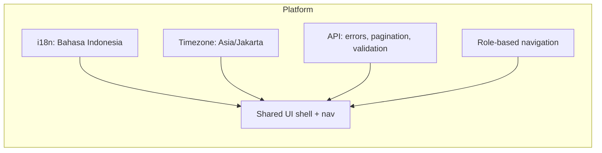

# E1 — Foundations & Platform · Feature Document

> **Epic:** E1 Foundations & Platform · **Status:** Draft v1 · **Parent:** [EPICS.md](../../EPICS.md)
> The base every other epic assumes: authentication, RBAC + company scoping, comprehensive audit, and platform conventions (localization, timezone, API, app shells).

---

## 1. Goal & outcome

Stand up the platform foundations: a runnable **Go API + React web + React Native/mobile + Postgres** with **phone-or-email + password auth**, a **fixed-role RBAC** model with shift-leader **company scoping**, a **comprehensive audit log** (every mutation), and shared conventions (**Bahasa Indonesia** UI, **Asia/Jakarta** timezone, consistent API errors/pagination/validation). Everything in E2–E10 builds on this.

## 2. Actors & roles

| Role | Definition |
|---|---|
| **Super Admin** | Full access; manages users, roles, master data, system config. |
| **HR / Placement Admin** | Manages employees, placements, agreements, master data; second-level approver. |
| **Shift Leader** | On-site supervisor **scoped to one company** (scope from E3 ShiftLeaderAssignment). |
| **Agent** | Self-service (clock-in, schedule, leave/OT, own payslips). |

## 3. Scope

**In scope:** authentication & sessions, RBAC + scoping, comprehensive audit log, platform conventions (localization, timezone, API standards, app shell/navigation).
**Out of scope:** the domain features (E2–E10). The legacy identity/role **data mapping** lives in [E2 DATA-MAPPING](../E2-identity/DATA-MAPPING.md) (role-enum remap G-1, password-hash handling G-2).

## 4. Domain entities



**Invariants:**
- **INV-1:** a User maps **1:1 to an Employee** (E2).
- **INV-2:** **four fixed roles**; permissions are seeded per role (not user-editable in v1).
- **INV-3:** a **shift leader's company scope is derived** from their active E3 `ShiftLeaderAssignment` — not a static field.
- **INV-4:** **every mutating action** writes an `AuditLog` entry (comprehensive).
- **INV-5:** **phone-or-email + password** auth for all users; **phone required+unique**, **email optional+unique**; passwords hashed (argon2id/bcrypt).
- **INV-6:** UI is **Bahasa Indonesia**; **Asia/Jakarta** is the canonical timezone for all date/time logic.

## 5. Features

| ID | Feature | PRD |
|----|---------|-----|
| **F1.1** | Authentication & Sessions | [authentication.md](prds/authentication.md) |
| **F1.2** | RBAC, Roles & Scoping | [rbac-roles.md](prds/rbac-roles.md) |
| **F1.3** | Comprehensive Audit Log | [audit-log.md](prds/audit-log.md) |
| **F1.4** | Platform Conventions & App Shell | [platform-conventions.md](prds/platform-conventions.md) |

## 6. Platform / clients

| Surface | Who | What |
|---|---|---|
| **Web console** | Super Admin / HR / Shift Leader | Full admin + operational UI. |
| **Mobile app** | Agent / Shift Leader | Self-service + on-site ops. |
| **Go API** | — | Single backend serving web + mobile; auth, RBAC, audit enforced here. |

---

### F1.1 — Authentication & Sessions

Phone-or-email + password login for all users across web + mobile, with secure password storage, password reset, and session/token management. Login provisioning is driven from E2 but **automatic at employee create** (employee → user, 1:1 non-null) — not opt-in.



> **Note:** the `Valid + active?` gate and every subsequent request consult **`users.status`** and the session-epoch **`users.tokens_valid_after`** — token issuance stamps the current epoch, and a per-request middleware check rejects tokens issued before it. This is how disable/offboard ([F2.7](../E2-identity/prds/offboarding.md)) revoke instantly; placement-end never does.

**Entities:** `User`, sessions/tokens. **Depends on:** E2 (provisioning).

---

### F1.2 — RBAC, Roles & Scoping

Four fixed roles with seeded permissions; the API enforces role + **company scope** (shift leaders act only on their company, via E3 assignment) on every request.

```mermaid
flowchart TD
    subgraph SYS[API - every request]
        B1([Request]) --> B2[Resolve user + role]
        B2 --> B3{Permission for action?}
        B3 -- No --> B4[403]
        B3 -- Yes --> B5{Company-scoped action?}
        B5 -- Yes --> B6{Within user's scope? (E3 assignment)}
        B6 -- No --> B4
        B6 -- Yes --> B7[Allow]
        B5 -- No --> B7
    end
```

**Entities:** `Role`, `RolePermission`. **Depends on:** E3 (shift-leader scope).

---

### F1.3 — Comprehensive Audit Log

Every create/update/delete across the system writes an immutable audit entry (actor, action, entity, before/after, ip, time) — backing the many "audited" rules in E2–E10 and HR/compliance needs.



**Entities:** `AuditLog`. **Depends on:** — (used by all).

---

### F1.4 — Platform Conventions & App Shell

Shared standards: **Bahasa Indonesia** localization, **Asia/Jakarta** timezone, consistent **API** conventions (error format, pagination, validation), and the base **app shell/navigation** for web + mobile.



**Entities:** config/constants. **Depends on:** F1.1–F1.3.

---

## 7. Decisions & open questions

**Resolved (2026-05-29):**
- ✅ **Phone-or-email + password** auth for all users (web + mobile); phone required+unique, email optional+unique. *(Updated 2026-06-07 — was email-only.)*
- ✅ **Fixed four roles** + shift-leader **company scoping** (scope from E3).
- ✅ **Comprehensive audit** (every mutation).
- ✅ **Bahasa Indonesia** UI; **Asia/Jakarta** canonical timezone.

**Resolved — open-items review (2026-05-29), see [EPICS.md §8](../../EPICS.md):**
- ✅ **MFA** → post-v1 (admin/HR hardening later).
- ✅ **Email-less agents** → solved by **phone** as the universal required identifier (no email needed to log in). *(Superseded 2026-06-07: every employee auto-provisions a login at create — Employee↔User 1:1 non-null, no opt-in step — with a system-generated temp password shown once and force-rotated on first login.)*
- ✅ **Role assignment** → super_admin **and** hr_admin may assign roles.

**Resolved (2026-06-06):**
- ✅ **Session model** → **JWT access token + opaque (rotating) refresh token**, plus a **per-request user `status` + session-epoch (`users.tokens_valid_after`) check** in the auth middleware for **instant revocation** (no longer purely stateless JWT). Disable/offboard bump the epoch and call `RevokeAllRefreshForUser`; outstanding access tokens fail at the next request. Revocation is tied to **employment-end** ([F2.7](../E2-identity/prds/offboarding.md), OB-#) — placement transfer/renewal/supersede/auto-end never revoke. *Resolves the prior "session model deferred / revocation out of scope" note.*

**Deferred to build/tech phase:**
1. Password policy (complexity, rotation, lockout/rate-limit thresholds).
2. Audit retention + storage strategy (high volume).
