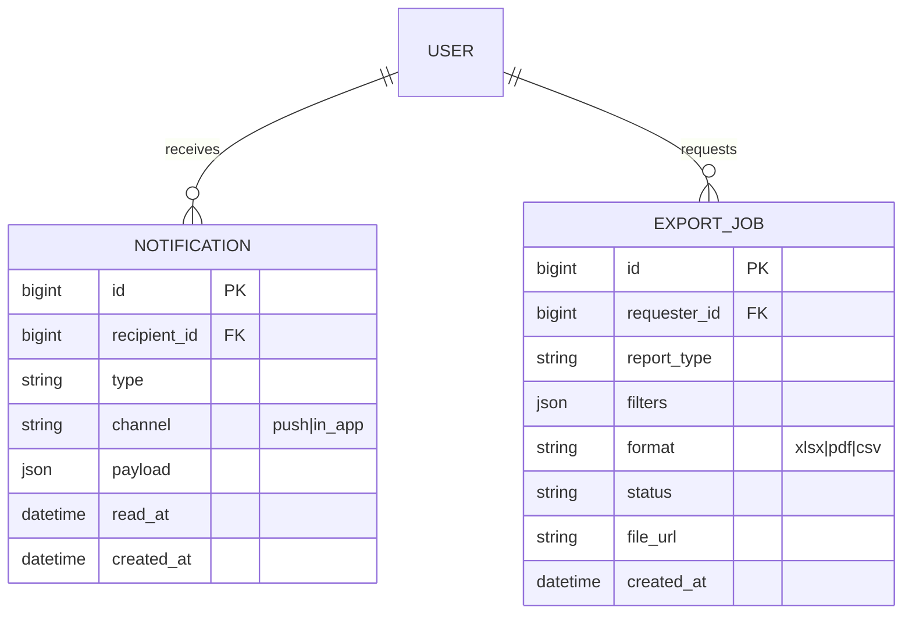
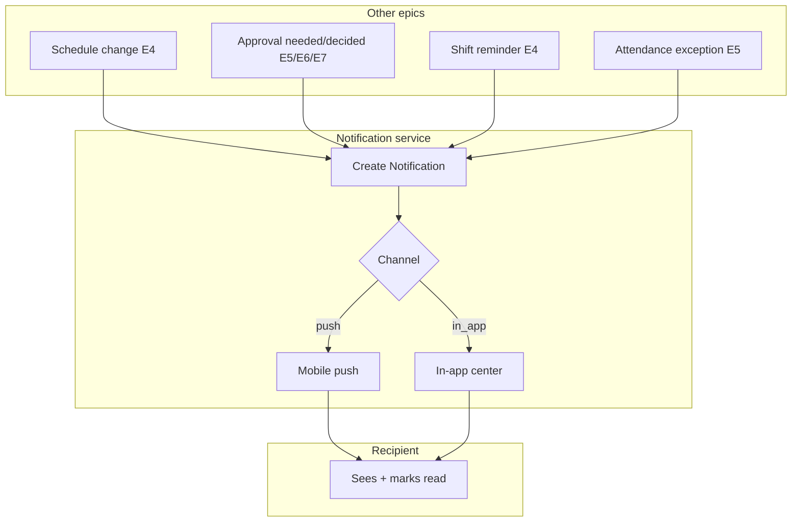
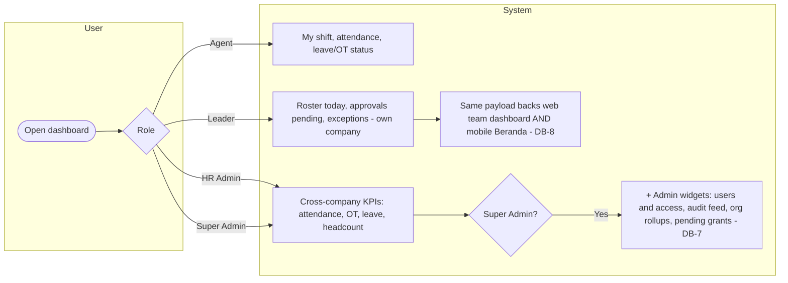
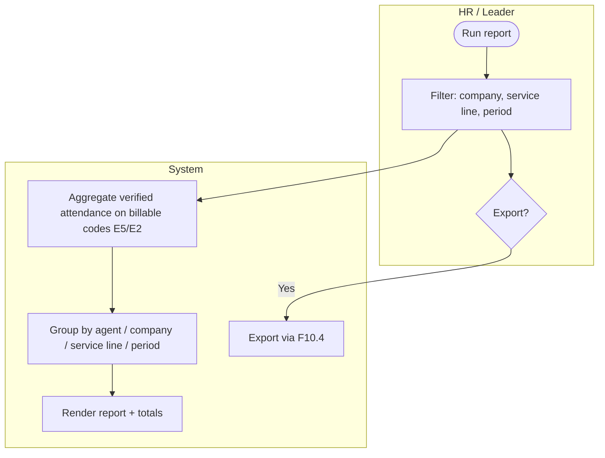
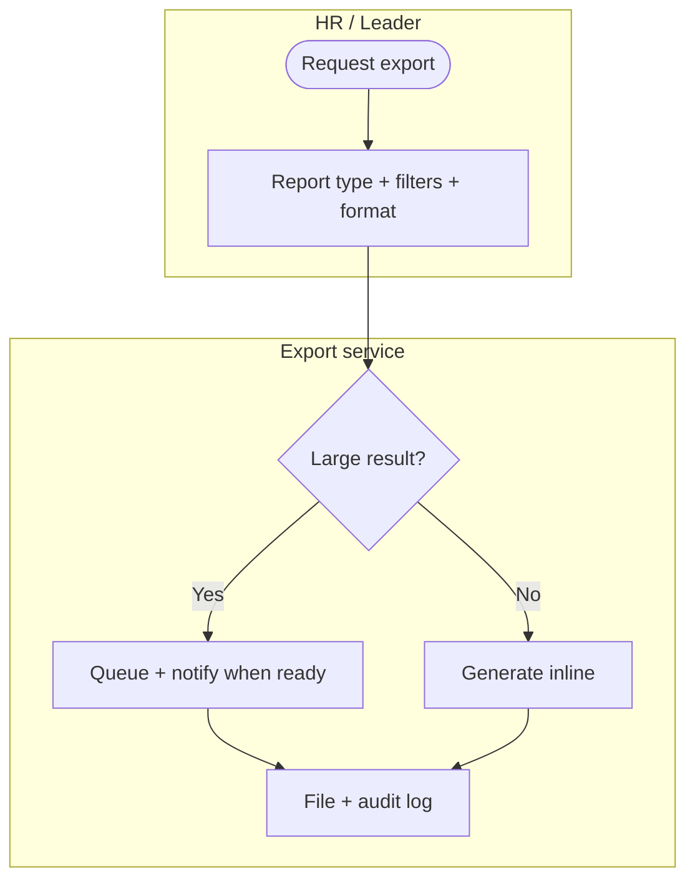

# E10 — Reporting & Notifications · Feature Document

> **Epic:** E10 Reporting & Notifications · **Status:** Draft v1 · **Parent:** [EPICS.md](../../EPICS.md)
> Cross-cutting: push + in-app notifications, role-based dashboards, the v1 **attendance & billable-hours** report, and a reusable on-demand export framework. Internal-only.

---

## 1. Goal & outcome

Tie the system together with **notifications** (push + in-app) for the events other epics raise (schedule changes, approvals, reminders, attendance exceptions), **role-based dashboards**, and reporting. The v1 priority report is **attendance & billable hours** (the core outsource revenue artifact); other reports (OT, leave, placement/headcount) ride the same export framework as fast-follows. **All reporting is internal to SWP** — clients don't log in and receive nothing directly from the system.

## 2. Actors & roles

| Actor | Involvement |
|---|---|
| **Agent** | Receives notifications (push/in-app); sees a personal dashboard. |
| **Shift Leader** | Notifications + a team/company dashboard; runs their company's reports. |
| **HR / Super Admin** | Cross-company dashboards; runs/exports all reports (incl. billable hours). |
| **System** | Emits notifications on domain events; computes dashboards/reports; runs exports. |

## 3. Scope

**In scope:** notifications (push + in-app), notification center, role-based dashboards, attendance & billable-hours report, reusable export framework (Excel/PDF/CSV).
**Out of scope:** email / WhatsApp / SMS channels (not chosen), client-facing reports or portal (internal-only), scheduled/emailed reports + external BI (not chosen for v1).

## 4. Domain entities

**Invariants:**
- **INV-1:** notifications use **push + in-app only** in v1 (no email/SMS/WhatsApp).
- **INV-2:** all reporting/exports are **internal** — no client access, no external recipients from the system.
- **INV-3:** dashboards/reports are **role-scoped** (agent = own, shift leader = their company, HR/Super Admin = all).
- **INV-4:** the **billable** report counts only **verified** attendance (E5) on **billable** attendance codes (E2).
- **INV-5:** every export is **audited** (who exported what, when, with which filters).

## 5. Features

| ID | Feature | PRD |
|----|---------|-----|
| **F10.1** | Notifications & Notification Center | [notifications.md](prds/notifications.md) |
| **F10.2** | Role-Based Dashboards | [dashboards.md](prds/dashboards.md) |
| **F10.3** | Attendance & Billable-Hours Report | [attendance-billable-report.md](prds/attendance-billable-report.md) |
| **F10.4** | Export Framework | [export-framework.md](prds/export-framework.md) |

## 6. Platform / clients

| Surface | Who | What |
|---|---|---|
| **Mobile app** | Agent / Shift Leader | Push + in-app notifications; personal/team dashboards. |
| **Web console** | Shift Leader / HR | In-app notifications, dashboards, run + export reports. |

---

### F10.1 — Notifications & Notification Center

A central notification service other epics call to push events to users via **push (mobile)** and an **in-app center**, with read/unread state and light per-user preferences.

**Entities:** `Notification`. **Depends on:** events from E3–E8.

---

### F10.2 — Role-Based Dashboards

Landing dashboards tailored by role: agent (my next shift, my attendance/leave/OT status), shift leader (today's roster, pending approvals, exceptions for their company — on **web and mobile**), HR (cross-company KPIs). **Super Admin** sees the HR cockpit **plus admin-only widgets** (users & access, audit feed, org rollups, pending grants — DB-7).

**Entities:** read projections across modules. **Depends on:** E4–E8.

---

### F10.3 — Attendance & Billable-Hours Report (v1 priority)

The core outsource report: **verified** worked/billable hours per agent / client company / service line / period — what SWP uses to bill clients (billing done outside the system) and analyze utilization.

**Entities:** reads `Attendance`, `AttendanceCode`, `Placement`, `ClientCompany`. **Depends on:** E5, E2, E3, F10.4.

---

### F10.4 — Export Framework

A reusable export service (Excel / PDF / CSV) used by every report (attendance/billable now; OT, leave, placement as fast-follows), with filters honored, large jobs queued, and full audit.

**Entities:** `ExportJob`. **Depends on:** the report features + E1 (audit).

---

## 7. Decisions & open questions

**Resolved (2026-05-29):**
- ✅ Notifications = **push + in-app only** (no email/SMS/WhatsApp in v1).
- ✅ Reporting is **internal-only** (no client access/portal).
- ✅ Delivery = **dashboards + on-demand export** (no scheduled/emailed, no BI in v1).
- ✅ v1 priority report = **attendance & billable hours**; OT/leave/placement reports are fast-follows on the same framework.

**Resolved — open-items review (2026-05-29), see [EPICS.md §8](../../EPICS.md):**
- ✅ **Billable counting** = verified records only (consistent with E5).
- ✅ **Notification preferences** = all-on in v1 (mute non-critical later).
- ✅ **Billing math** = hours only (rates applied outside the system).

**Resolved (2026-06-11), see [EPICS.md §8](../../EPICS.md):**
- ✅ **Super Admin dashboard = HR cockpit superset** (DB-7) — adds an admin-only widget section (users & access, recent audit feed, org rollups by service line, pending grants) on `HrDashboard.admin`, present only for `super_admin`. Extends the earlier "same body, distinct label" stance into a true superset.
- ✅ **Shift-leader dashboard is dual-surface** (DB-8) — the existing `LeaderDashboard` payload backs both the web team dashboard and a mobile Beranda; no new endpoint.

**Deferred to build/tech phase:**
1. Push provider (FCM/APNs) setup + reminder lead times.
