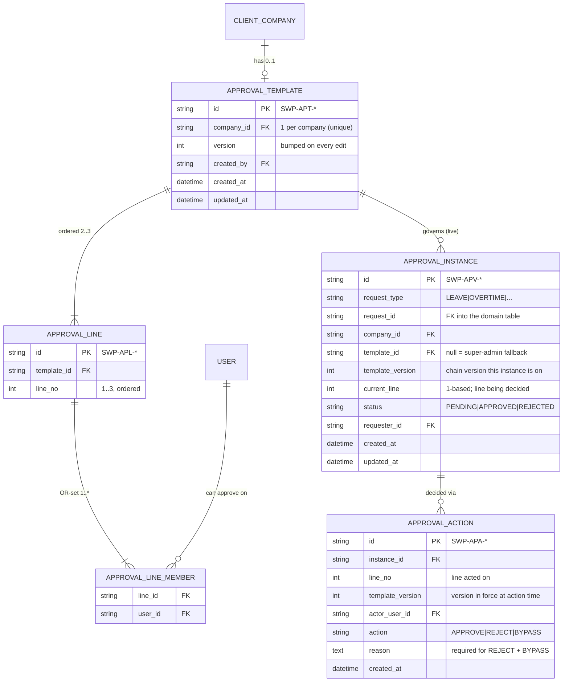
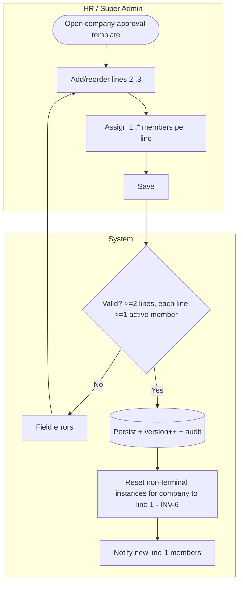
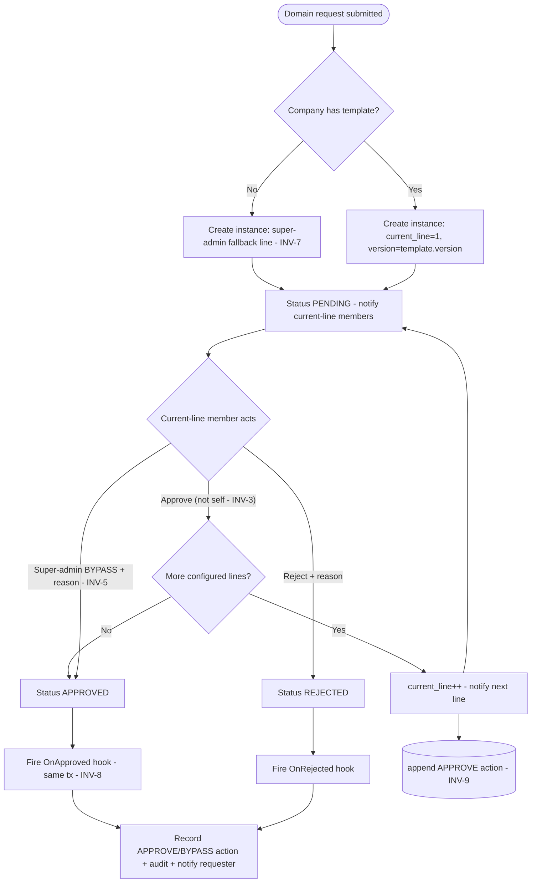
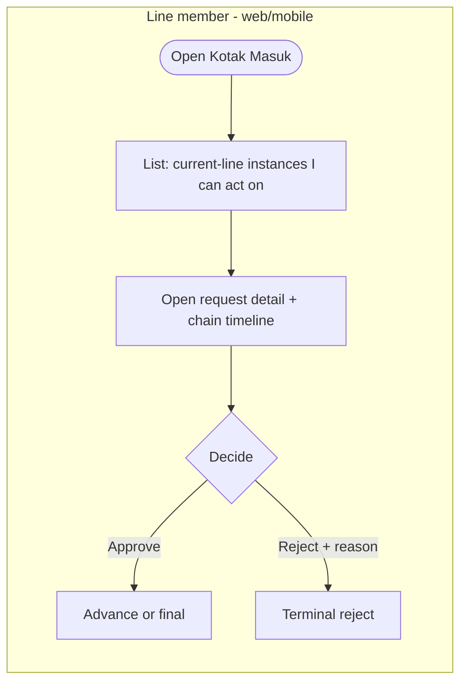

# E11 — Approvals · Feature Document

> **Epic:** E11 Approvals (configurable multi-line engine, cross-cutting) · **Status:** Draft v1 · **Parent:** [EPICS.md](../../EPICS.md)
> A generic, per-company approval engine: route any request type (leave, overtime, …) through an HR-configured chain of ordered lines, replacing the hardcoded `shift_leader → HR/lead` routing. Added 2026-06-14 (EPICS §8 E11).

---

## 1. Goal & outcome

SWP's old approval model hardcoded **who** approves **what**: leave and overtime ran `shift_leader (L1) → HR/lead (L2)`, and profile edits ran a separate change-request queue. That routing was rigid — it could not express "this client company wants the on-site SL **and** the account manager **and** a super-admin sign-off," and it duplicated a state machine per module.

E11 replaces all of it with **one configurable engine**. HR configures a single **approval template per client company**: an ordered chain of **2–3 lines**, each line a set of users where **any one** approval clears the line (OR), and lines clear **in sequence**. Leave and overtime route through this engine; new request types opt in via a side-effect hook. **Profile change-request approval is removed** — those edits become instant self-edit (E2). The engine owns routing, the decision trail, the inbox, and the super-admin bypass; the domain epics own only their **on-approval side-effects**.

## 2. Actors & roles

| Actor | Involvement |
|---|---|
| **HR / Placement Admin** | Configures the per-company approval template (lines + members); may be a line member. (`approvals.template.manage`) |
| **Super Admin** | Configures templates; is the **fallback approver** when no template exists; may **bypass** any request. (`approvals.template.manage`, `approvals.bypass`) |
| **Line member** (any active SWP staff — shift leader, lead, HR, super admin, …) | Approves/rejects requests where they sit on the **current** line of the chain. Routing is by **membership**, not role. (`approvals.act`) |
| **Requester** (agent, or any staff submitting a request) | Submits the underlying request (leave/OT); cannot approve their own (INV-3). Sees chain progress. |
| **System** | Builds the instance from the company's template, advances lines, blocks self-approval, fires side-effect hooks on terminal transitions, audits, notifies. |

## 3. Scope

**In scope:** per-company approval **template** CRUD (ordered lines, OR-set membership, optional 3rd line); the **execution engine** (instance lifecycle, sequential advance, terminal reject, super-admin bypass, no-template fallback, live-template reset of pending instances); per-request-type **side-effect hooks** (`OnApproved`/`OnRejected`); the **approval inbox** (web + mobile); the append-only **decision trail** (`approval_actions`).

**Out of scope:** the underlying request domains (E6 leave quota mechanics, E7 OT day-type calc — the engine only *calls* their hooks); notification delivery (E10); audit storage (E1). **No** SLA/auto-escalation timer in v1 (a line may sit un-actioned indefinitely; super-admin bypass is the escape hatch). **No** per-instance template snapshot (live template + pending reset instead, INV-6).

## 4. Domain entities

**Invariants:**
- **INV-1 — one template per company.** `ApprovalTemplate.company_id` is unique. A company has 0 or 1 template.
- **INV-2 — OR within a line, AND across lines.** A line is satisfied by **any one** member's `APPROVE`. The request is approved only when **every configured line** has been satisfied in order. Line 3 is optional to *configure*; if configured, it must be satisfied.
- **INV-3 — no self-approval.** A requester who is a member of a line in their own chain cannot satisfy it; another member must. A sole-member line clears only by super-admin **bypass** (INV-5).
- **INV-4 — terminal reject.** Any current-line member's `REJECT` moves the instance to `REJECTED` (terminal); a reason is required; the `OnRejected` hook fires.
- **INV-5 — super-admin bypass.** A super admin may `BYPASS` (force-approve) an instance from any non-terminal state, skipping all remaining lines even if not a member; a reason is required.
- **INV-6 — live template, pending reset.** Editing a template bumps `version` and resets every non-terminal instance for that company to `current_line = 1` on the new version; prior actions are retained (audit) but no longer count. No per-instance snapshot.
- **INV-7 — no-template fallback.** With no template, an instance is created with `template_id = null` and a single implicit super-admin line; it never auto-approves and never blocks submission.
- **INV-8 — side-effects only on terminal transition.** The per-type `OnApproved` hook fires exactly once, when the last line clears (or on bypass); `OnRejected` fires on reject. The engine runs the hook in the same transaction as the status change.
- **INV-9 — append-only trail.** `approval_actions` is never updated/deleted; one row per decision (approve/reject/bypass), stamped with the `template_version` in force.

## 5. Features

| ID | Feature | PRD |
|----|---------|-----|
| **F11.1** | Approval Template Management | [approval-template-management.md](prds/approval-template-management.md) |
| **F11.2** | Approval Execution Engine | [approval-execution.md](prds/approval-execution.md) |
| **F11.3** | Approval Inbox (web + mobile) | [approval-inbox.md](prds/approval-inbox.md) |

## 6. Platform / clients

| Surface | Who | What |
|---|---|---|
| **Web console — Settings/Klien** | HR / Super Admin | Configure a company's approval template: add/reorder lines (2–3), assign members per line, save (triggers pending reset). |
| **Web console — Kotak Masuk (Inbox)** | Line members (HR, lead, …) | "Needs my decision" queue: requests where I'm on the current line; approve/reject with reason. |
| **Mobile app — Inbox/Approvals** | Line members on-site (shift leader, …) | Same queue, phone-first: approve/reject the current line. |
| **Web/Mobile — request detail** | Requester + approvers | Chain-progress timeline (lines, who acted, who's pending). |
| **Web console** | Super Admin | Bypass action (force-approve with reason) on any pending instance. |

---

### F11.1 — Approval Template Management

HR/super-admin define, per client company, an ordered chain of 2–3 lines; each line is a multi-user OR-set. Saving validates (≥2 lines, each line ≥1 active member) and, because templates are live (INV-6), resets that company's pending instances.

**Entities:** `ApprovalTemplate`, `ApprovalLine`, `ApprovalLineMember`. **Depends on:** E2 (companies), E1 (users, RBAC, audit).

---

### F11.2 — Approval Execution Engine

When a domain request is submitted, the engine builds an instance from the company's template (or the super-admin fallback), then advances line-by-line. Any member of the current line approves → advance; the last line clearing fires the type's `OnApproved` hook; any reject is terminal; a super admin may bypass.

**Entities:** `ApprovalInstance`, `ApprovalAction`. **Depends on:** F11.1, per-type hook registrations (E6/E7). **Side-effect hook contract:** `OnApproved(ctx, tx, request_id)` / `OnRejected(ctx, tx, request_id)`, registered per `request_type`, run in the engine's transaction.

---

### F11.3 — Approval Inbox (web + mobile)

A unified "needs my decision" queue: every non-terminal instance whose **current** line includes the viewer (excluding their own requests, INV-3). Reads the same data the per-domain approval tabs show (single source of truth, mirrors NAVIGATION-AND-RBAC §2). Phone-first parity for on-site approvers.

**Entities:** reads `ApprovalInstance` + `ApprovalAction` + the domain request. **Depends on:** F11.2, E10 (inbox shell/notifications).

---

## 7. Decisions & open questions

**Resolved (2026-06-14, EPICS §8 E11):**
- ✅ Per-company **single template**, 2–3 ordered lines, line 3 optional (INV-1/INV-2).
- ✅ **OR within a line** (any one approves), **sequential** across lines (INV-2).
- ✅ **Self-approval blocked, no auto-skip**; sole-member line → bypass only (INV-3).
- ✅ **Super-admin bypass** force-approves with reason from any state (INV-5).
- ✅ **No-template → super-admin fallback** line (INV-7).
- ✅ **Live template + pending reset** on edit (INV-6) — no per-instance snapshot.
- ✅ **Generic engine**; leave + overtime opt in via `OnApproved`/`OnRejected` hooks (INV-8); replaces `leave_approvals`/`overtime_approvals` with one `approval_actions` trail (INV-9).
- ✅ **Line members = any active SWP staff user**; validated active at template save.
- ✅ **Profile change-request approval removed** (E2); profile edits instant self-edit.

**Open:**
- SLA / auto-escalation if a line sits un-actioned for N days (v1: none; bypass is the escape hatch).
- Should a line allow **role-refs** (e.g. "this company's shift leader") in addition to explicit users? (v1: explicit users only — fully manual, EPICS §8 line-assignment decision.)
- Reorder semantics on edit when a deleted line had pending actions (v1: handled by INV-6 reset — old actions retained as audit, chain restarts).
