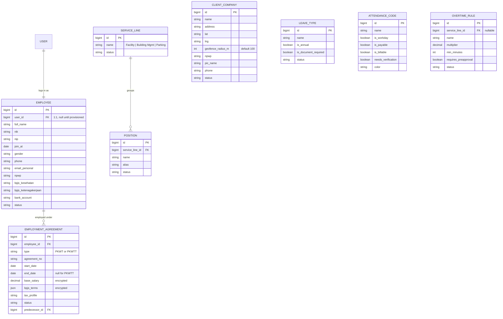
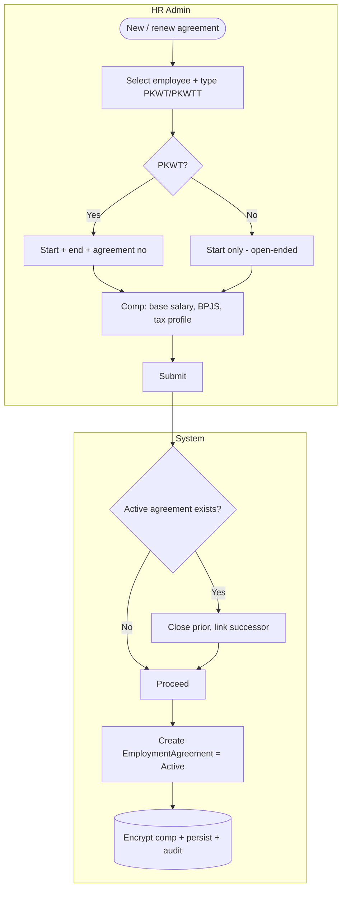
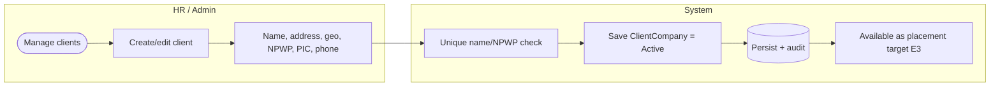
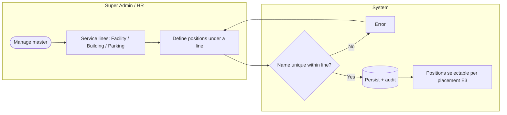

# E2 — Identity, Org & Master Data · Feature Document

> **Epic:** E2 Identity, Org & Master Data · **Status:** Draft v1 · **Parent:** [EPICS.md](../../EPICS.md)
> The people, the employment relationship, the client directory, and the reference data every other epic hangs on.

---

## 1. Goal & outcome

Define **who** the system is about (agents/employees + their SWP login), the **employment relationship** (PKWT/PKWTT agreement that placement designations sit under), the **client company directory** (placement targets), and the **master/reference data** (service lines, positions, leave types, attendance codes, overtime rules). E3 already depends on these; E4–E8 consume them. This epic makes them first-class and admin-managed instead of the free-text / encrypted-blob shapes in legacy.

## 2. Actors & roles

| Actor | Involvement |
|---|---|
| **Super Admin** | Manages all master data; full identity/role control. |
| **HR / Placement Admin** | Creates employees, employment agreements, client companies; manages most master data. |
| **Shift Leader** | Consumes master data (read); no master-data authoring. |
| **Agent** | Subject of an Employee record; with a **hybrid self-service login** (clock in/out, view schedule, request leave/OT). |
| **System** | Validates uniqueness/invariants, provisions logins (with E1), encrypts comp terms, audits. |

## 3. Scope

**In scope:** Employee profile + user provisioning, EmploymentAgreement (PKWT/PKWTT + current comp), ClientCompany directory, ServiceLine + Position master, operational master (leave types, attendance codes, overtime rules).
**Out of scope:** auth/RBAC mechanics & sessions (E1), placement (E3), schedules (E4), the *behavior* of attendance/leave/overtime (E5/E6/E7 — E2 only owns their master definitions), payslip history (E8).

## 4. Domain entities

**Invariants:**
- **INV-1:** an Employee maps **1:1 to a User** (nullable until a login is provisioned).
- **INV-2:** an Employee has **at most one *active* EmploymentAgreement** at a time (history retained; renewals link via `predecessor_id`).
- **INV-3:** a Position belongs to **exactly one** ServiceLine; position name is unique within its line.
- **INV-4:** ServiceLine is the fixed seed set (Facility Services, Building Management, Parking); admin-extendable but not deletable while referenced.

## 5. Features

| ID | Feature | PRD |
|----|---------|-----|
| **F2.1** | Employee & Agent Profile (+ login provisioning) | [employee-profile.md](prds/employee-profile.md) |
| **F2.2** | Employment Agreement (PKWT/PKWTT + comp) | [employment-agreement.md](prds/employment-agreement.md) |
| **F2.3** | Client Company Directory | [client-company-directory.md](prds/client-company-directory.md) |
| **F2.4** | Service Lines & Position Master | [service-lines-positions.md](prds/service-lines-positions.md) |
| **F2.5** | Operational Master Data (leave / attendance / overtime) | [operational-master-data.md](prds/operational-master-data.md) |

---

### F2.1 — Employee & Agent Profile (+ login provisioning)

The person record (identity, contact, statutory IDs, bank) for every agent and staff member. Hybrid model: creating an employee can optionally **provision a self-service User login** (E1) so agents can clock in and self-serve; staff/leaders get fuller access by role.

**Entities:** `Employee` (+ `User` via E1). **Depends on:** E1 (auth/RBAC).

---

### F2.2 — Employment Agreement (PKWT/PKWTT + comp)

The legal employment relationship between the agent and **SWP** — fixed-term `PKWT` (with end date) or indefinite `PKWTT` (open-ended). Holds the agreement reference, period, and **current compensation terms** (base salary, BPJS, tax) that overtime/leave calculations read. Renewals create linked successors; one active at a time. Placement designations (E3) must sit within an active agreement.

**Entities:** `EmploymentAgreement`. **Depends on:** F2.1. **Consumed by:** E3 (placement window/auto-cap), E7 (OT calc base), E8 (payroll history).

---

### F2.3 — Client Company Directory

The catalog of partnering companies where agents are placed (legacy `companies` where `role=2`). Pure reference data with geo (used later by attendance geofencing) and statutory info.

**Entities:** `ClientCompany`. **Consumed by:** E3, E5 (geofence).

---

### F2.4 — Service Lines & Position Master

The three service lines (Facility / Building Mgmt / Parking) and the **positions scoped under each** (e.g., Parking → Attendant/Supervisor; Building → Technician/Engineer). Positions are picked per placement (E3 BR-9). Service line drives shift/attendance rules downstream (E4/E5).

**Entities:** `ServiceLine`, `Position`. **Consumed by:** E3, E4, E5.

---

### F2.5 — Operational Master Data (leave / attendance / overtime)

Admin-managed master definitions consumed by the time-tracking epics: **leave types** (annual flag, document-required), **attendance codes** (workday/payable/**billable**/needs-verification + color), and **overtime rules** (multipliers, min duration, pre-approval) — the latter net-new (no legacy source). E2 owns the definitions; the *behavior* lives in E5/E6/E7.

**Entities:** `LeaveType`, `AttendanceCode`, `OvertimeRule`. **Consumed by:** E5, E6, E7.

---

## 6. Cross-feature rules

- **Platform / clients:** master-data authoring (employees, agreements, clients, service lines, positions, operational master) is **web console** (admin/HR). Agents access only their **own profile** (read + limited edit) via the **mobile app**; shift leaders consume master data read-only. Each PRD restates its surfaces. Heavier mobile surfaces appear in E4–E7.
- Master data is **soft-deleted / deactivated**, never hard-deleted, because historical records (placements, attendance, leave) reference it.
- All create/update/deactivate actions are audited (E1).
- Compensation fields on EmploymentAgreement are **encrypted at rest** (carry-over from legacy `DBEncryption`); access is role-gated.
- Uniqueness: User email, Employee NIK, ClientCompany name/NPWP, Position name-within-line.

## 7. Decisions & open questions

**Resolved (2026-05-29):**
- ✅ **Hybrid agent login** — Employee 1:1 User; agents get lightweight self-service (clock-in, schedule, leave/OT), staff/leaders get fuller access (F2.1).
- ✅ **EmploymentAgreement carries current comp** (base salary, BPJS, tax) for downstream calcs; historical payslips stay in E8.
- ✅ **Flat internal org** — roles only, no SWP department/division hierarchy.
- ✅ **Position scoped by service line** (INV-3).

**Resolved — open-items review (2026-05-29), see [EPICS.md §8](../../EPICS.md):**
- ✅ **Login provisioning** = opt-in at create (provisionable later).
- ✅ **Service lines** = the 3 seeded but **admin-extendable**.
- ✅ **Geofence** = per-site `geofence_radius_m` on ClientCompany (default 100m) — added to the model (§4 / F2.3).
- ✅ **Agent mobile-editable fields** = phone, address, bank (HR-approved).
- ✅ **Overtime rules** shape defined in E7.

**Still open (migration data verification → E9):**
1. Confirm `recruitment_role_types` values map to PKWT/PKWTT employment type/status. → [DATA-MAPPING.md](DATA-MAPPING.md).
