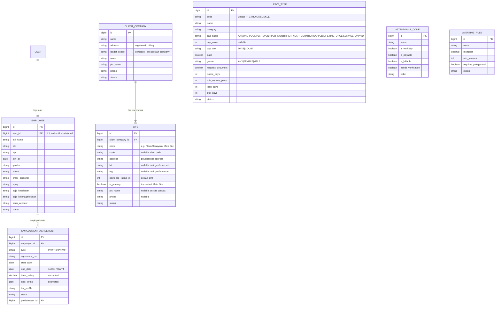
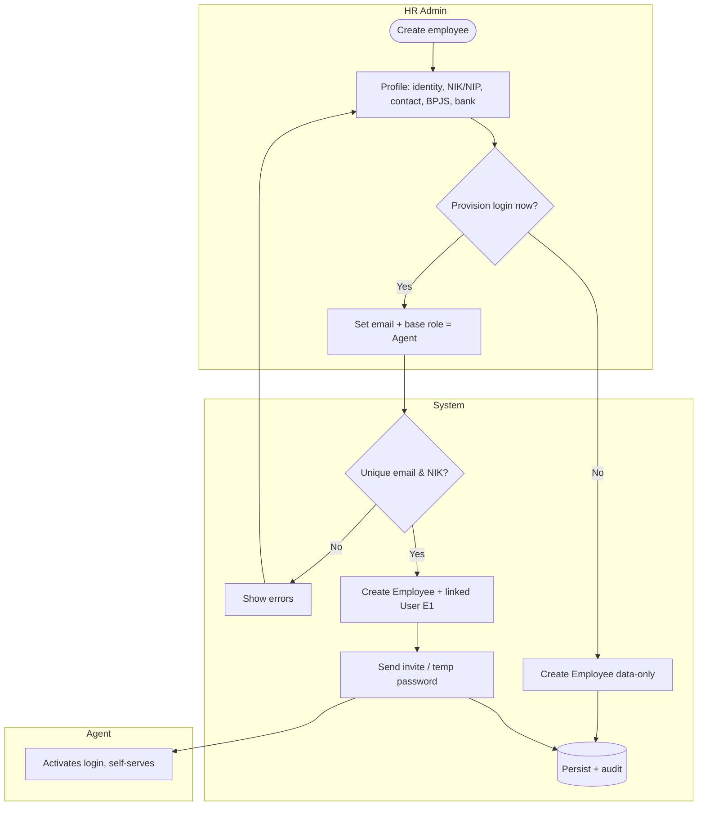
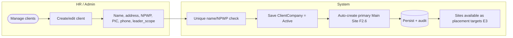
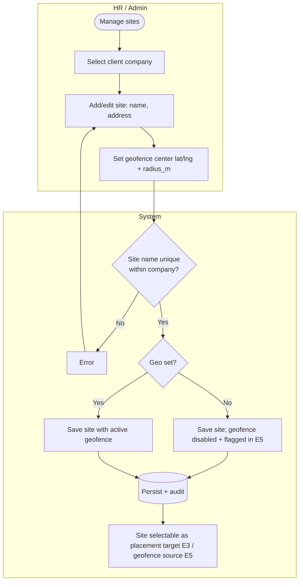
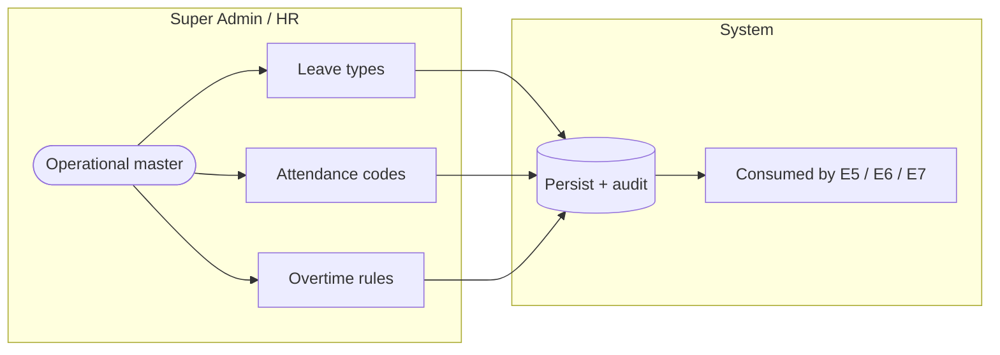
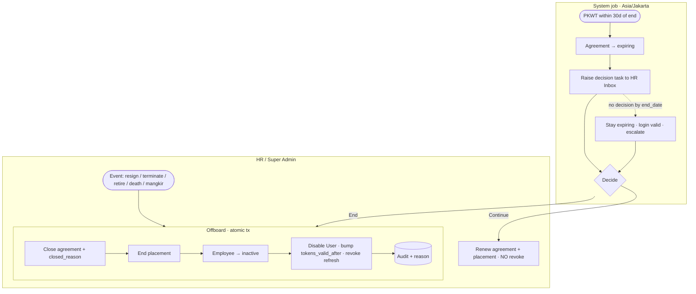

# E2 — Identity, Org & Master Data · Feature Document

> **Epic:** E2 Identity, Org & Master Data · **Status:** Draft v1 · **Parent:** [EPICS.md](../../EPICS.md)
> The people, the employment relationship, the client directory, and the reference data every other epic hangs on.

---

## 1. Goal & outcome

Define **who** the system is about (agents/employees + their SWP login), the **employment relationship** (PKWT/PKWTT agreement that placement designations sit under), the **client company directory** (placement targets), and the **master/reference data** (leave types, attendance codes, overtime rules). E3 already depends on these; E4–E8 consume them. This epic makes them first-class and admin-managed instead of the free-text / encrypted-blob shapes in legacy. **Position is free-text per placement (E3) — no master, no CRUD here.**

## 2. Actors & roles

| Actor | Involvement |
|---|---|
| **Super Admin** | Manages all master data; full identity/role control. |
| **HR / Placement Admin** | Creates employees, employment agreements, client companies; manages most master data. |
| **Shift Leader** | Consumes master data (read); no master-data authoring. |
| **Agent** | Subject of an Employee record; with a **hybrid self-service login** (clock in/out, view schedule, request leave/OT). |
| **System** | Validates uniqueness/invariants, provisions logins (with E1), encrypts comp terms, audits. |

## 3. Scope

**In scope:** Employee profile + user provisioning, EmploymentAgreement (PKWT/PKWTT + current comp), ClientCompany directory, **Client Sites + geofence config** (placement locations per company), operational master (leave types, attendance codes, overtime rules).
**Out of scope:** auth/RBAC mechanics & sessions (E1), placement (E3), schedules (E4), the *behavior* of attendance/leave/overtime (E5/E6/E7 — E2 only owns their master definitions), payslip history (E8).

## 4. Domain entities

**Invariants:**
- **INV-1:** an Employee maps **1:1 to a User** (nullable until a login is provisioned).
- **INV-2:** an Employee has **at most one *active* EmploymentAgreement** at a time (history retained; renewals link via `predecessor_id`).
- **INV-5:** a ClientCompany has **at least one** Site, **exactly one** of which is `is_primary` (the default "Main Site"). Geofence config (lat/lng/`geofence_radius_m`) lives on **Site**, never on ClientCompany. Site name is unique within its company. *(Added 2026-06-03, F2.6.)*
- **INV-6:** login access is bound to **employment**, not placement. Revocation fires **only** when the EmploymentAgreement closes (offboarding); ending/transferring/renewing a *placement* never revokes a login. *(Added 2026-06-06, F2.7.)*

## 5. Features

| ID | Feature | PRD |
|----|---------|-----|
| **F2.1** | Employee & Agent Profile (+ login provisioning) | [employee-profile.md](prds/employee-profile.md) |
| **F2.2** | Employment Agreement (PKWT/PKWTT + comp) | [employment-agreement.md](prds/employment-agreement.md) |
| **F2.3** | Client Company Directory | [client-company-directory.md](prds/client-company-directory.md) |
| **F2.6** | Client Sites & Geofence | [client-sites-geofence.md](prds/client-sites-geofence.md) |
| **F2.5** | Operational Master Data (leave / attendance / overtime) | [operational-master-data.md](prds/operational-master-data.md) |
| **F2.7** | Employee Offboarding & Session Revocation | [offboarding.md](prds/offboarding.md) |

---

### F2.1 — Employee & Agent Profile (+ login provisioning)

The person record (identity, contact, statutory IDs, bank) for every agent and staff member. Hybrid model: creating an employee can optionally **provision a self-service User login** (E1) so agents can clock in and self-serve; staff/leaders get fuller access by role.

**Entities:** `Employee` (+ `User` via E1). **Depends on:** E1 (auth/RBAC).

---

### F2.2 — Employment Agreement (PKWT/PKWTT + comp)

The legal employment relationship between the agent and **SWP** — fixed-term `PKWT` (with end date) or indefinite `PKWTT` (open-ended). Holds the agreement reference, period, and **current compensation terms** (base salary, BPJS, tax) that overtime/leave calculations read. Renewals create linked successors; one active at a time. Placement designations (E3) must sit within an active agreement.

**Entities:** `EmploymentAgreement`. **Depends on:** F2.1. **Consumed by:** E3 (placement window/auto-cap), E7 (OT calc base), E8 (payroll history).

> **MVP scope note (2026-06-07, EPICS §8):** agreements are **created `active`** in one step — there is **no DRAFT** state (DB `status` CHECK = `active | superseded | closed`) and **no agreement document/attachment upload** (object/bucket storage isn't provisioned for MVP; the attachments capability is **deferred post-MVP**). The flow above reflects this. `expiring` (EA-8/EA-9) is a derived flag over an `active` PKWT, not a stored status. See [employment-agreement PRD](prds/employment-agreement.md) EA-11/EA-12.

---

### F2.3 — Client Company Directory

The catalog of partnering companies where agents are placed (legacy `companies` where `role=2`). Reference data carrying the company's **statutory/billing** info (name, registered address, NPWP, PIC) plus `leader_scope`. The **physical placement locations + geofence** live on its Sites (F2.6), not here.

**Entities:** `ClientCompany` (auto-creates a primary `Site`). **Consumed by:** E3, F2.6.

> **UI/flow** *(2026-06-07, EPICS §8):* edit is a **full-page screen launched from the detail page** (`/client-companies/$id/edit`), not a drawer; the **list's only row action is Aktifkan/Nonaktifkan** (no row kebab, guarded by CC-5); the detail **"Profil" tab** shows statutory/billing + `leader_scope` only — **Sites & geofence are on the "Lokasi & Site" tab** (F2.6), never duplicated.

> **Detail tabs & list scope** *(2026-06-08):* the detail page also carries three **E3-backed** tabs — **Penempatan Aktif** (active roster), **Pemimpin Shift** (current leader + assign/replace/revoke, the single entry point for E3 [F3.4](../E3-placement/prds/shift-leader-assignment.md)), and **Riwayat** (historical placements, `include_history`) — all reading the E3 company-roster (F3.5); leader mutations call the E3 shift-leader-assignment endpoints. The company **list is role-scoped**: a shift leader sees only the company they lead (CC-7).

---

### F2.6 — Client Sites & Geofence

The **physical placement locations** of a client company — a mall, an office tower, a parking complex. One company has **one or more** Sites; single-location companies get one auto **primary "Main Site"**. Each site carries the **geofence** (center lat/lng + radius) that E5 clock-in validates against, plus an optional on-site contact. This is the new home for the geo that used to sit on ClientCompany (relocated 2026-06-03 — reverses the earlier "flat, no sub-sites" decision; EPICS §8). Placement (E3) targets a **Site**, and `ClientCompany.leader_scope` decides whether the shift leader is per-company or per-site.

**Entities:** `Site`. **Depends on:** F2.3 (parent company). **Consumed by:** E3 (placement target), E5 (geofence center), E10 (per-site reporting).

---

### F2.5 — Operational Master Data (leave / attendance / overtime)

Admin-managed master definitions consumed by the time-tracking epics: **leave types** (annual flag, document-required), **attendance codes** (workday/payable/**billable**/needs-verification + color), and **overtime rules** (multipliers, min duration, pre-approval) — the latter net-new (no legacy source). E2 owns the definitions; the *behavior* lives in E5/E6/E7.

**Entities:** `LeaveType`, `AttendanceCode`, `OvertimeRule`. **Consumed by:** E5, E6, E7.

---

### F2.7 — Employee Offboarding & Session Revocation

The deliberate end of the SWP↔agent **employment** relationship — distinct from ending a *placement* (E3). One atomic action closes the active EmploymentAgreement, deactivates the Employee, ends the open placement, disables the linked User, and **instantly revokes every session** (INV-6). Two trigger classes: **expiry-driven** (system flags a PKWT 30d before `end_date` → HR decides *continue* or *end*; nothing auto-terminates — a lapsed contract keeps access under **grace** until HR acts) and **event-driven** (HR records resignation, termination/PHK, retirement, death, or absconding with a reason + effective date, which may be future-dated). Revocation uses a **session epoch** on `User` (E1) so the stateless access token is instantly invalidated without a per-token denylist.

**Entities:** `Offboarding` (new) + extends `EmploymentAgreement` (status `expiring`, `closed_reason` enum). **Depends on:** F2.1, F2.2, E3 (placement terminal states), E1 (session revocation hook). **Consumed by:** E10 (Inbox task + notifications).

---

## 6. Cross-feature rules

- **Platform / clients:** master-data authoring (employees, agreements, clients, operational master) is **web console** (admin/HR). Agents access only their **own profile** (read + limited edit) via the **mobile app**; shift leaders consume master data read-only. Each PRD restates its surfaces. Heavier mobile surfaces appear in E4–E7.
- Master data is **soft-deleted / deactivated**, never hard-deleted, because historical records (placements, attendance, leave) reference it.
- All create/update/deactivate actions are audited (E1).
- Compensation fields on EmploymentAgreement are **encrypted at rest** (carry-over from legacy `DBEncryption`); access is role-gated.
- Uniqueness: User email, Employee NIK, ClientCompany name/NPWP, **Site name-within-company**.

## 7. Decisions & open questions

**Resolved (2026-05-29):**
- ✅ **Hybrid agent login** — Employee 1:1 User; agents get lightweight self-service (clock-in, schedule, leave/OT), staff/leaders get fuller access (F2.1).
- ✅ **EmploymentAgreement carries current comp** (base salary, BPJS, tax) for downstream calcs; historical payslips stay in E8.
- ✅ **Flat internal org** — roles only, no SWP department/division hierarchy.
- ✅ **Position is free-text per placement** *(2026-06-12, EPICS §8 — supersedes "position scoped by service line"; service_line + Position master removed entirely)* — no master, no CRUD, no uniqueness; a typeahead endpoint searches `DISTINCT` existing placement position values (E3 BR-9).

**Resolved — open-items review (2026-05-29), see [EPICS.md §8](../../EPICS.md):**
- ✅ **Login provisioning** = opt-in at create (provisionable later).
- ✅ **Geofence** = per-site `geofence_radius_m` (default 100m) — *(superseded 2026-06-03: relocated from ClientCompany onto the new `Site` entity, see below).*
- ✅ **Agent self-editable fields** *(tiers resolved 2026-06-11, F2.1)* — **instant (no approval):** photo, address, app language; **approval-required:** phone, emergency contact, bank; **read-only:** statutory/terms (NIK, name, NPWP, BPJS, placement, contract, comp). Approval-tier edits become **change requests** routed to the unified **Inbox** via `change_requests.approve` (shift leader default, HR fallback — same model as leave/OT). **Bank** changes are split to the HR-only sub-permission `change_requests.approve.bank` — SL approves non-bank fields, bank escalates to HR. EP-5/EP-5c/EP-5d.

**Resolved (2026-06-03) — Client Sites (EPICS §8):**
- ✅ **Sites are first-class** (reverses "flat, no sub-sites"): ClientCompany 1→N `Site`; geofence (address, lat/lng, radius) **moves off ClientCompany onto Site** (INV-5, F2.6).
- ✅ **Every company has ≥1 Site** — single-location companies get one auto primary **Main Site**; Placement (E3) targets a Site (required).
- ✅ **Geofence model** = single circle (center + radius) per site; multi-circle/polygon are post-v1.
- ✅ **`leader_scope`** on ClientCompany (`company` | `site`, default `company`) decides per-company vs per-site shift leadership (E3 INV-2/3/4).
- ✅ **Migration** = sites net-new; loader auto-creates one Main Site per company; HR configures geofences post-cutover (E9).
- ✅ **Overtime rules** shape defined in E7.

**Still open (migration data verification → E9):**
1. Confirm `recruitment_role_types` values map to PKWT/PKWTT employment type/status. → [DATA-MAPPING.md](DATA-MAPPING.md).
