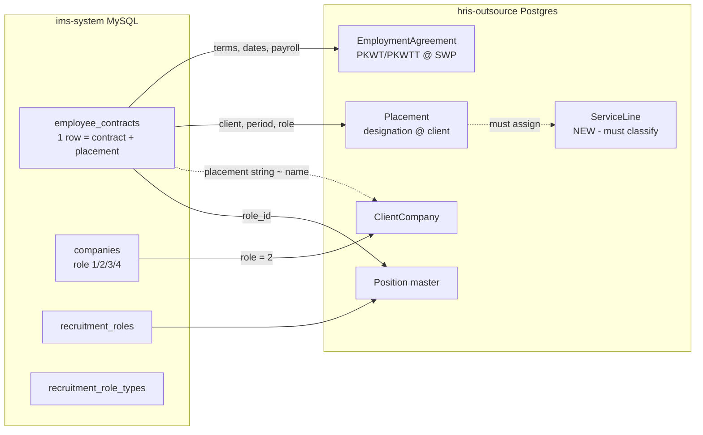

# E3 — Placement · ims-system → hris-outsource Data Mapping

> Migration analysis for the Placement domain. Source: SWP prod (`lumen_swp`, MySQL). Target: hris-outsource (Postgres).
> Parent: [FEATURE.md](FEATURE.md) · Related epic: E9 Data Migration. Status: Draft v1.

---

## 1. Why this is non-trivial

The legacy system packs **employment terms + work placement into a single `employee_contracts` row**, with the client site stored as **free text** and the service line **not stored at all**. hris-outsource splits this into three clean entities — **EmploymentAgreement** (E2), **Placement** (E3), and **ClientCompany** (E2) — so the migration is a **decompose + reconcile**, not a column copy.

## 2. Source tables (Placement-relevant)

| Table | Role in mapping | Key columns |
|-------|-----------------|-------------|
| `employee_contracts` | primary source — splits into EmploymentAgreement + Placement | `id, employee_id, placement, new_office, role_id, contract_status_id, pkwt_reference, contract_start_at, contract_end_at, resign_at, annual_leave, gaji_pokok, bpjs_*, pph21, is_employee_active, show_all_benefit, created_by` |
| `employees` | the agent | `id, name, nip, nik, join_at, user_id, last_contract_id, …` |
| `companies` | client companies (`role=2`) + hierarchy | `id, parent_id, top_parent_id, name, address, lat/long_address, role, npwp, penanggung_jawab, is_enabled` |
| `recruitment_roles` (via `role_id`) | job role → Position master | `id, role, alias` |
| `recruitment_role_types` (via `contract_status_id`) | contract status / type lookup | `id, …` |

> ⚠️ `EmployeeContract` model: `$timestamps = false`; payroll columns use the `DBEncryption` cast (`app/Casts/DBEncryption.php`). `employee_contracts.role_id` → `RecruitmentRole`, `contract_status_id` → `RecruitmentRoleType`. Identity is split: attendance keys on `users.id`, HR keys on `employees.id` (`employees.user_id` bridges them) — relevant for E9.

## 3. Field mapping — `employee_contracts` → target

| Legacy column | Type | → Target field | Target entity | Transform |
|---|---|---|---|---|
| `id` | bigint | `legacy_contract_id` (crosswalk) | both | keep id-map for re-runnable migration |
| `employee_id` | bigint FK | `employee_id` | EmploymentAgreement + Placement | remap to new `Employee.id` via id-map |
| `pkwt_reference` | string | `agreement_no` | **EmploymentAgreement** | — |
| `contract_start_at` | date | `start_date` | **EmploymentAgreement** (+ default Placement `start_date`) | — |
| `contract_end_at` | date | `end_date` (null ⇒ PKWTT) | **EmploymentAgreement** | null/empty → treat as PKWTT (verify) |
| `contract_status_id` | string→`RecruitmentRoleType` | `status` / `type` | EmploymentAgreement | derive PKWT vs PKWTT + status (needs lookup values) |
| `resign_at` | date | `ended_reason=Resigned` + close | Placement + EmploymentAgreement | if set → status Resigned, ended_at=resign_at |
| `annual_leave` | int | `annual_leave_entitlement` | Placement | — |
| `gaji_pokok` | **enc** string | `base_salary_ref` | EmploymentAgreement (terms) | **decrypt** (DBEncryption) → store; payroll read-only (E8) |
| `bpjs_ks, bpjs_tk_jht/jkk/jkm/jp` | **enc** string | BPJS terms | EmploymentAgreement / Payroll (E8) | decrypt; carry for E8 |
| `pph21` | **enc** string | tax term | Payroll (E8) | decrypt; carry for E8 |
| `show_all_benefit` | bool | benefit display flag | E8 (or drop) | low value — confirm |
| `placement` | **string (free text)** | `client_company_id` | **Placement** | **reconcile** string → `ClientCompany` by matching `companies.name` (role 2/4); manual cleanup for unmatched |
| — (none) | — | `site_id` | **Placement** | ❗ no legacy site → set to the matched company's auto **primary "Main Site"** (E2 F2.6 / DATA-MAPPING G-8). HR re-points to a real site post-cutover. |
| `new_office` | string | placement note / transfer hint | Placement `notes` | likely a transfer destination note — keep as note or drop |
| `role_id` | string→`RecruitmentRole` | `position_id` | **Placement** (Position master) | map each `RecruitmentRole` → `Position`; build lookup |
| `is_employee_active` | string | active flag | Employee / Placement status | normalize ("1"/"0"/text) → boolean/status |
| `created_by` | bigint | `created_by` | both | remap `users.id` → new user id |
| `created_at`,`updated_at` | datetime | timestamps | both | carry |
| `deleted_at` | softDelete | soft delete | both | carry (exclude or migrate as archived) |
| — (none) | — | `service_line_id` | **Placement** | ❗ **no source** — must classify (see §5) |
| — (none) | — | `predecessor_id` | Placement | reconstruct renewal/transfer chains by `employee_id` + date order (best-effort) |

## 4. Field mapping — `companies` (role=2) → `ClientCompany`

| Legacy `companies` | → `ClientCompany` | Notes |
|---|---|---|
| `id` | `legacy_company_id` (crosswalk) | id-map |
| `name` | `name` | — |
| `address`, `lat_address`, `long_address` | `address`, `lat`, `lng` | geo used later by attendance (E5) |
| `npwp`, `penanggung_jawab`, `phone_number`, `email`, `website` | same | — |
| `parent_id`, `top_parent_id` | hierarchy | retain client→parent link; role 3/4 not used by SWP (G-6) |
| `role` | filter | **migrate only `role=2`** as ClientCompany (verify); role 1/3 = SWP internal → not a client |
| `is_enabled` | `status` | enabled → Active |
| `check_in_time`, `autocheckout` | attendance policy | belongs to E5/E4, carry if needed |

## 5. Gaps & decisions required

| # | Gap | Proposed handling |
|---|-----|-------------------|
| G-1 | **Service line absent** in legacy data | **Decision: manual classification**, done later once SWP confirms the approach. Initial load leaves `service_line_id` unset (pending); classify via a manual sheet post-confirmation. |
| G-2 | **`placement` is free text** | Build a name-match reconciliation (placement string → `companies.name`, role 2/4). Unmatched rows go to a review queue for manual mapping. Expect typos/aliases. |
| G-3 | **Encrypted payroll fields** | Decrypt with legacy app key via the `DBEncryption` logic during extract; re-store in hris-outsource (encrypted). Treat as read-only (E8). |
| G-4 | **PKWT vs PKWTT not explicit** | Derive from `contract_status_id` (`RecruitmentRoleType` values — need to read) and/or null `contract_end_at`. Confirm rule. |
| G-5 | **EmploymentAgreement vs Placement period** | Legacy has one date pair. On split, both EmploymentAgreement and Placement initially inherit `contract_start_at`/`contract_end_at`; adjust if business wants distinct designation windows. |
| G-6 | **Sub-companies (`role=4`)** | **Decision: not used by SWP — ignore for now.** Migrate only `companies.role=2` as ClientCompany. Revisit only if data shows role 3/4 in use. |
| G-7 | **Renewal/transfer chains** | No explicit link in legacy. Reconstruct `predecessor_id` best-effort by ordering an employee's contracts by date; flag ambiguous chains. |
| G-8 | **Identity duality** (`users` vs `employees`) | Resolve to a single hris-outsource identity; keep both legacy ids in crosswalk (E9). |

## 6. Migration rules

1. **Idempotent + re-runnable** via legacy-id crosswalks (`legacy_contract_id`, `legacy_company_id`, `legacy_employee_id`, `legacy_user_id`).
2. **No destructive transforms** — every source row maps to target(s) or lands in a **review queue**; nothing silently dropped.
3. **Reconciliation report** per run: counts in/out, unmatched `placement` strings, unclassified service lines, decrypt failures.
4. Detailed extract/load mechanics live in **E9**; this doc owns the *field-level* Placement mapping + decisions.
