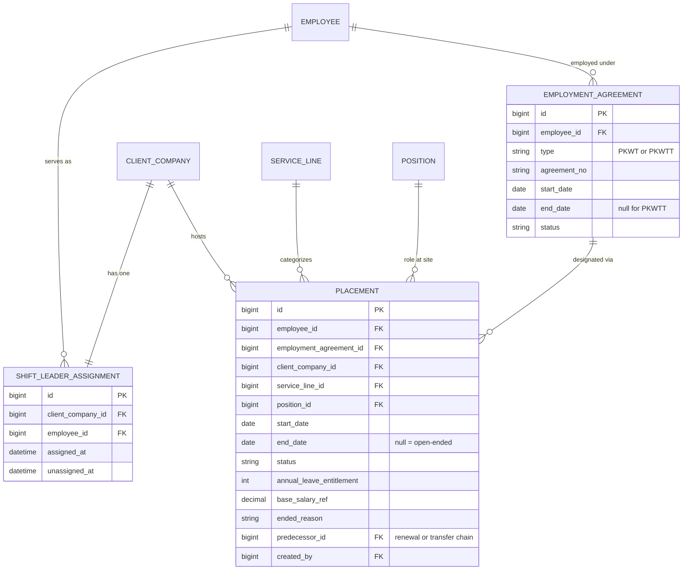
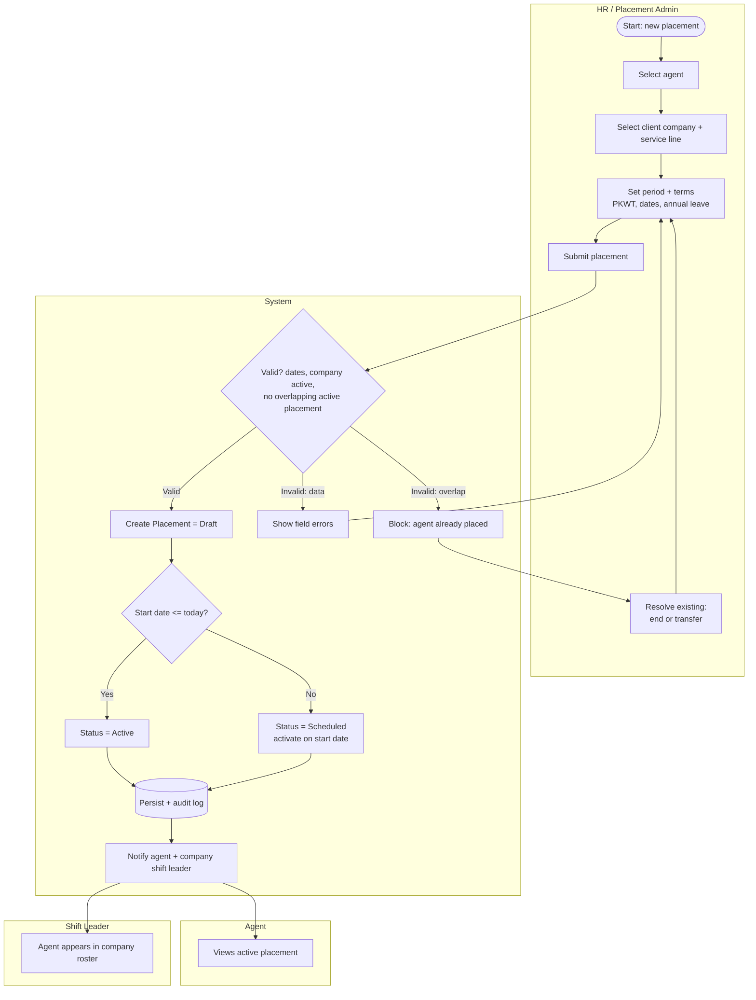
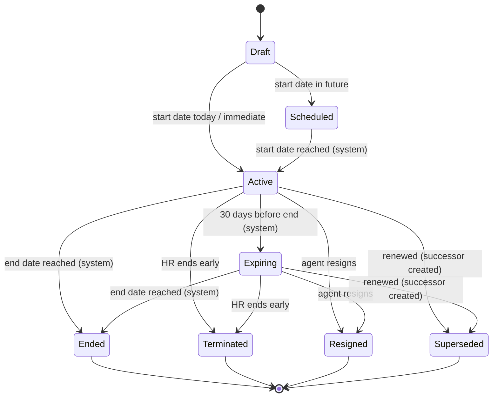
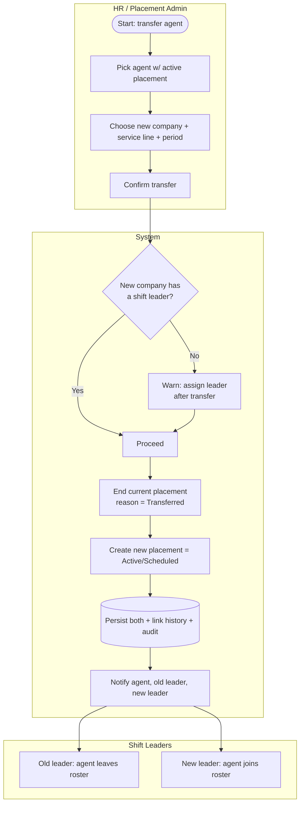
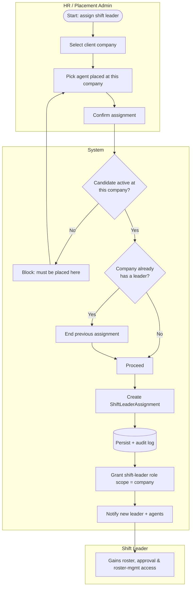
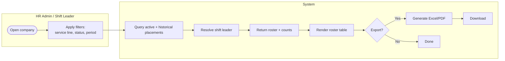

# E3 — Placement Management · Feature Document

> **Epic:** E3 Placement Management (the differentiator) · **Status:** Draft v1 · **Parent:** [EPICS.md](../../EPICS.md)
> Placing agents at client companies, in a service line, for a contract period — with history, lifecycle, and the per-company shift leader.

---

## 1. Goal & outcome

Make **placement a first-class entity** (in the legacy system it was just a string on `employee_contracts`). After this epic, SWP can place an agent at a client company in a service line for a defined period, track the full placement history of every agent, and know exactly which shift leader owns each company's on-site team. Every downstream module (shift scheduling, attendance, leave, overtime) hangs off the placement record.

## 2. Actors & roles

| Actor | Involvement in this epic |
|---|---|
| **HR / Placement Admin** | Primary driver — creates, activates, transfers, and ends placements; assigns shift leaders. |
| **Super Admin** | Same powers as HR admin + can override/correct any placement; manages master data (companies, service lines). |
| **Shift Leader** | Designated per company; consumes the roster (read) and is assigned/unassigned by HR admin. |
| **Agent** | Subject of a placement; views own active placement & history (read-only). |
| **System** | Validates rules, manages status transitions, emits notifications, writes audit log. |

## 3. Scope

**In scope:** placement creation, lifecycle/status, re-placement & transfer with history, shift-leader assignment (1 per company), company roster view.
**Out of scope (other epics):** the shift master & rostering (E4), attendance (E5), leave (E6), overtime (E7), payroll figures (E8 read-only), and the migration of legacy placement data (E9).

## 4. Domain entities

> **Employment vs placement (Indonesian labor law):** In outsourcing (alih daya), the employment relationship is between the agent and **SWP**, not the client. So the **EmploymentAgreement** (`PKWT` fixed-term / `PKWTT` indefinite) lives at the employee↔SWP level (modeled in E2), and a **Placement** is only a *work designation* to a client site. A placement references its employment agreement; for `PKWT` the placement period must fall within the agreement's validity, while `PKWTT` agreements allow **open-ended** placements.

**Invariants (confirmed 2026-05-29 — see §7):**
- **INV-1:** an agent has **at most one *active* placement** at any moment (no split/multi-site agents). ✅
- **INV-2:** a client company with active placements has **exactly one** shift leader.
- **INV-3:** a shift leader leads **exactly one** company (strict 1:1). ✅
- **INV-4:** the designated shift leader must themselves be an agent **actively placed at that same company**.

## 5. Features

| ID | Feature | PRD |
|----|---------|-----|
| **F3.1** | Agent Placement (create & activate) | [agent-placement.md](prds/agent-placement.md) |
| **F3.2** | Placement Lifecycle & Status | [placement-lifecycle.md](prds/placement-lifecycle.md) |
| **F3.3** | Re-placement & Transfer (with history) | [replacement-transfer.md](prds/replacement-transfer.md) |
| **F3.4** | Shift-Leader Assignment | [shift-leader-assignment.md](prds/shift-leader-assignment.md) |
| **F3.5** | Company Placement Roster | [company-roster.md](prds/company-roster.md) |

---

### F3.1 — Agent Placement (create & activate)

HR admin places an agent at a client company, in a service line, for a contract period, capturing terms (PKWT reference, period, annual-leave entitlement, base-salary reference). The placement starts as `Draft`, validates against the invariants, then activates on/after its start date.

**Entities:** `Placement` (create), reads `Employee`, `ClientCompany`, `ServiceLine`. **Depends on:** E2 (master data).

---

### F3.2 — Placement Lifecycle & Status

Manages the placement state machine and the transitions HR admins trigger (renewal, termination, resignation) plus system-driven transitions (auto-activate on start date, flag expiring at **30 days** before end — hardcoded). **Renewal creates a linked successor placement** (a new record whose `predecessor_id` points to the old one); the prior placement is closed as `Superseded`. History is never edited in place.

**Entities:** `Placement` (status, ended_reason, resign_at, `predecessor_id`). **Depends on:** F3.1.

---

### F3.3 — Re-placement & Transfer (with history)

Move an agent from one company/service line to another. Ends the current placement (reason = `Transferred`) and opens a new one, preserving the full chain so an agent's placement history is always queryable.

**Entities:** `Placement` (close + create, history link). **Depends on:** F3.1, F3.2.

---

### F3.4 — Shift-Leader Assignment

Designate exactly one shift leader per client company. The leader must be an agent actively placed at that company (INV-4). Reassignment ends the prior assignment.

**Entities:** `ShiftLeaderAssignment` (create/close), `Employee` role scope. **Depends on:** F3.1, E1 (RBAC).

---

### F3.5 — Company Placement Roster

A per-company view listing all agents placed there, their service line, status, period, and the company's shift leader — with filters and export. This is the HR admin's and shift leader's day-to-day view.

**Entities:** reads `Placement`, `ShiftLeaderAssignment`. **Depends on:** F3.1, F3.4, E10 (export).

---

## 6. Cross-feature rules

- All state changes write an **audit log** entry (who, when, before/after) — see E1.
- **History is never destroyed:** ending/transferring a placement closes the record, never deletes it.
- Notifications (E10) fire on: placement activated, expiring soon, ended/terminated, transfer, shift-leader (re)assigned.

## 7. Decisions & open questions

**Resolved (2026-05-29):**
- ✅ **INV-1** — one active placement per agent (no split/multi-site).
- ✅ **INV-3** — shift leader strictly 1:1 with a company (no small-site exceptions for now).
- ✅ **Renewal** creates a **linked successor** placement (`predecessor_id`), never an in-place extension. → F3.2
- ✅ **Expiring threshold = 30 days**, hardcoded (no config yet).
- ✅ **Headcount targets** are **reporting only** (E10) — not modeled at placement level.
- ✅ **1-day buffer** between placements — no overlap, no same-day handover. → F3.1 / PRD BR-2
- ✅ **Position** comes from master data (E2) but is set **per placement**, so the same agent may hold a different position at a different company.
- ✅ **Backdating** allowed for **HR admin** (with reason + audit), not Super Admin only.
- ✅ **Employment agreement (PKWT/PKWTT)** is separate from placement and tied to SWP↔employee (E2); placement `end_date` may be open-ended (PKWTT) and, for PKWT, must sit within the agreement period.

**Resolved (round 2):**
- ✅ **Service line** → **manual classification** later, after SWP confirms (no inference for now). → [DATA-MAPPING.md](DATA-MAPPING.md) G-1.
- ✅ **Sub-companies** (`role=4`) → **not used by SWP; ignore**. ClientCompany = `companies.role=2` only. → G-6.
- ✅ **PKWT overrun** → **auto-cap** placement end to agreement end (PRD BR-1b).
- ✅ **Buffer** → next day after prior end is sufficient.

**Still open (data verification, deferred to E9):**
1. Confirm how legacy distinguishes PKWT vs PKWTT (likely `contract_status_id` / absence of `contract_end_at`). → DATA-MAPPING.md G-4.
