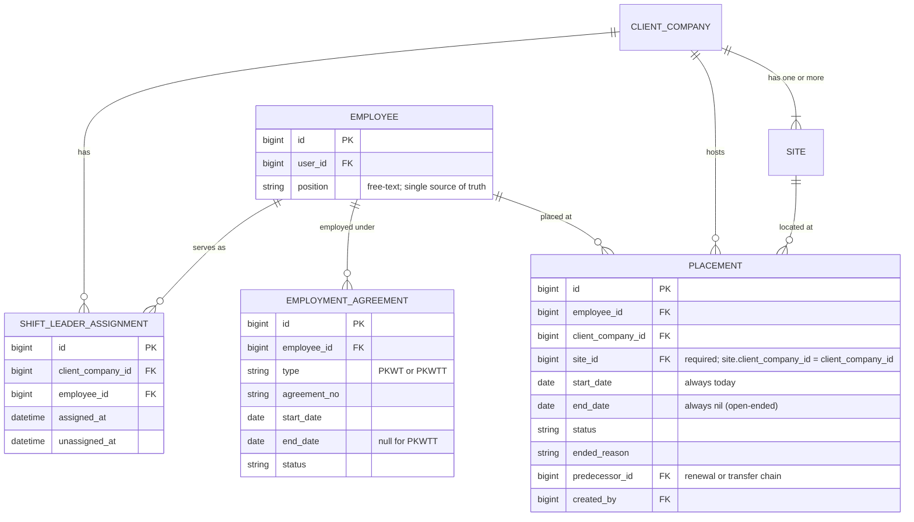
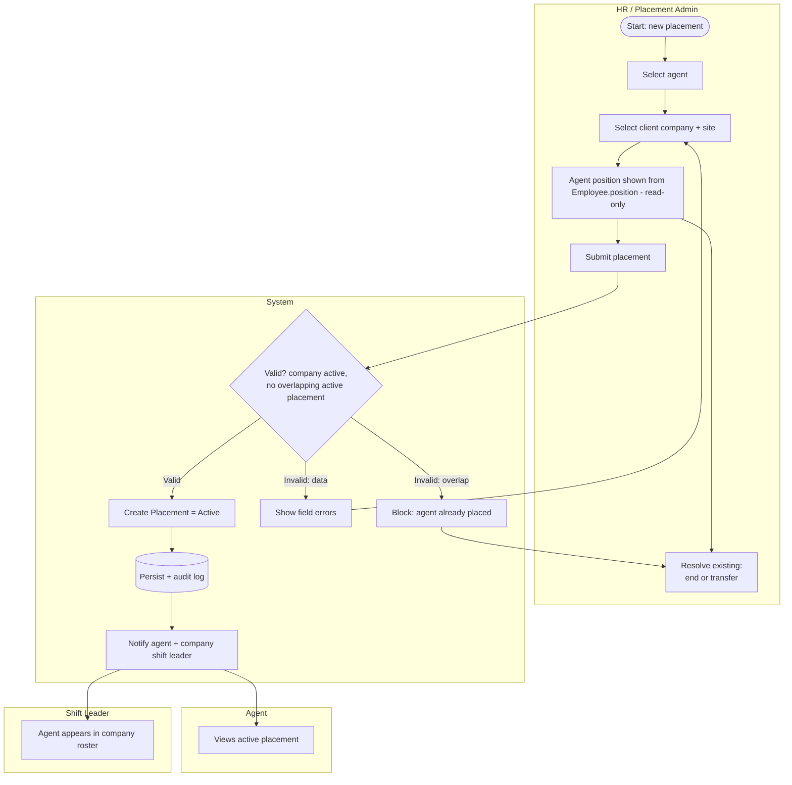
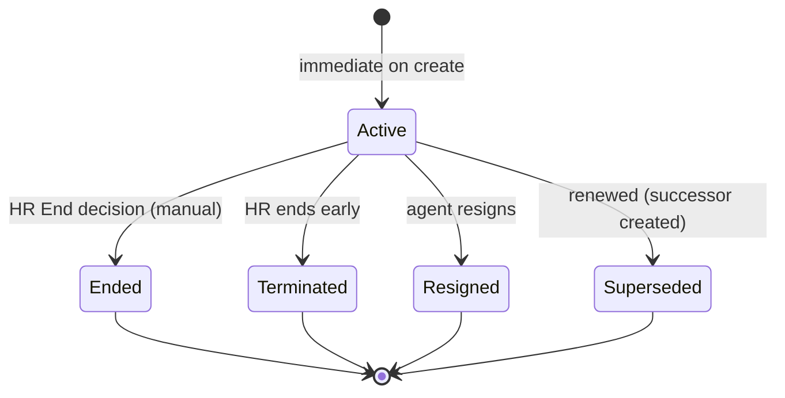
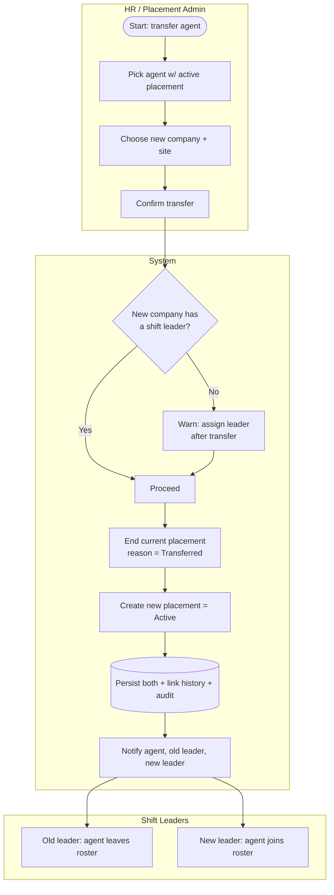
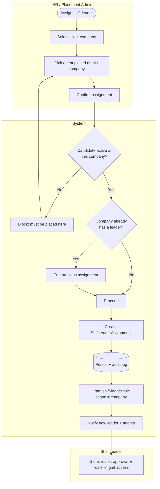
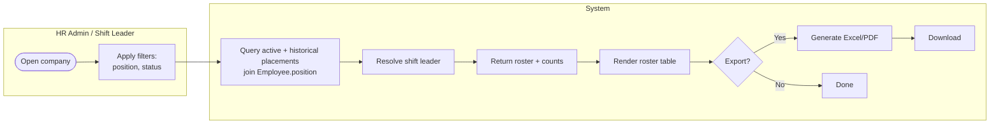

# E3 — Placement Management · Feature Document

> **Epic:** E3 Placement Management (the differentiator) · **Status:** Draft v2 · **Parent:** [EPICS.md](../../EPICS.md)
> Placing agents at client companies — with history, lifecycle, and the per-company shift leader. Position is held on the Employee record (E2), not on the placement. Placement is a "currently active at company X" record, not a date-bounded contract.

---

## 1. Goal & outcome

Make **placement a first-class entity** (in the legacy system it was just a string on `employee_contracts`). After this epic, SWP can place an agent at a client company, track the full placement history of every agent, and know exactly which shift leader owns each company's on-site team. Placement is a **"currently active at company X"** record — `start_date` is always today, `end_date` is always nil (open-ended); no Scheduled/future-dated state, no backdating, no period validation. The agent's **position** lives on `Employee.position` (E2), not on the placement. Transfer does not change position. Every downstream module (shift scheduling, attendance, leave, overtime) hangs off the placement record.

## 2. Actors & roles

| Actor | Involvement in this epic |
|---|---|
| **HR / Placement Admin** | Keeps **global oversight + override** — creates, activates, transfers, and ends placements anywhere, assigns shift leaders. The routine arranger within scope is now the Lead; HR is the fallback outside any lead's scope and the final authority everywhere. |
| **Lead** | Company-scoped operational approver/arranger. **Arranges placements** — creates, transfers, renews, and ends placements — within their **assigned client companies** (scoped). Cannot add employees, run payroll, or assign shift leaders. |
| **Super Admin** | Same powers as HR admin + can override/correct any placement; manages master data (companies, sites). |
| **Shift Leader** | Designated per company; consumes the roster (read) and is assigned/unassigned by HR admin. |
| **Agent** | Subject of a placement; views own active placement & history (read-only). |
| **System** | Validates rules, manages status transitions, emits notifications, writes audit log. |

## 3. Scope

**In scope:** placement creation (located at a **Site**, E2 F2.6), lifecycle/status (including manual End by HR), re-placement & transfer with history, shift-leader assignment (1 per **company** — company-wide only), company roster view.
**Out of scope (other epics):** the shift master & rostering (E4), attendance (E5), leave (E6), overtime (E7), payroll figures (E8 read-only), and the migration of legacy placement data (E9).

> **Position** is held on `Employee.position` (E2), not on Placement. There is no position field on the placement record. *(Resolved 2026-06-19 — position moves to Employee as the single source of truth; transfer does not change position.)*

## 4. Domain entities

```mermaid
erDiagram
    EMPLOYEE ||--o{ EMPLOYMENT_AGREEMENT : "employed under"
    EMPLOYEE ||--o{ PLACEMENT : "placed at"
    CLIENT_COMPANY ||--o{ PLACEMENT : "hosts"
    CLIENT_COMPANY ||--|{ SITE : "has one or more"
    SITE ||--o{ PLACEMENT : "located at"
    CLIENT_COMPANY ||--o{ SHIFT_LEADER_ASSIGNMENT : "has"
    EMPLOYEE ||--o{ SHIFT_LEADER_ASSIGNMENT : "serves as"

    EMPLOYEE {
        bigint id PK
        bigint user_id FK
        string position "free-text; single source of truth"
    }
    EMPLOYMENT_AGREEMENT {
        bigint id PK
        bigint employee_id FK
        string type "PKWT or PKWTT"
        string agreement_no
        date start_date
        date end_date "null for PKWTT"
        string status
    }
    PLACEMENT {
        bigint id PK
        bigint employee_id FK
        bigint client_company_id FK
        bigint site_id FK "required; site.client_company_id = client_company_id"
        date start_date "always today"
        date end_date "always nil (open-ended)"
        string status
        string ended_reason
        bigint predecessor_id FK "renewal or transfer chain"
        bigint created_by FK
    }
    SHIFT_LEADER_ASSIGNMENT {
        bigint id PK
        bigint client_company_id FK
        bigint employee_id FK
        datetime assigned_at
        datetime unassigned_at
    }
```

> **Employment vs placement (Indonesian labor law):** In outsourcing (alih daya), the employment relationship is between the agent and **SWP**, not the client. So the **EmploymentAgreement** (`PKWT` fixed-term / `PKWTT` indefinite) lives at the employee↔SWP level (modeled in E2), and a **Placement** is only a *work designation* to a client site. Placement is **not date-bounded**: `start_date` is always today (immediate activation) and `end_date` is always nil (open-ended). There is no Scheduled/future-dated state, no backdating, no period validation. END is still supported (manual end by HR). The employment agreement is a **document-only** record (E2 F2.2) — it has no system impact on placement validation, expiry detection, or offboarding cascade.

**Invariants:**
- **INV-1:** an agent has **at most one *active* placement** at any moment (no split/multi-site agents). ✅
- **INV-5:** a placement is located at **exactly one `Site`** (`Placement.site_id` required, E2 F2.6), and that site belongs to the placement's client company. ✅
- A shift leader is **company-wide** (always 1 per company, no per-site leaders):
  - **INV-2:** a company with active placements has **exactly one** shift leader.
  - **INV-3:** a shift leader leads **exactly one** company — strict 1:1. ✅
  - **INV-4:** the designated shift leader must themselves be an agent **actively placed within that company**.

## 5. Features

| ID | Feature | PRD |
|----|---------|-----|
| **F3.1** | Agent Placement (create & activate) | [agent-placement.md](prds/agent-placement.md) |
| **F3.2** | Placement Lifecycle & Status | [placement-lifecycle.md](prds/placement-lifecycle.md) |
| **F3.3** | Re-placement & Transfer (with history) | [replacement-transfer.md](prds/replacement-transfer.md) |
| **F3.4** | Shift-Leader Assignment | [shift-leader-assignment.md](prds/shift-leader-assignment.md) |
| **F3.5** | Company Placement Roster | [company-roster.md](prds/company-roster.md) |

---

### F3.1 — Agent Placement (create & activate)

HR admin places an agent at a client company. Placement is a **"currently active at company X"** record: `start_date` is always today, `end_date` is always nil (open-ended). There is no Scheduled/future-dated state, no backdating, no period validation. The agent's **position** is read from `Employee.position` (E2 F2.1), not entered on the placement. The **employment agreement is document-only** (E2 F2.2) — it has no bearing on placement creation or validation. Placement starts as `Active` immediately; END is still supported (manual end by HR via F3.2).

```mermaid
flowchart TD
    subgraph HR[HR / Placement Admin]
        A1([Start: new placement]) --> A2[Select agent]
        A2 --> A3[Select client company + site]
        A3 --> A4[Agent position shown from Employee.position - read-only]
        A4 --> A6[Resolve existing:<br/>end or transfer]
        A4 --> A7[Submit placement]
    end
    subgraph SYS[System]
        A7 --> S1{Valid? company active,<br/>no overlapping active placement}
        S1 -- Invalid: overlap --> S2[Block: agent already placed] --> A6
        S1 -- Invalid: data --> S3[Show field errors] --> A3
        S1 -- Valid --> S4[Create Placement = Active]
        S4 --> S8[(Persist + audit log)]
        S8 --> S9[Notify agent + company shift leader]
    end
    subgraph AG[Agent]
        S9 --> G1[Views active placement]
    end
    subgraph SL[Shift Leader]
        S9 --> L1[Agent appears in company roster]
    end
```

**Entities:** `Placement` (create), reads `Employee`, `ClientCompany`, `Site`. **Depends on:** E2 (master data, Employee.position).

---

### F3.2 — Placement Lifecycle & Status

Manages the placement state machine and the transitions HR admins trigger (end, renewal, termination, resignation). Placement is not date-bounded — there is no Scheduled/future-dated state, no Expiring flag, and no auto-activate. Placement starts as `Active` immediately on creation. **End** is a manual HR action that closes the placement. **Renewal creates a linked successor placement** (a new record whose `predecessor_id` points to the old one); the prior placement is closed as `Superseded`. History is never edited in place. Placement-end here is a *work-designation* change only — it **never revokes the agent's login**; login revocation is employment-end only (E2 [F2.7](../E2-identity/prds/offboarding.md), INV-6 / OB-2).

```mermaid
stateDiagram-v2
    [*] --> Active: immediate on create
    Active --> Ended: HR End decision (manual)
    Active --> Terminated: HR ends early
    Active --> Resigned: agent resigns
    Active --> Superseded: renewed (successor created)
    Ended --> [*]
    Terminated --> [*]
    Resigned --> [*]
    Superseded --> [*]
```

**Entities:** `Placement` (status, ended_reason, resign_at, `predecessor_id`). **Depends on:** F3.1.

---

### F3.3 — Re-placement & Transfer (with history)

Move an agent from one company (or site) to another. Ends the current placement (reason = `Transferred`) and opens a new one, preserving the full chain so an agent's placement history is always queryable. Transfer does **not** change position — position lives on `Employee.position` (E2) and is unchanged.

```mermaid
flowchart TD
    subgraph HR[HR / Placement Admin]
        T1([Start: transfer agent]) --> T2[Pick agent w/ active placement]
        T2 --> T3[Choose new company + site]
        T3 --> T6[Confirm transfer]
    end
    subgraph SYS[System]
        T6 --> V1{New company has<br/>a shift leader?}
        V1 -- No --> V2[Warn: assign leader<br/>after transfer]
        V1 -- Yes --> V3[Proceed]
        V2 --> V3
        V3 --> V4[End current placement<br/>reason = Transferred]
        V4 --> V5[Create new placement = Active]
        V5 --> V6[(Persist both + link history + audit)]
        V6 --> V7[Notify agent, old leader, new leader]
    end
    subgraph SL[Shift Leaders]
        V7 --> L1[Old leader: agent leaves roster]
        V7 --> L2[New leader: agent joins roster]
    end
```

**Entities:** `Placement` (close + create, history link). **Depends on:** F3.1, F3.2.

---

### F3.4 — Shift-Leader Assignment

Designate exactly one shift leader per client company (company-wide). The leader must be an agent actively placed at that company (INV-4). Reassignment ends the prior assignment.

```mermaid
flowchart TD
    subgraph HR[HR / Placement Admin]
        D1([Assign shift leader]) --> D2[Select client company]
        D2 --> D3[Pick agent placed at this company]
        D3 --> D6[Confirm assignment]
    end
    subgraph SYS[System]
        D6 --> C1{Candidate active at<br/>this company?}
        C1 -- No --> C2[Block: must be placed here] --> D3
        C1 -- Yes --> C3{Company already<br/>has a leader?}
        C3 -- Yes --> C4[End previous assignment]
        C3 -- No --> C5[Proceed]
        C4 --> C5
        C5 --> C6[Create ShiftLeaderAssignment]
        C6 --> C7[(Persist + audit log)]
        C7 --> C8[Grant shift-leader role scope = company]
        C8 --> C9[Notify new leader + agents]
    end
    subgraph SL[Shift Leader]
        C9 --> L1[Gains roster, approval & roster-mgmt access]
    end
```

**Entities:** `ShiftLeaderAssignment` (create/close), `Employee` role scope. **Depends on:** F3.1, E1 (RBAC).

---

### F3.5 — Company Placement Roster

A per-company view listing all agents placed there, their position (from Employee.position, E2), status, and the company's shift leader — with filters and export. This is the HR admin's and shift leader's day-to-day view.

```mermaid
flowchart LR
    subgraph User[HR Admin / Shift Leader]
        R1([Open company]) --> R2[Apply filters:<br/>position, status]
    end
    subgraph SYS[System]
        R2 --> Q1[Query active + historical placements<br/>join Employee.position]
        Q1 --> Q2[Resolve shift leader]
        Q2 --> Q3[Return roster + counts]
        Q3 --> R3[Render roster table]
        R3 --> R4{Export?}
        R4 -- Yes --> Q4[Generate Excel/PDF] --> R5[Download]
        R4 -- No --> R6[Done]
    end
```

**Entities:** reads `Placement`, `ShiftLeaderAssignment`. **Depends on:** F3.1, F3.4, E10 (export).

---

## 6. Cross-feature rules

- All state changes write an **audit log** entry (who, when, before/after) — see E1.
- **History is never destroyed:** ending/transferring a placement closes the record, never deletes it.
- Notifications (E10) fire on: placement activated, ended/terminated, transfer, shift-leader (re)assigned.

## 7. Decisions & open questions

**Resolved (2026-06-19 — placement decoupled from time, position on Employee, leader company-wide):**
- ✅ **Placement is decoupled from time** — `start_date` is always today, `end_date` is always nil (open-ended). No Scheduled state, no future-dated placements, no backdating, no period validation. Placement is a "currently active at company X" record, not a date-bounded contract. END is still supported (manual end by HR, F3.2).
- ✅ **Position is on Employee, not Placement** — `Employee.position` (E2 F2.1) is the single source of truth. Placement no longer has its own position field. Transfer does not change position.
- ✅ **Leader scope is company-wide only** — `leader_scope` removed from `ClientCompany`; shift leader always covers the entire company. No per-site leaders. INV-2/3/4 simplified accordingly.
- ✅ **Employment agreement is document-only** (E2 F2.2) — it has no system impact on placement validation, expiry detection, or offboarding cascade. The employment_agreement_id and awaiting_agreement fields are removed from Placement.

**Resolved (previous rounds — reconciled 2026-06-19):**
- ✅ **INV-1** — one active placement per agent (no split/multi-site).
- ✅ **INV-3** — shift leader strictly 1:1 with a company.
- ✅ **Renewal** creates a **linked successor** placement (`predecessor_id`), never an in-place extension. → F3.2
- ✅ **Position** is a **free-text string on Employee** (E2 F2.1) — the Position master and `service_line` are removed entirely.
- ✅ **Compensation & annual-leave entitlement are E2 terms, not placement terms** *(2026-06-07)*.
- ✅ **Placement-end never revokes login.** Transfer / renewal / supersede / any placement close changes only the *work designation*; login revocation is **employment-end only** (E2 F2.7, INV-6 / OB-2).
- ✅ **Shift leader identified by active `shift_leader_assignments` row**; role + scope derived at request time *(2026-06-08)*.
- ✅ **Single entry point** for leader assignment = client-company detail "Pemimpin Shift" tab.

**Still open (data verification, deferred to E9):**
1. Confirm how legacy distinguishes PKWT vs PKWTT (likely `contract_status_id` / absence of `contract_end_at`). → DATA-MAPPING.md G-4.
