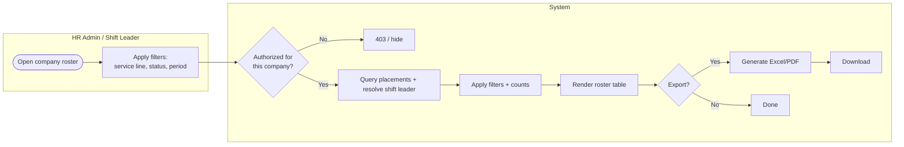

# PRD · F3.5 — Company Placement Roster

> **Epic:** E3 Placement Management · **Feature:** F3.5 · **Status:** Draft v1
> **Parent:** [FEATURE.md](../FEATURE.md) · **Owner:** _TBD_

---

## 1. Context & problem

HR admins and shift leaders need a single, reliable view of **who is placed at a client company** — the active team, their service line, position, period, status, and the company's shift leader — plus the ability to look back at past placements and export the list. This is the day-to-day operational lens over everything F3.1–F3.4 produce.

## 2. Goals & non-goals

**Goals**
- A per-company roster of placements (active + historical) with the company's current shift leader.
- Filters: service line, status, period, active-only vs include-history.
- Export to Excel/PDF.
- Correct visibility scoping: HR sees all companies; a shift leader sees only their own.

**Non-goals**
- Editing placements (done in F3.1–F3.3) — the roster is read-only.
- Scheduling/attendance views → E4/E5.

## 3. Actors

- **HR / Placement Admin**, **Super Admin** — any company.
- **Shift Leader** — their own company only.
- **System** — query, scope, render, export.

## 4. Workflow



## 5. Business rules

| Ref | Rule |
|-----|------|
| RO-1 | The roster lists placements for one client company: agent, service line, position, period, status, and (for the company) the current shift leader. |
| RO-2 | Default view = **active + scheduled** placements; a toggle includes historical (terminal) placements. |
| RO-3 | Filters: service line, status, and period (date range overlap). Combinable. |
| RO-4 | **Scope:** HR/Super Admin can open any company; a **shift leader can open only the company they lead** (others are hidden/403). |
| RO-5 | The roster shows summary counts (total active, by service line, by status). |
| RO-6 | Export (Excel/PDF) reflects the **currently applied filters** and records an audit entry (who exported what, when). |
| RO-7 | Read-only — no mutation from this view; row actions deep-link to F3.1–F3.4. The shift-leader **"Ganti"** action and the empty-leader prompt link to the **client-company "Pemimpin Shift" tab** (E2 F2.3), the single entry point for assign/replace/revoke (F3.4 SL-11). |
| RO-8 | Sorted by status (active first) then agent name; paginated for large companies. |

## 6. Data model

Read-only projection over `Placement` + `Employee` + `ServiceLine` + `Position` + `ShiftLeaderAssignment`. No new entities.

## 7. Acceptance criteria (Gherkin)

```gherkin
Feature: Company placement roster

  Background:
    Given "Plaza Senayan" has 12 active placements across "Parking" and "Building Management"
    And "Budi" is its shift leader

  Scenario: HR admin views a company roster
    Given I am an HR admin
    When I open the roster for "Plaza Senayan"
    Then I see all active and scheduled placements with agent, service line, position, period, and status
    And I see "Budi" listed as the shift leader
    And I see summary counts by service line and status

  Scenario: Filter by service line
    When I filter the roster by service line "Parking"
    Then only "Parking" placements are shown
    And the counts update accordingly

  Scenario: Include historical placements
    When I enable "include history"
    Then ended, terminated, resigned, transferred, and superseded placements also appear

  Scenario: Shift leader sees only their company
    Given I am the shift leader "Budi"
    When I open rosters
    Then I can open "Plaza Senayan"
    And I cannot open the roster of any company I do not lead

  Scenario: Export reflects active filters
    Given I filtered by service line "Building Management"
    When I export to Excel
    Then the file contains only "Building Management" placements
    And the export is recorded in the audit log

  Scenario: Empty company
    Given "New Tower" has no placements yet
    When I open its roster
    Then I see an empty state and a prompt to create the first placement (F3.1)
```

## 8. Cases & edge cases

| # | Case | Expected behavior |
|---|------|-------------------|
| C-1 | Company with no shift leader | Roster shows "No shift leader — assign one" linking to the company **"Pemimpin Shift" tab** (E2 F2.3 / F3.4). |
| C-2 | Very large company (1000+ placements) | Server-side pagination + filtering; export streams/queues for big result sets. |
| C-3 | Placement spanning the filter period boundary | Included if its period overlaps the filter range (RO-3). |
| C-4 | Shift leader deep-links to another company's roster URL | Blocked by scope (RO-4), 403. |
| C-5 | Export while data changes mid-generation | Export is a point-in-time snapshot of the applied query. |
| C-6 | Agent appears via a superseded + active placement (post-renewal) | Active shown by default; superseded shown only with history enabled. |

## 9. Dependencies

- **F3.1–F3.4** (data shown), **E1** (scope/RBAC + audit), **E10** (export engine), and shares the export/report tooling with reporting.

## 10. Decisions & open questions

- ✅ Read-only; HR sees all, shift leader sees own company only.
- ✅ Default active+scheduled; history behind a toggle.
- **Open:** beyond the company roster, do HR admins need a **global cross-company placement search** (all agents, any company)? (likely yes → propose as an E10 reporting view, not here.)
