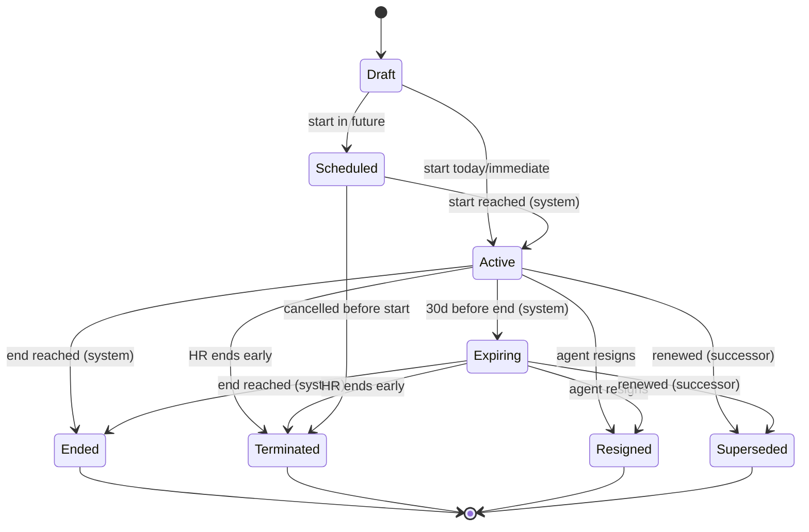

# PRD · F3.2 — Placement Lifecycle & Status

> **Epic:** E3 Placement Management · **Feature:** F3.2 · **Status:** Draft v1
> **Parent:** [FEATURE.md](../FEATURE.md) · **Owner:** _TBD_

---

## 1. Context & problem

A placement is not static — it activates, ages toward its end date, gets renewed, or is cut short by termination or resignation. Without an explicit, enforced state machine, the system can't reliably tell who is *currently* placed, surface contracts about to expire, or keep a clean history. This PRD owns the **placement state machine** and every transition into and out of it.

## 2. Goals & non-goals

**Goals**
- A single, enforced status model for every placement.
- System-driven transitions: auto-activate scheduled placements, flag expiring ones (30 days), auto-end on expiry.
- HR-driven transitions: terminate early, record resignation, **renew via a linked successor**.
- Every transition is audited and notifies the right people.

**Non-goals**
- Creating the first placement → F3.1.
- Moving an agent to a *different* company/service line → F3.3 (transfer).
- Assigning/vacating the shift leader → F3.4 (this PRD only *triggers* a vacancy check).

## 3. Actors

- **HR / Placement Admin** — terminates, records resignation, renews.
- **Super Admin** — same + corrections on terminal records.
- **System** (scheduled job, org timezone **Asia/Jakarta**) — auto-activate, flag expiring, auto-end.
- **Agent / Shift Leader** — notified of changes affecting them.

## 4. State model



## 5. Business rules

| Ref | Rule |
|-----|------|
| LC-1 | Status ∈ {`Draft`, `Scheduled`, `Active`, `Expiring`, `Ended`, `Terminated`, `Resigned`, `Superseded`}. `Ended`/`Terminated`/`Resigned`/`Superseded` are **terminal & immutable** (Super Admin override only). |
| LC-2 | A `Scheduled` placement auto-transitions to `Active` on its `start_date` (system job, Asia/Jakarta). |
| LC-3 | An `Active` placement with an `end_date` auto-transitions to `Expiring` **30 days** before `end_date` (hardcoded). **Open-ended placements never expire.** |
| LC-4 | An `Active`/`Expiring` placement auto-transitions to `Ended` (reason `EndOfTerm`) once `end_date` passes. |
| LC-5 | HR admin may **terminate** an `Active`/`Expiring`/`Scheduled` placement early with a **reason** + effective date → `Terminated`. |
| LC-6 | Recording an agent **resignation** closes the active placement → `Resigned` with `resign_at`. (The employment agreement itself is closed in E2.) |
| LC-7 | **Renewal** (same company + service line) creates a **successor placement** (`predecessor_id` → old) and sets the prior placement to `Superseded` effective the successor's `start_date`. The successor obeys F3.1 rules (incl. the 1-day buffer). |
| LC-8 | Any transition into a terminal state for a placement whose agent is that company's **shift leader** triggers a **leader-vacancy check** (F3.4). |
| LC-9 | Every transition writes an audit-log entry (actor or `system`, before/after, reason) and fires the matching notification (E10). |
| LC-10 | `Expiring`/expiry notifications go to HR admin + the company shift leader; activation notifications go to the agent + shift leader. |

## 6. Data model (lifecycle fields on Placement)

| Field | Type | Notes |
|-------|------|-------|
| `status` | enum | per LC-1 |
| `status_changed_at` | datetime | last transition time |
| `ended_reason` | enum | `EndOfTerm` \| `Terminated` \| `Resigned` \| `Transferred` \| `Superseded` (null while open) |
| `ended_at` | date | effective end for any terminal state |
| `termination_reason` | text | required when `Terminated` |
| `resign_at` | date | required when `Resigned` |
| `predecessor_id` | FK → Placement | set on the successor created by renewal |
| `successor_id` | FK → Placement | back-reference (nullable) |

## 7. Acceptance criteria (Gherkin)

```gherkin
Feature: Placement lifecycle

  Scenario: Scheduled placement auto-activates on its start date
    Given a placement for "Budi" with status "Scheduled" starting today
    When the daily activation job runs in Asia/Jakarta time
    Then the placement status becomes "Active"
    And "Budi" and the company shift leader are notified

  Scenario: Active placement is flagged Expiring 30 days before end
    Given an active placement ending in 30 days
    When the expiry job runs
    Then the placement status becomes "Expiring"
    And HR admin and the shift leader receive an expiring notification

  Scenario: Open-ended placement never expires
    Given an active placement with no end date
    When the expiry job runs
    Then the placement remains "Active"

  Scenario: Placement auto-ends after its end date
    Given an expiring placement whose end date passed yesterday
    When the end-of-term job runs
    Then the placement status becomes "Ended" with reason "EndOfTerm"

  Scenario: HR terminates a placement early
    Given an active placement for "Budi"
    When an HR admin terminates it with a reason and an effective date
    Then the placement status becomes "Terminated"
    And the reason is stored and audited

  Scenario: Renewal creates a linked successor
    Given an expiring placement P1 for "Budi" at "Plaza Senayan" in "Parking"
    When an HR admin renews it with a new period starting the day after P1 ends
    Then a new placement P2 is created with predecessor set to P1
    And P1 becomes "Superseded" effective P2's start date
    And P2 satisfies the 1-day buffer rule

  Scenario: Terminal placements are immutable
    Given a placement with status "Ended"
    When an HR admin tries to edit its dates
    Then the change is rejected
    And only a Super Admin override is permitted

  Scenario: Ending the shift leader's own placement triggers a vacancy
    Given "Budi" is the shift leader of "Plaza Senayan"
    And his placement there is terminated
    Then a shift-leader vacancy is raised for "Plaza Senayan" (F3.4)
```

## 8. Cases & edge cases

| # | Case | Expected behavior |
|---|------|-------------------|
| C-1 | Renewal period leaves a gap (successor starts >1 day after old end) | Allowed; old placement still ends naturally, successor `Scheduled`. |
| C-2 | Renewal with same/overlapping dates as predecessor | Rejected by the 1-day buffer (F3.1 BR-2). |
| C-3 | Terminate a `Scheduled` (not yet active) placement | Allowed → `Terminated`; never activates. |
| C-4 | Resignation effective before `end_date` | Placement `Resigned` at `resign_at`; remaining schedule (E4) is cancelled. |
| C-5 | end_date edited to the past on an active placement | Treated as immediate end-of-term on next job run (or blocked — see §10). |
| C-6 | System job missed a day (downtime) | Job is **catch-up safe**: evaluates all due transitions by date, not "today only". |
| C-7 | Multiple placements of one agent over time | Only one is ever non-terminal at a time (INV-1); history chain readable via predecessor/successor. |
| C-8 | Auto-cap interaction: PKWT agreement extended after renewal | Successor placement may extend up to the new agreement end (F3.1 BR-1b). |

## 9. Dependencies

- **F3.1** — placement creation (successor reuses it).
- **F3.4** — leader-vacancy trigger (LC-8).
- **E4** — ending a placement cancels future schedules.
- **E1 / E10** — audit log + notifications.
- A **scheduled job runner** (platform) for LC-2/3/4.

## 10. Decisions & open questions

- ✅ Renewal = linked successor (`predecessor_id`); prior → `Superseded`.
- ✅ Expiring = 30 days, hardcoded; open-ended never expires.
- **Open:** C-5 — should editing `end_date` into the past be allowed (immediate end) or blocked? (default: blocked, use Terminate instead.)
- **Open:** does resignation always close the placement immediately, or allow a future-dated last working day? (assumed: effective `resign_at`, may be future.)
