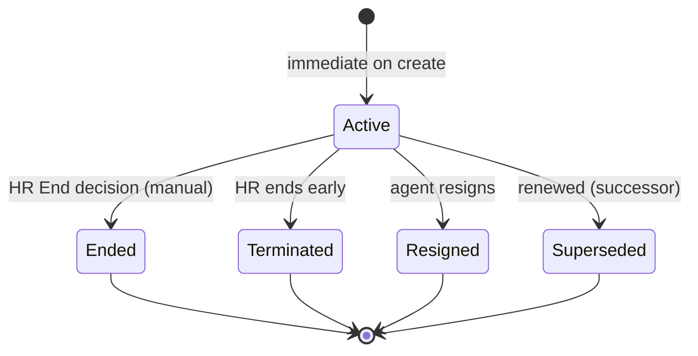

# PRD · F3.2 — Placement Lifecycle & Status

> **Epic:** E3 Placement Management · **Feature:** F3.2 · **Status:** Draft v2
> **Parent:** [FEATURE.md](../FEATURE.md) · **Owner:** _TBD_

---

## 1. Context & problem

A placement is not static — it can be ended, renewed, or cut short by termination or resignation. Without an explicit, enforced state machine, the system can't reliably tell who is *currently* placed or keep a clean history. Placement is **not date-bounded** — there is no Scheduled/future-dated state, no Expiring flag, and no auto-activate. Placement starts as `Active` immediately on create. **End** is a manual HR action (the only way a placement is closed by end-of-term). This PRD owns the **placement state machine** and every transition into and out of it. *(Resolved 2026-06-19.)*

## 2. Goals & non-goals

**Goals**
- A single, enforced status model for every placement.
- HR-driven transitions: **End** (manual close), terminate early, record resignation, **renew via a linked successor**.
- Every transition is audited and notifies the right people.

**Non-goals**
- Creating the first placement → F3.1.
- Moving an agent to a *different* company/site → F3.3 (transfer).
- Assigning/vacating the shift leader → F3.4 (this PRD only *triggers* a vacancy check).

## 3. Actors

- **HR / Placement Admin** — terminates, records resignation, renews.
- **Super Admin** — same + corrections on terminal records.
- **System** (scheduled job, org timezone **Asia/Jakarta**) — auto-activate, flag expiring (raises an HR decision task); **never auto-ends employment**.
- **Agent / Shift Leader** — notified of changes affecting them.

## 4. State model


```mermaid
stateDiagram-v2
    [*] --> Active: immediate on create
    Active --> Ended: HR End decision (manual)
    Active --> Terminated: HR ends early
    Active --> Resigned: agent resigns
    Active --> Superseded: renewed (successor)
    Ended --> [*]
    Terminated --> [*]
    Resigned --> [*]
    Superseded --> [*]
```

## 5. Business rules

| Ref | Rule |
|-----|------|
| LC-1 | Status ∈ {`Active`, `Ended`, `Terminated`, `Resigned`, `Superseded`}. `Ended`/`Terminated`/`Resigned`/`Superseded` are **terminal & immutable** (Super Admin override only). |
| LC-2 | HR admin may **End** an `Active` placement — sets `ended_reason = EndOfTerm`, `ended_at`. |
| LC-3 | HR admin may **terminate** an `Active` placement early with a **reason** + effective date → `Terminated`. |
| LC-4 | Recording an agent **resignation** closes the active placement → `Resigned` with `resign_at`. (The employment agreement itself is closed in E2.) |
| LC-5 | **Renewal** (same company + site) creates a **successor placement** (`predecessor_id` → old) and sets the prior placement to `Superseded`. The successor obeys F3.1 rules. |
| LC-6 | Any transition into a terminal state for a placement whose agent is that company's **shift leader** triggers a **leader-vacancy check** (F3.4). |
| LC-7 | Every transition writes an audit-log entry (actor, before/after, reason) and fires the matching notification (E10). |
| LC-8 | Activation notifications go to the agent + shift leader; end/termination notifications go to the agent + shift leader. |

## 6. Data model (lifecycle fields on Placement)

| Field | Type | Notes |
|-------|------|-------|
| `status` | enum | per LC-1 |
| `status_changed_at` | datetime | last transition time |
| `ended_reason` | enum | `EndOfTerm` \| `Terminated` \| `Resigned` \| `Transferred` \| `Superseded` \| `Deceased` \| `Retired` \| `Absconded` (null while open) |
| `ended_at` | date | effective end for any terminal state |
| `termination_reason` | text | required when `Terminated` |
| `resign_at` | date | required when `Resigned` |
| `predecessor_id` | FK → Placement | set on the successor created by renewal |
| `successor_id` | FK → Placement | back-reference (nullable) |

## 7. Acceptance criteria (Gherkin)

```gherkin
Feature: Placement lifecycle

  Scenario: HR ends a placement
    Given an active placement for "Budi"
    When an HR admin ends it with reason EndOfTerm
    Then the placement status becomes "Ended"
    And the agent and shift leader are notified

  Scenario: HR terminates a placement early
    Given an active placement for "Budi"
    When an HR admin terminates it with a reason and an effective date
    Then the placement status becomes "Terminated"
    And the reason is stored and audited

  Scenario: Renewal creates a linked successor
    Given an active placement P1 for "Budi" at "Plaza Senayan"
    When an HR admin renews it
    Then a new placement P2 is created with predecessor set to P1
    And P1 becomes "Superseded"
    And P2 has status "Active"

  Scenario: Terminal placements are immutable
    Given a placement with status "Ended"
    When an HR admin tries to edit its dates
    Then the change is rejected
    And only a Super Admin override is permitted

  Scenario: Ending the shift leader's own placement triggers a vacancy
    Given "Budi" is the shift leader of "Plaza Senayan"
    And his placement there is ended
    Then a shift-leader vacancy is raised for "Plaza Senayan" (F3.4)
```

## 8. Cases & edge cases

| # | Case | Expected behavior |
|---|------|-------------------|
| C-1 | Resignation | Placement `Resigned` at `resign_at`; remaining schedule (E4) is cancelled. |
| C-2 | System job missed a day (downtime) | No system-driven transitions in this model; not applicable. |
| C-3 | Multiple placements of one agent over time | Only one is ever non-terminal at a time (INV-1); history chain readable via predecessor/successor. |

## 9. Dependencies

- **F3.1** — placement creation (successor reuses it).
- **F3.4** — leader-vacancy trigger (LC-6).
- **E4** — ending a placement cancels future schedules.
- **E1 / E10** — audit log + notifications.

## 10. Decisions & open questions

- ✅ **No Scheduled/Draft state** — placement starts `Active` immediately (no future-dated, no auto-activate). *(Resolved 2026-06-19.)*
- ✅ **No Expiring state** — placement is not date-bounded; END is manual by HR (LC-2). No system-driven expiry, no grace window. *(Resolved 2026-06-19.)*
- ✅ **End** is a manual HR transition — `Active → Ended` with `ended_reason = EndOfTerm`. *(Added 2026-06-19.)*
- ✅ Renewal = linked successor (`predecessor_id`); prior → `Superseded`.
- ✅ **Placement-end never revokes login** — login revocation is tied to EMPLOYMENT-end (F2.7), not to any placement transition.

_No open questions remain for this feature._
