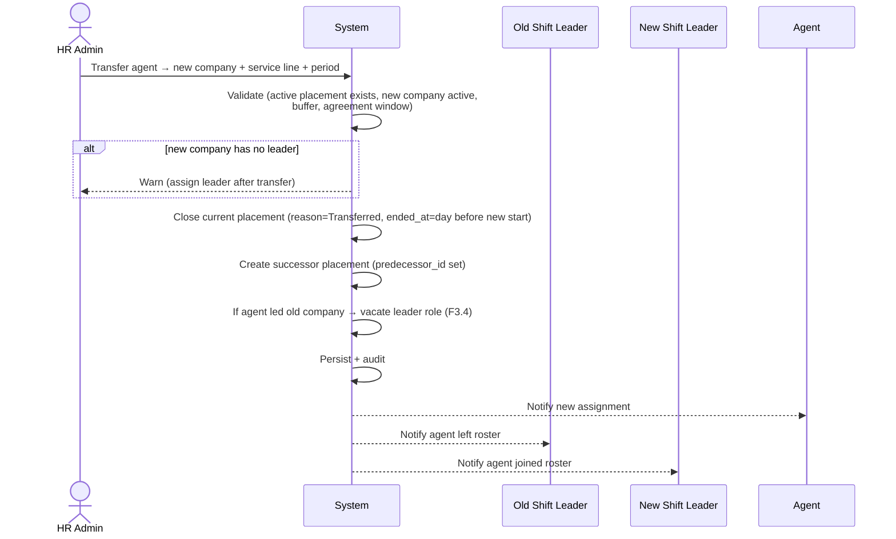

# PRD · F3.3 — Re-placement & Transfer (with history)

> **Epic:** E3 Placement Management · **Feature:** F3.3 · **Status:** Draft v1
> **Parent:** [FEATURE.md](../FEATURE.md) · **Owner:** _TBD_

---

## 1. Context & problem

Agents move between client sites — a parking attendant reassigned from one mall to another, a building crew rotated to a new property. The system must let HR **move an agent to a different client company and/or service line** while preserving the full placement history (where they were, when, and why they moved). Legacy ims-system tracked this only as a typed-over `placement` string and a `new_office` note, losing the chain. This feature makes transfer a first-class, history-preserving operation.

## 2. Goals & non-goals

**Goals**
- Move an active agent to a new company/service line in one operation.
- Close the current placement (reason `Transferred`) and open a **linked successor** (`predecessor_id`).
- Preserve a queryable transfer history per agent.
- Handle the side effects: vacate shift-leader role if the agent led the old company; warn if the new company has no leader.

**Non-goals**
- Same-company renewal (no site change) → F3.2.
- First-time placement → F3.1.
- Assigning the new company's shift leader → F3.4.

## 3. Actors

- **HR / Placement Admin** (primary), **Super Admin**.
- **System** — validates, closes/creates, links history, audits, notifies.
- **Agent**, **old shift leader**, **new shift leader** — notified.

## 4. Workflow



## 5. Business rules

| Ref | Rule |
|-----|------|
| TR-1 | Transfer requires an agent with a current `Active`/`Expiring` placement, a **different** target company **or** service line, and a new period. |
| TR-2 | The current placement is closed with `ended_reason = Transferred` and `ended_at = newStart − 1 day` (honouring the 1-day buffer, F3.1 BR-2). A transfer (like a renewal) closes **only the placement** and **never revokes the agent's login** — login revocation is employment-end only (E2 [F2.7](../../E2-identity/prds/offboarding.md), INV-6 / OB-2). |
| TR-3 | A successor placement is created (F3.1 rules apply: active company, position from master, agreement window/auto-cap, buffer) with `predecessor_id` → the closed placement. |
| TR-4 | If the agent was the **shift leader of the old company**, the transfer **vacates** that leadership (F3.4) and raises a vacancy for the old company. |
| TR-5 | If the **new company has no shift leader**, the transfer still succeeds but warns and prompts F3.4. |
| TR-6 | Transfer is **atomic** — closing the old and creating the new succeed or fail together. |
| TR-7 | Position is re-selected for the new placement (BR-9): it may differ from the old company's position. |
| TR-8 | All steps audited; agent, old leader, and new leader notified (E10). |
| TR-9 | The agent's transfer history (chain of `predecessor_id`) is queryable and never mutated. |

## 6. Data model

Reuses `Placement` (close + create). New/relevant fields: `ended_reason = Transferred`, `predecessor_id`, `successor_id`, plus an optional `transfer_note` (carries legacy `new_office` context on migration).

## 7. Acceptance criteria (Gherkin)

```gherkin
Feature: Agent transfer between client companies

  Background:
    Given I am signed in as an HR admin
    And "Budi" has an active placement at "Mall Kelapa Gading" in "Parking"
    And "Plaza Senayan" is an active client company

  Scenario: Transfer an agent to a new company
    When I transfer "Budi" to "Plaza Senayan" in "Building Management" starting next Monday
    Then his "Mall Kelapa Gading" placement is closed with reason "Transferred"
    And its end date is the day before next Monday
    And a new active/scheduled placement at "Plaza Senayan" is created with predecessor set to the old one
    And "Budi", the old leader, and the new leader are notified

  Scenario: Transfer is atomic on failure
    Given the successor placement would violate the 1-day buffer
    When I attempt the transfer
    Then neither the old placement is closed nor a new one created
    And I see the buffer validation error

  Scenario: Transferring a shift leader vacates their leadership
    Given "Budi" is the shift leader of "Mall Kelapa Gading"
    When I transfer him to "Plaza Senayan"
    Then his leadership of "Mall Kelapa Gading" is ended
    And a shift-leader vacancy is raised for "Mall Kelapa Gading"

  Scenario: Warn when the destination has no shift leader
    Given "Plaza Senayan" has no shift leader
    When I transfer "Budi" there
    Then the transfer succeeds
    And I am warned to assign a shift leader for "Plaza Senayan"

  Scenario: Transfer requires an actual change
    When I "transfer" "Budi" to the same company and same service line
    Then it is rejected as a renewal (use F3.2), not a transfer

  Scenario: Position may change on transfer
    Given "Budi" was a "Parking Attendant" at "Mall Kelapa Gading"
    When I transfer him to "Plaza Senayan" as "Building Technician"
    Then his new placement records position "Building Technician"
    And his old placement still shows "Parking Attendant"
```

## 8. Cases & edge cases

| # | Case | Expected behavior |
|---|------|-------------------|
| C-1 | Transfer effective immediately (new start = today) | Old closed `ended_at = yesterday`; new `Active` today. |
| C-2 | Transfer with a future start | New placement `Scheduled`; old stays active until `newStart − 1 day`. |
| C-3 | Same company, different service line | Valid transfer (TR-1 allows service-line-only change). |
| C-4 | Agent currently `Expiring` | Transfer allowed; treated like active. |
| C-5 | Destination company is inactive/archived | Blocked (F3.1 BR-3). |
| C-6 | Agent has no active placement (already ended) | Use F3.1 (new placement), not transfer. |
| C-7 | Backdated transfer | Allowed for HR admin with reason (F3.1 BR-6); history dates adjusted; audited. |
| C-8 | PKWT agreement ends before the new placement end | Successor end auto-capped to agreement end (F3.1 BR-1b). |

## 9. Dependencies

- **F3.1** (successor creation rules), **F3.2** (status/`Superseded` semantics differ — here it's `Transferred`), **F3.4** (vacate/assign leader), **E10** (notifications), **E1** (audit).

## 10. Decisions & open questions

- ✅ Transfer = close (`Transferred`) + create linked successor, atomic.
- ✅ Position re-selected per destination (may differ).
- **Open:** when transferring a shift leader, should the system **block until a replacement leader is named** for the old company, or allow a temporary vacancy? (assumed: allow vacancy + warn.)
