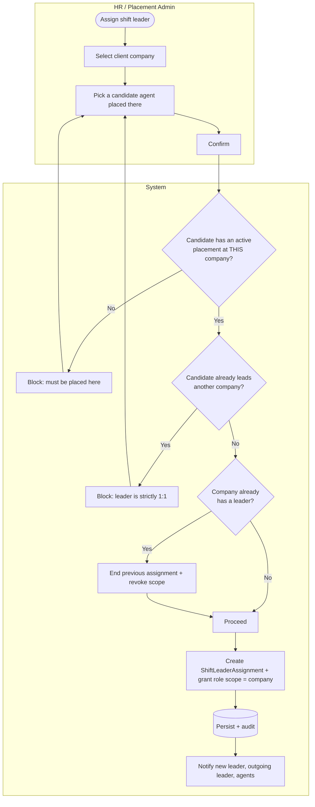

# PRD · F3.4 — Shift-Leader Assignment

> **Epic:** E3 Placement Management · **Feature:** F3.4 · **Status:** Draft v1
> **Parent:** [FEATURE.md](../FEATURE.md) · **Owner:** _TBD_

---

## 1. Context & problem

Each client company runs its on-site team under **exactly one shift leader** — the person who builds rosters, verifies attendance, and approves leave/overtime for that site. The shift leader is themselves an agent placed at that company, granted elevated authority scoped to it. This PRD owns **designating, reassigning, and vacating** that role, and is the gate that turns an ordinary agent into the company's approver.

## 2. Goals & non-goals

**Goals**
- Assign exactly one shift leader per client company (INV-2).
- Enforce that the leader is an agent **actively placed at that same company** (INV-4) and leads **only that one company** (INV-3).
- Grant the shift-leader role scoped to the company on assignment; revoke on vacancy/reassignment.
- Keep an assignment history.

**Non-goals**
- What the shift leader can *do* once assigned (roster, approvals) → lives in E4/E5/E6/E7; this PRD only grants the scope.
- Creating/transferring the agent's placement → F3.1/F3.3.

## 3. Actors

- **HR / Placement Admin** (primary), **Super Admin** — assign/reassign/vacate.
- **System** — validates invariants, grants/revokes role scope, audits, notifies.
- **Shift Leader (incoming/outgoing)**, **Agents at the company** — notified.

## 4. Workflow



## 5. Business rules

| Ref | Rule |
|-----|------|
| SL-1 | A client company has **at most one active** shift-leader assignment (INV-2). |
| SL-2 | The candidate must have an **active placement at that company** (INV-4). |
| SL-3 | A person may lead **only one company at a time** (INV-3) — assigning someone who already leads another company is blocked (reassign/vacate the other first). |
| SL-4 | Assigning a new leader where one exists **ends the previous assignment** (`unassigned_at = now`) and revokes its role scope, atomically. |
| SL-5 | Assignment **grants the shift-leader role scoped to the company**; the agent retains their base agent capabilities for their own attendance/leave. |
| SL-6 | When the leader's **placement at the company ends** (terminate/resign/transfer/expire — F3.2/F3.3), their assignment is **auto-vacated** and a vacancy is raised. |
| SL-7 | A company **may temporarily have no leader** (vacancy); approvals that require a leader escalate to HR admin until filled. |
| SL-8 | All assignments/vacancies are audited and notify the incoming leader, outgoing leader, and the company's agents (E10). |
| SL-9 | Assignment history is retained (never hard-deleted). |

## 6. Data model

| Field | Type | Notes |
|-------|------|-------|
| `id` | PK | |
| `client_company_id` | FK | **unique among active** assignments (SL-1) |
| `employee_id` | FK | the leader; must have active placement at the company (SL-2) |
| `assigned_at` | datetime | |
| `unassigned_at` | datetime | null while active |
| `assigned_by` | FK → User | actor |
| `vacated_reason` | enum | `Reassigned` \| `PlacementEnded` \| `Manual` |

> RBAC scope: assignment writes a company-scoped `shift_leader` grant (E1). Revoked on `unassigned_at`.

## 7. Acceptance criteria (Gherkin)

```gherkin
Feature: Shift-leader assignment

  Background:
    Given I am signed in as an HR admin
    And "Plaza Senayan" is an active client company
    And "Budi" has an active placement at "Plaza Senayan"

  Scenario: Assign a shift leader
    When I assign "Budi" as the shift leader of "Plaza Senayan"
    Then "Budi" gains shift-leader access scoped to "Plaza Senayan"
    And "Budi" and the company's agents are notified

  Scenario: Reject a candidate not placed at the company
    Given "Andi" is not placed at "Plaza Senayan"
    When I try to assign "Andi" as its shift leader
    Then the assignment is blocked with "Candidate must be placed at this company"

  Scenario: Enforce one company per leader
    Given "Budi" already leads "Mall Kelapa Gading"
    When I try to assign "Budi" as the leader of "Plaza Senayan"
    Then the assignment is blocked because a shift leader is strictly 1:1 with a company

  Scenario: Reassigning ends the previous leader
    Given "Budi" is the current leader of "Plaza Senayan"
    And "Citra" has an active placement at "Plaza Senayan"
    When I assign "Citra" as the leader of "Plaza Senayan"
    Then "Budi"'s assignment is ended with reason "Reassigned" and his scope is revoked
    And "Citra" gains the shift-leader scope

  Scenario: Leader's placement ending auto-vacates the role
    Given "Budi" leads "Plaza Senayan"
    When his placement at "Plaza Senayan" is terminated
    Then his shift-leader assignment is vacated with reason "PlacementEnded"
    And a vacancy is raised for "Plaza Senayan"

  Scenario: Approvals escalate while a company has no leader
    Given "Plaza Senayan" has no active shift leader
    When an agent there submits a leave request
    Then the approval is routed to an HR admin
```

## 8. Cases & edge cases

| # | Case | Expected behavior |
|---|------|-------------------|
| C-1 | Assign the company's first-ever leader | No previous assignment to end; straightforward grant. |
| C-2 | Candidate's placement is `Scheduled` (not yet active) | Blocked — leader must be *actively* placed (SL-2). |
| C-3 | Outgoing leader is also being transferred (F3.3) | Vacate is idempotent — transfer-vacate and reassign-end converge to one ended record. |
| C-4 | Two HR admins assign different leaders to the same company concurrently | Unique-active constraint (SL-1) makes the second commit fail; retried as a reassignment. |
| C-5 | Company archived while it has a leader | Leader assignment vacated; company no longer accepts placements (F3.1 BR-3). |
| C-6 | Self-assignment (HR admin who is also placed there) | Allowed if invariants hold; audited. |

## 9. Dependencies

- **F3.1** (active placement prerequisite), **F3.2/F3.3** (auto-vacate triggers), **E1** (RBAC scope + audit), **E10** (notifications), and downstream **E5/E6/E7** consume the granted scope.

## 10. Decisions & open questions

- ✅ One leader per company; one company per leader (strict 1:1).
- ✅ Leader must be actively placed at the company.
- ✅ Vacancy allowed; approvals escalate to HR admin meanwhile.
- **Open:** can an HR admin act as a **stand-in approver** for a specific company indefinitely, or is escalation only a stop-gap until a leader is named? (assumed: stop-gap.)
