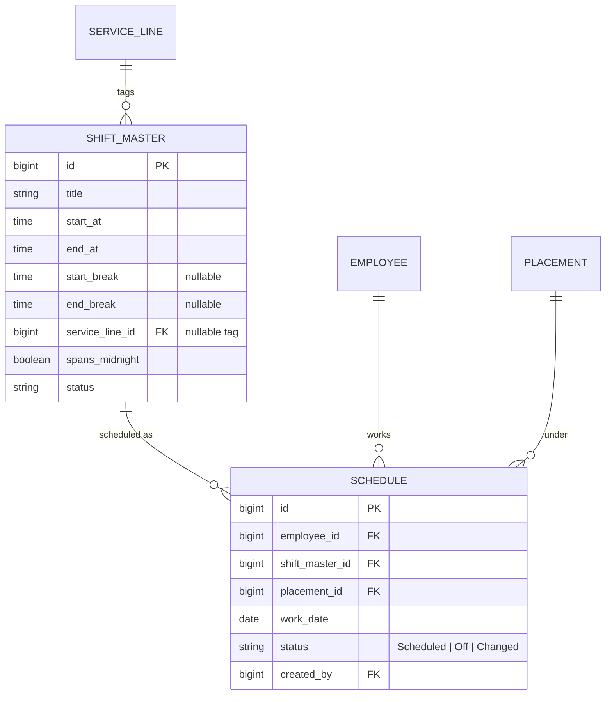
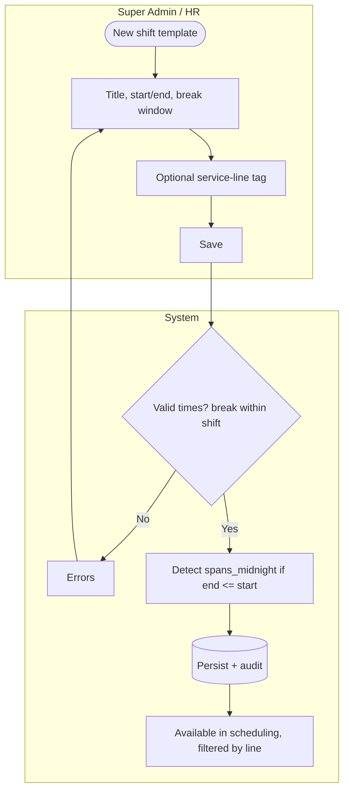
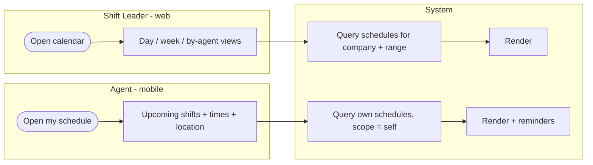

# E4 — Shift Configuration & Scheduling · Feature Document

> **Epic:** E4 Shift Configuration & Scheduling · **Status:** Draft v1 · **Parent:** [EPICS.md](../../EPICS.md)
> A global shift-template catalog, and day-by-day manual scheduling of placed agents by their shift leader — auto-published to mobile.

---

## 1. Goal & outcome

Give SWP a single **work-shift master** (shift templates with working hours + breaks) and let each company's **shift leader assign a shift to each placed agent, per day**. Schedules are the backbone the attendance epic (E5) judges clock-ins against. Per the decisions: scheduling is **day-by-day manual** (no rotation engine), the master is **global but service-line-taggable**, schedules **auto-publish on save** (no approval gate), and there are **no coverage minimums**.

## 2. Actors & roles

| Actor | Involvement |
|---|---|
| **Super Admin / HR Admin** | Manage the shift master; can schedule any company (oversight). |
| **Shift Leader** | Builds the daily schedule for **their one company's** placed agents. |
| **Agent** | Views own schedule on mobile; notified of changes; (optionally) requests swaps/day-off. |
| **System** | Validates placement/conflict rules, auto-publishes, notifies, audits. |

## 3. Scope

**In scope:** shift master catalog, day-by-day schedule assignment (auto-publish), schedule calendar + agent mobile view, schedule changes & conflict rules (+ optional agent swap requests).
**Out of scope:** rotation/pattern templates (not chosen), coverage minimums (not chosen), approval gate (auto-publish), attendance capture vs schedule (E5), overtime (E7).

## 4. Domain entities



**Invariants:**
- **INV-1:** at most **one schedule entry per agent per date** (no double-booking a day).
- **INV-2:** an agent can only be scheduled on a date where they have an **active placement** (E3); the schedule links that `placement_id` (and thus the company + service line).
- **INV-3:** a shift leader may schedule only agents at **their own company** (F3.4 scope); HR/Super Admin any.
- **INV-4:** **auto-publish** — saving a schedule entry makes it immediately visible to the agent (mobile) and triggers a notification.
- **INV-5:** a schedule entry's times **track the shift master until realized by attendance** — `start_time` is frozen at **check-in**; `end_time`/`cross_midnight` is frozen at **check-out**. Before check-in both values follow the current master live; after check-in but before check-out, `start_time` is frozen while `end_time` still tracks master edits (the open attendance window updates accordingly). Both are frozen once check-out is recorded. Propagation scope: only entries with `work_date >= today`, `status != Off`, and not leave-cancelled. Break times are master-only and not stored on entries.

## 5. Features

| ID | Feature | PRD |
|----|---------|-----|
| **F4.1** | Work-Shift Master Catalog | [shift-master-catalog.md](prds/shift-master-catalog.md) |
| **F4.2** | Daily Schedule Assignment | [daily-schedule-assignment.md](prds/daily-schedule-assignment.md) |
| **F4.3** | Schedule Calendar & Agent View | [schedule-views.md](prds/schedule-views.md) |
| **F4.4** | Schedule Changes & Shift Swaps | [schedule-changes-swaps.md](prds/schedule-changes-swaps.md) |

## 6. Platform / clients

| Surface | Who | What |
|---|---|---|
| **Web console** | HR / Super Admin | Manage shift master; oversee/schedule any company. |
| **Web (+ tablet)** | Shift Leader | Build & edit the daily schedule grid for their company. |
| **Mobile app** | Agent | View own upcoming schedule, get change notifications, (optional) request swap/day-off. |
| **Mobile app** | Shift Leader | Quick view/edit of today's roster; approve swap requests. |

---

### F4.1 — Work-Shift Master Catalog

Admin-defined shift templates (working hours + break window), tagged optionally to a service line so leaders see the relevant ones. Global across SWP. Handles cross-midnight shifts (e.g., night 23:00–07:00).



**Entities:** `ShiftMaster`. **Depends on:** E2 (ServiceLine).

---

### F4.2 — Daily Schedule Assignment

The shift leader's core task: for a date (or date range), assign each placed agent a shift picked from the master (filtered by the placement's service line). Saving is **immediately live** to the agent — no draft/publish step.

```mermaid
flowchart TD
    subgraph SL[Shift Leader]
        B1([Open company schedule grid]) --> B2[Pick date + agent]
        B2 --> B3[Choose shift from master<br/>filtered by service line]
        B3 --> B5[Save cell]
        B6[Mark day OFF] --> B5
    end
    subgraph SYS[System]
        B5 --> C1{Agent actively placed on this date?}
        C1 -- No --> C2[Block: not placed] --> B2
        C1 -- Yes --> C3{Already a shift that day?}
        C3 -- Yes --> C4[Replace / warn] --> C5
        C3 -- No --> C5[Create Schedule = Scheduled]
        C5 --> C6[(Persist + audit) AUTO-PUBLISH]
        C6 --> C7[Notify agent on mobile]
    end
    subgraph AG[Agent]
        C7 --> G1[Sees shift immediately]
    end
```

**Entities:** `Schedule` (create). **Depends on:** F4.1, E3 (active placement), F3.4 (leader scope).

---

### F4.3 — Schedule Calendar & Agent View

Read surfaces over the schedule: the leader's company calendar (by day/week, by agent), and the agent's own upcoming-shifts view on mobile, kept live by auto-publish.



**Entities:** reads `Schedule`, `ShiftMaster`, `ClientCompany` (location). **Depends on:** F4.2.

---

### F4.4 — Schedule Changes & Shift Swaps

Editing/clearing assignments with conflict rules, plus an **optional** agent-initiated **swap / day-off request** approved by the shift leader (mobile self-service). Every change re-publishes and notifies.

```mermaid
flowchart TD
    subgraph AG[Agent - mobile]
        T1([Request swap / day-off]) --> T2[Pick date + reason / counterpart]
    end
    subgraph SL[Shift Leader]
        T2 --> L1{Approve?}
        L1 -- No --> L2[Reject + reason]
        L1 -- Yes --> L3[Apply change to schedule]
        L4([Direct edit/clear a cell]) --> L3
    end
    subgraph SYS[System]
        L3 --> C1{Conflict rules ok?<br/>placement active, one/day}
        C1 -- No --> C2[Block + explain] --> L1
        C1 -- Yes --> C3[Update Schedule + status Changed]
        C3 --> C4[(Persist + audit) AUTO-PUBLISH]
        C4 --> C5[Notify affected agent(s)]
        L2 --> C5
    end
```

**Entities:** `Schedule` (update), optional `ScheduleChangeRequest`. **Depends on:** F4.2.

---

## 6b. Cross-feature rules

- Service line drives which shift templates are offered and (downstream) the attendance policy (E5).
- Ending a placement (E3) **cancels future schedule entries** for that agent at that company.
- Cross-midnight shifts attribute the work to the **start date** (confirm in §7); E5 must handle the overnight clock-out.
- All schedule writes auto-publish + audit + notify (INV-4).

## 7. Decisions & open questions

**Resolved (2026-05-29):**
- ✅ **Day-by-day manual** scheduling (no rotation/pattern engine).
- ✅ **Global shift master**, optionally tagged by service line.
- ✅ **Auto-publish on save** (no draft/approval gate).
- ✅ **No coverage minimums** (pure individual assignment).

**Resolved — open-items review (2026-05-29), see [EPICS.md §8](../../EPICS.md):**
- ✅ **Agent shift-swaps / day-off requests** → **deferred to post-v1** (v1 = leader-driven edits only; F4.4 swaps drop from v1).
- ✅ **One shift per agent per day** (no split shifts).
- ✅ **Scheduling over approved leave** → **blocked**.
- ✅ **Cross-midnight** shift attributes to its **start date**.
- ✅ Schedule horizon unbounded; bulk "apply to date range" helper included; reminder = evening-before + ~1h prior.
