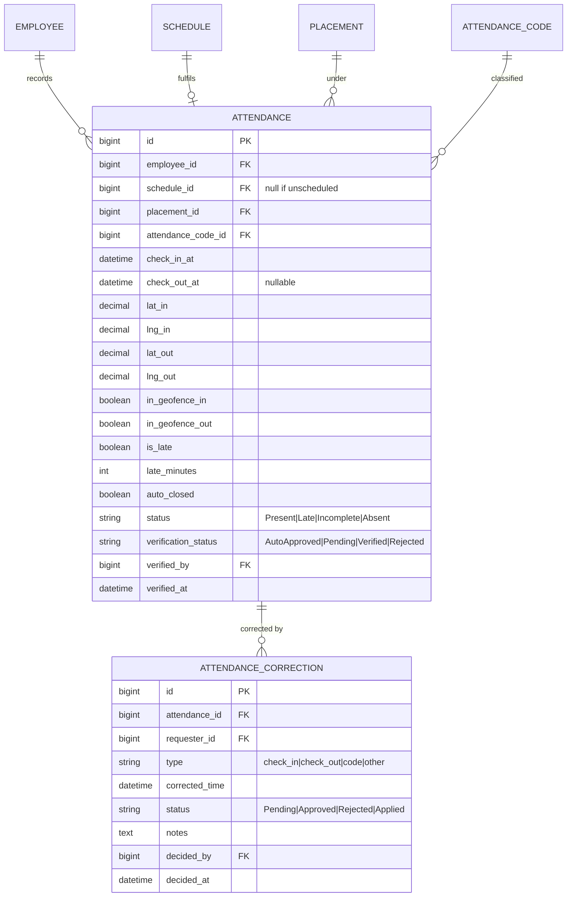
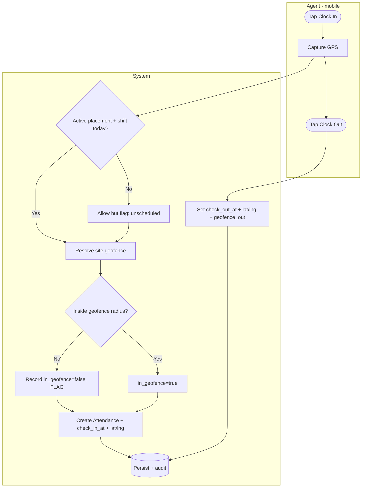
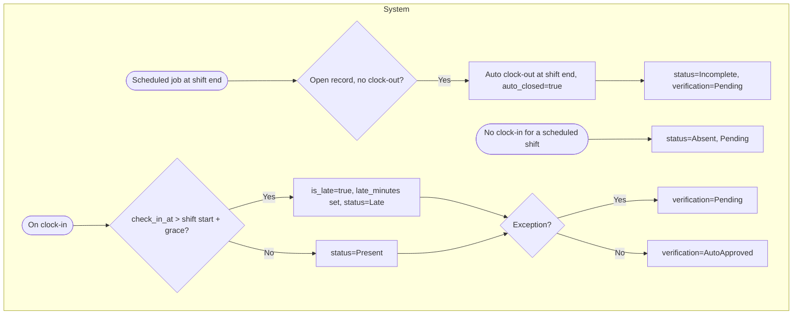
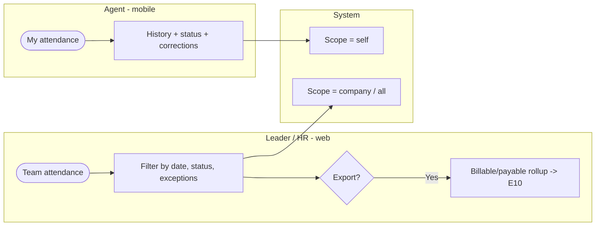

# E5 — Attendance · Feature Document

> **Epic:** E5 Attendance · **Status:** Draft v1 · **Parent:** [EPICS.md](../../EPICS.md)
> Shift-aware, GPS-geofenced clock in/out for placed agents; auto-evaluation of lateness; exceptions-only shift-leader verification; corrections.

---

## 1. Goal & outcome

Let placed agents **clock in/out from mobile, validated against the site geofence**, and tie each record to the **scheduled shift** (E4) so the system can auto-judge lateness and completeness. Clean records auto-approve; only exceptions reach the shift leader. This is the source of truth for "who actually worked," feeding overtime (E7), payroll history context (E8), and client-billable reporting (E10).

## 2. Actors & roles

| Actor | Involvement |
|---|---|
| **Agent** | Clocks in/out on mobile (geofenced); views own attendance; files corrections. |
| **Shift Leader** | Verifies flagged (exception) records for their company; approves corrections. |
| **HR / Super Admin** | Oversight across companies; corrections; configuration. |
| **System** | Geofence check, late/auto-close evaluation, auto-approve clean records, audit, notify. |

## 3. Scope

**In scope:** GPS-geofenced clock in/out, shift-aware evaluation (late/incomplete), auto-clock-out, exceptions-only verification, corrections, attendance records/dashboard.
**Out of scope:** the schedule itself (E4), overtime calc (E7), leave (E6), payroll figures (E8). Selfie/QR capture — **not chosen** (GPS only).

## 4. Domain entities



**Invariants:**
- **INV-1:** an attendance record links to the agent's **scheduled shift** for that date when one exists; clock-ins with no schedule are **flagged** (exception).
- **INV-2:** geofence is evaluated against the **placement's client-company location + radius** (radius is a ClientCompany config — see §6b).
- **INV-3:** **exceptions-only verification** — a record needs leader verification iff `is_late` OR out-of-geofence OR `auto_closed` OR missing clock-in/out OR its attendance code `needs_verification`; otherwise `AutoApproved`.
- **INV-4:** if no clock-out by the scheduled shift end, the system **auto-clocks-out** at shift end, sets `auto_closed`, and marks the record `Pending` verification.

## 5. Features

| ID | Feature | PRD |
|----|---------|-----|
| **F5.1** | Clock In/Out (GPS geofence) | [clock-in-out.md](prds/clock-in-out.md) |
| **F5.2** | Attendance Evaluation & Auto-Close | [attendance-evaluation.md](prds/attendance-evaluation.md) |
| **F5.3** | Shift-Leader Verification (exceptions) | [attendance-verification.md](prds/attendance-verification.md) |
| **F5.4** | Attendance Corrections | [attendance-corrections.md](prds/attendance-corrections.md) |
| **F5.5** | Attendance Records & Dashboard | [attendance-records.md](prds/attendance-records.md) |

## 6. Platform / clients

| Surface | Who | What |
|---|---|---|
| **Mobile app** | Agent | Clock in/out (GPS), view own attendance, file corrections. |
| **Web / mobile** | Shift Leader | Verify exception records, approve corrections, view team attendance. |
| **Web console** | HR / Super Admin | Cross-company oversight, corrections, billable reporting (E10). |

## 6b. Cross-epic note

Geofencing needs a **center + radius per site** — held on the **`Site` entity (E2 F2.6)** (`lat`/`lng` + `geofence_radius_m`); the agent's placement resolves to exactly one site (E3 INV-5). *(2026-06-03: relocated from ClientCompany onto Site.)* Late detection needs a **grace period** (proposed default below).

---

### F5.1 — Clock In/Out (GPS geofence)

Agent clocks in/out from mobile; the app captures GPS and the system checks it against the site geofence. **Out-of-geofence is allowed but flagged** (avoids blocking real work on GPS drift). Ties to the agent's scheduled shift.



**Entities:** `Attendance` (create/update). **Depends on:** E4 (schedule), E3 (placement), E2 (site geofence).

---

### F5.2 — Attendance Evaluation & Auto-Close

System logic over records: compute **lateness** vs the scheduled shift start (+ grace), assign **status** and a default attendance code, and **auto-clock-out** open records at the scheduled shift end.



**Entities:** `Attendance` (evaluate). **Depends on:** F5.1, E4, E2 (codes, grace).

---

### F5.3 — Shift-Leader Verification (exceptions only)

Only flagged records (late / out-of-geofence / auto-closed / absent / code-flagged) land in the leader's verification queue; clean records are already `AutoApproved`. Leader approves or rejects (→ correction).


**Entities:** `Attendance` (verify). **Depends on:** F5.2, F3.4 (leader scope).

---

### F5.4 — Attendance Corrections

Agent or leader files a correction for a wrong/missed clock-in/out (or code); approved via the leader (escalates to HR if no leader). Mirrors legacy `attendance_corrections` (typed, statused, with approval bookkeeping).

```mermaid
flowchart TD
    subgraph REQ[Agent / Leader]
        C1([File correction]) --> C2[Type: check_in / check_out / code, proposed time + reason]
    end
    subgraph SL[Shift Leader / HR]
        C2 --> C3{Approve?}
        C3 -- Reject --> C4[Rejected + reason]
        C3 -- Approve --> C5[Approved]
    end
    subgraph SYS[System]
        C5 --> C6[Apply to Attendance, status=Applied, re-evaluate]
        C6 --> C7[(Persist + audit) keep original snapshot]
        C4 --> C8[(Persist + audit)]
        C6 --> C9[Notify requester]
        C8 --> C9
    end
```

**Entities:** `AttendanceCorrection`, `Attendance` (apply). **Depends on:** F5.1/F5.2.

---

### F5.5 — Attendance Records & Dashboard

Read/reporting surfaces: agent's own history (mobile), leader/HR team views with exception highlighting, and **billable** rollups (attendance codes flagged billable) feeding E10.



**Entities:** reads `Attendance`, `AttendanceCode`. **Depends on:** F5.1–F5.4, E10 (export).

---

## 7. Decisions & open questions

**Resolved (2026-05-29):**
- ✅ **GPS geofence only** (no selfie/QR) for clock in/out.
- ✅ **Out-of-geofence allowed + flagged** for verification (not blocked).
- ✅ **Exceptions-only verification** (clean records auto-approve).
- ✅ **Auto-clock-out at scheduled shift end** + flag (legacy `checked_out_by_system` behavior).

**Resolved — open-items review (2026-05-29), see [EPICS.md §8](../../EPICS.md):**
- ✅ **Geofence radius** = per-site `geofence_radius_m` (default 100m) — *(2026-06-03: on the `Site` entity, E2 F2.6; was ClientCompany).*
- ✅ **Late grace** = 15 min.
- ✅ **Unscheduled clock-in** = allowed + flagged.
- ✅ **Offline clock-in** = online-only for v1 (queue+sync revisited later).
- ✅ **Cross-midnight** = attribute to the shift's start date.
- ✅ **Billable** = verified records only (E5↔E10).
- ✅ **Leaders' own exceptions** → escalate to HR (no self-verify).
- ✅ **Self-correction window** = 7 days (older = HR only).
- ✅ **Anti-spoofing** = post-v1; early clock-out flagged if >15 min early.
