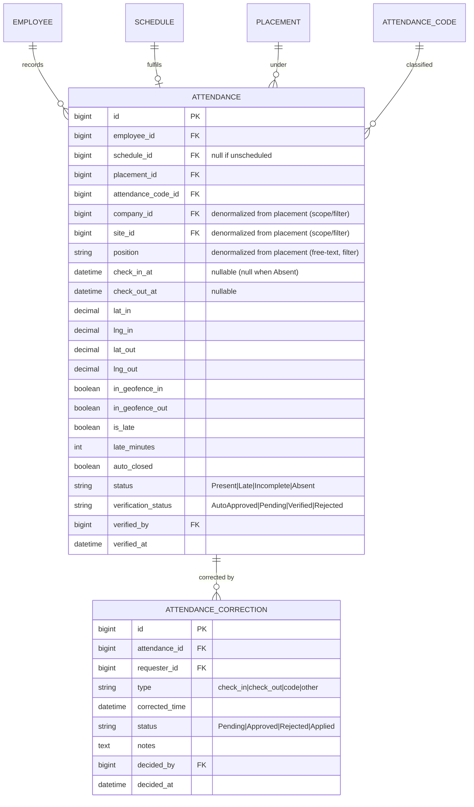
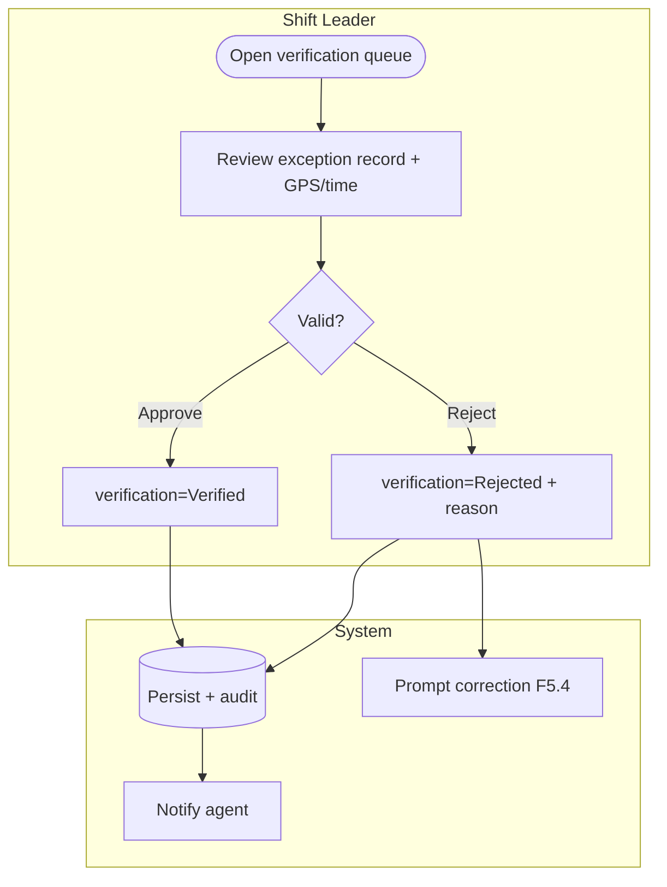
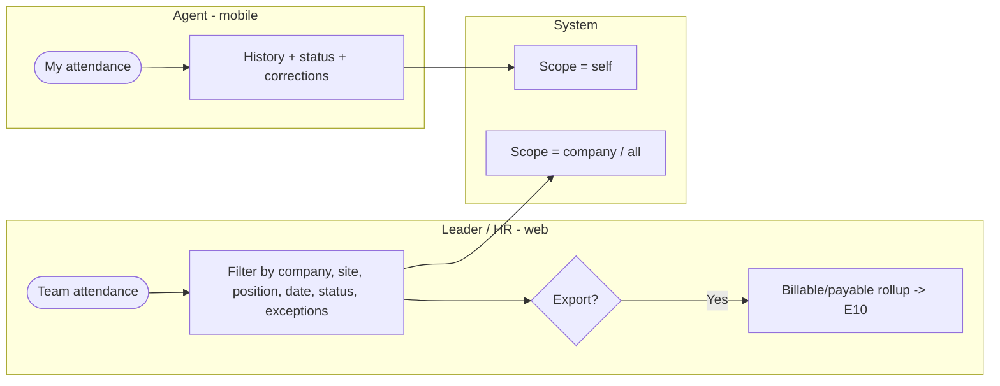
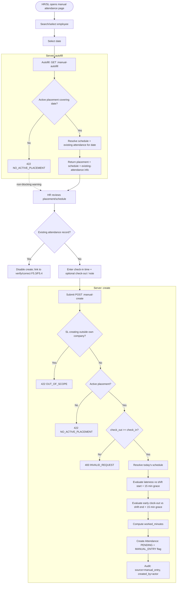

# E5 — Attendance · Feature Document

> **Epic:** E5 Attendance · **Status:** Draft v1 · **Parent:** [EPICS.md](../../EPICS.md)
> Shift-aware, GPS-geofenced clock in/out for placed agents; auto-evaluation of lateness; exceptions-only shift-leader verification; corrections.

---

## 1. Goal & outcome

Let placed agents **clock in/out from mobile, validated against the site geofence**, and tie each record to the **scheduled shift** (E4) so the system can auto-judge lateness and completeness. Clean records auto-approve; only exceptions reach the shift leader. This is the source of truth for "who actually worked," feeding overtime (E7), payroll history context (E8), and client-billable reporting (E10).

## 2. Actors & roles

| Actor | Involvement |
|---|---|
| **Agent** | Clocks in/out on mobile (geofenced); views own attendance; files corrections. |
| **Shift Leader** | Verifies flagged (exception) records for their company; approves corrections. |
| **HR / Super Admin** | Oversight across companies; corrections; configuration. |
| **System** | Geofence check, late/auto-close evaluation, auto-approve clean records, audit, notify. |

## 3. Scope

**In scope:** GPS-geofenced clock in/out, shift-aware evaluation (late/incomplete), auto-clock-out, exceptions-only verification, corrections, attendance records/dashboard.
**Out of scope:** the schedule itself (E4), overtime calc (E7), leave (E6), payroll figures (E8). Selfie/QR capture — **not chosen** (GPS only).

## 4. Domain entities



**Invariants:**
- **INV-1:** an attendance record links to the agent's **scheduled shift** for that date when one exists; clock-ins with no schedule are **flagged** (exception).
- **INV-2:** geofence is evaluated against the **placement's client-company location + radius** (radius is a ClientCompany config — see §6b).
- **INV-3:** **exceptions-only verification** — a record needs leader verification iff `is_late` OR out-of-geofence OR `auto_closed` OR missing clock-in/out OR its attendance code `needs_verification`; otherwise `AutoApproved`.
- **INV-4:** if no clock-out by the scheduled shift end, the system **auto-clocks-out** at shift end, sets `auto_closed`, and marks the record `Pending` verification.
- **INV-5:** **`Absent` is set only for a scheduled shift with no clock-in by shift end** — the record carries `check_in_at = null` (and no clock-in geofence). An `Absent` record is **resolvable via a `check_in` correction (F5.4)**, whose approval re-evaluates `status` (`Absent → Present/Late` per `shift_start_at` + grace). An approved leave suppresses `Absent` → `On Leave` (F5.2, E6).
- **INV-6:** **`shift_start_at` is fixed at clock-in; `shift_end_at` tracks master edits until clock-out, then fixed** (see E4 INV-5; detail in F5.1 CI-9). INV-4's auto-close and F5.2's lateness/early evaluation always use the entry's current effective end until checkout.

**Denormalization:** `company_id`, `site_id`, and `position` (free-text) are **denormalized onto `Attendance`** (resolved from the agent's placement → site/position) so the high-volume records list (F5.5) can **filter and scope by company · site · position** without a JOIN — the same pattern as `company_id` carried for leader scope.

## 5. Features

| ID | Feature | PRD |
|----|---------|-----|
| **F5.1** | Clock In/Out (GPS geofence) | [clock-in-out.md](prds/clock-in-out.md) |
| **F5.2** | Attendance Evaluation & Auto-Close | [attendance-evaluation.md](prds/attendance-evaluation.md) |
| **F5.3** | Shift-Leader Verification (exceptions) | [attendance-verification.md](prds/attendance-verification.md) |
| **F5.4** | Attendance Corrections | [attendance-corrections.md](prds/attendance-corrections.md) |
| **F5.5** | Attendance Records & Dashboard | [attendance-records.md](prds/attendance-records.md) |
| **F5.6** | Manual Attendance Entry | [manual-attendance.md](prds/manual-attendance.md) |

## 6. Platform / clients

| Surface | Who | What |
|---|---|---|
| **Mobile app** | Agent | Clock in/out (GPS), view own attendance, file corrections. |
| **Web / mobile** | Shift Leader | Verify exception records, approve corrections, view team attendance. |
| **Web console** | HR / Super Admin | Cross-company oversight, corrections, billable reporting (E10). |

## 6b. Cross-epic note

Geofencing needs a **center + radius per site** — held on the **`Site` entity (E2 F2.6)** (`lat`/`lng` + `geofence_radius_m`); the agent's placement resolves to exactly one site (E3 INV-5). *(2026-06-03: relocated from ClientCompany onto Site.)* Late detection needs a **grace period** (proposed default below).

---

### F5.1 — Clock In/Out (GPS geofence)

Agent clocks in/out from mobile; the app captures GPS and the system checks it against the site geofence. **Out-of-geofence is allowed but flagged** (avoids blocking real work on GPS drift). Ties to the agent's scheduled shift.


**Entities:** `Attendance` (create/update). **Depends on:** E4 (schedule), E3 (placement), E2 (site geofence).

---

### F5.2 — Attendance Evaluation & Auto-Close

System logic over records: compute **lateness** vs the scheduled shift start (+ grace), assign **status** and a default attendance code, and **auto-clock-out** open records at the scheduled shift end.


**Entities:** `Attendance` (evaluate). **Depends on:** F5.1, E4, E2 (codes, grace).

---

### F5.3 — Shift-Leader Verification (exceptions only)

Only flagged records (late / out-of-geofence / auto-closed / absent / code-flagged) land in the leader's verification queue; clean records are already `AutoApproved`. Leader approves or rejects (→ correction).



**Entities:** `Attendance` (verify). **Depends on:** F5.2, F3.4 (leader scope).

---

### F5.4 — Attendance Corrections

Agent or leader files a correction for a wrong/missed clock-in/out (or code); approved via the leader (escalates to HR if no leader). Mirrors legacy `attendance_corrections` (typed, statused, with approval bookkeeping).

```mermaid
flowchart TD
    subgraph REQ[Agent / Leader]
        C1([File correction]) --> C2[Type: check_in / check_out / code, proposed time + reason]
    end
    subgraph SL[Shift Leader / HR]
        C2 --> C3{Approve?}
        C3 -- Reject --> C4[Rejected + reason]
        C3 -- Approve --> C5[Approved]
    end
    subgraph SYS[System]
        C5 --> C6[Apply to Attendance, status=Applied, re-evaluate]
        C6 --> C7[(Persist + audit) keep original snapshot]
        C4 --> C8[(Persist + audit)]
        C6 --> C9[Notify requester]
        C8 --> C9
    end
```

**Entities:** `AttendanceCorrection`, `Attendance` (apply). **Depends on:** F5.1/F5.2.

---

### F5.5 — Attendance Records & Dashboard

Read/reporting surfaces: agent's own history (mobile), leader/HR team views with exception highlighting, and **billable** rollups (attendance codes flagged billable) feeding E10.



**Entities:** reads `Attendance`, `AttendanceCode`. **Depends on:** F5.1–F5.4, E10 (export).

---

### F5.6 — Manual Attendance Entry (Buat Kehadiran Manual)

HR/Shift-Leader creates attendance record for any employee who forgot clock-in or whose clock was not captured. Bypasses GPS/geofence entirely.

**Page-based flow** (full-page form, not a modal):
1. **Employee search** — type-ahead search selects target employee
2. **Date picker** — select attendance date
3. **Autofill** — server resolves placement + today's schedule + any **existing attendance record** (GET `:manual-autofill`); shows company, site, position, schedule times in a right-column summary card
4. **Enter times** — check-in (required) + check-out (optional) datetime-local inputs
5. **Optional note** — free-text reason
6. **Submit** — POST `:manual-create`; redirects to attendance dashboard. *If a record already exists for the employee + date (e.g. the absence-sweep's `ABSENT`/`PENDING` row), the form disables create and links to verify/correct it instead (MR-14).*

**Business rules:**
- **MR-1:** server resolves employee's active placement; rejects with `422 NO_ACTIVE_PLACEMENT` if none.
- **MR-2:** check_out_at >= check_in_at required; `400 INVALID_REQUEST` if violated.
- **MR-3:** always created with `verification_status=PENDING` + `MANUAL_ENTRY` flag.
- **MR-4:** if schedule exists for today, lateness/early evaluation runs against it (15 min grace); flags `LATE`/`EARLY` as applicable.
- **MR-5:** no schedule → no lateness evaluation (unscheduled manual entry).
- **MR-6:** geofence bypassed: `geofence_in = { inside: true, distance_m: 0, radius_m: 0 }`, `lat_in/lng_in = null`.
- **MR-7:** `worked_minutes` computed server-side from check_in → check_out (0 if negative).
- **MR-8:** `WFO = true` always (manual entry implies on-site).
- **MR-9:** audit record written with source `manual_entry`.
- **MR-10:** idempotency required (same `Idempotency-Key` + body → safe replay).
- **MR-11:** `NOTE` optional, stored as `note` text.
- **MR-12:** `created_by` set from JWT principal of the creating user (HR/SL), stored on `attendance.created_by`.
- **MR-13:** shift leader scope: SL can create attendance only for employees whose active placement belongs to the SL's own company; `422 OUT_OF_SCOPE` if violated.
- **MR-14:** autofill also returns any **existing attendance** for the employee + date (`existing_attendance_id`/`_status`/`_verification_status`); when present the web form disables create and steers to verify/correct it (F5.3/F5.4) — avoiding duplicate rows.
- **MR-15:** autofill `422 NO_ACTIVE_PLACEMENT` is a **non-blocking informational warning** in the web form (re-validate employee/date), not a hard error; create still re-validates per MR-1. Genuine network/5xx → blocking error with retry.

**Autofill endpoint:** `GET /attendance:manual-autofill?employee_id=SWP-EMP-xxxx&date=YYYY-MM-DD` returns placement info (company, site, position) + today's schedule (schedule_id, shift_start_at, shift_end_at) + existing-attendance fields (existing_attendance_id, existing_attendance_status, existing_verification_status) — or `422 NO_ACTIVE_PLACEMENT` if the employee has no active placement. Placement resolution: `lifecycle_status IN (ACTIVE, EXPIRING, EXTENDED)` whose term covers the date (`end_date IS NULL` = open-ended PKWTT).



**API:** `GET /attendance:manual-autofill` (autofill) + `POST /attendance:manual-create` (create, idempotency-wrapped).
**Entities:** `Attendance` (create). **Depends on:** E3 (placement resolution), E4 (schedule lookup). `attendance.created_by` column (migration 00046).

**Decisions:**
- ✅ Geofence bypassed entirely — manual entry assumes the agent was on-site.
- ✅ Always PENDING — another HR/leader must verify.
- ✅ Shift leader allowed (scoped to own company) — actual practice requires SL to create attendance for missed check-ins; scope enforcement via MR-13.
- ✅ Page-based flow, not modal — form has enough fields to warrant full page (employee search, date, placement card, schedule card, times, note, submit).
- ✅ No `attendance_code_id` on manual entry — no code picker; the `MANUAL_ENTRY` flag covers the classification.
- ✅ `created_by` traced from JWT principal — enables audit trail of who manually overrode clock-in.
- ✅ *(2026-06-10)* Autofill surfaces existing attendance + steers to verify/correct — the absence-sweep already creates `ABSENT`/`PENDING` rows for scheduled shifts, so manual create is reserved for unscheduled/unprocessed gaps (MR-14).
- ✅ *(2026-06-10)* No-placement on autofill is a non-blocking warning; placement window includes `EXPIRING`/`EXTENDED` and open-ended (PKWTT) terms (MR-1, MR-15).
- ✅ PRD: [manual-attendance.md](prds/manual-attendance.md).

---

## 7. Decisions & open questions

**Resolved (2026-05-29):**
- ✅ **GPS geofence only** (no selfie/QR) for clock in/out.
- ✅ **Out-of-geofence allowed + flagged** for verification (not blocked).
- ✅ **Exceptions-only verification** (clean records auto-approve).
- ✅ **Auto-clock-out at scheduled shift end** + flag (legacy `checked_out_by_system` behavior).

**Resolved — open-items review (2026-05-29), see [EPICS.md §8](../../EPICS.md):**
- ✅ **Geofence radius** = per-site `geofence_radius_m` (default 100m) — *(2026-06-03: on the `Site` entity, E2 F2.6; was ClientCompany).*
- ✅ **Late grace** = 15 min.
- ✅ **Unscheduled clock-in** = allowed + flagged.
- ✅ **Offline clock-in** = online-only for v1 (queue+sync revisited later).
- ✅ **Cross-midnight** = attribute to the shift's start date.
- ✅ **Billable** = verified records only (E5↔E10).
- ✅ **Leaders' own exceptions** → escalate to HR (no self-verify).
- ✅ **Self-correction window** = 7 days (older = HR only).
- ✅ **Anti-spoofing** = post-v1; early clock-out flagged if >15 min early.

**Resolved (2026-06-08):**
- ✅ **Site & position denormalized onto `Attendance`** (alongside company) so the records list (F5.5) filters and scopes by **company · site · position** (position is free-text). *(Service-line denormalization dropped 2026-06-12; `position_id` FK → `position` free-text — service line and the position master removed project-wide.)*
- ✅ **`check_in_at` nullable** — a true `Absent` record (scheduled shift, no clock-in) carries `check_in_at = null` (INV-5).
- ✅ **Correction re-evaluates status** — an approved `check_in` correction on an `Absent` record re-runs F5.2 (`Absent → Present/Late` by `shift_start_at` + grace) and recomputes `is_late` / `late_minutes`.
