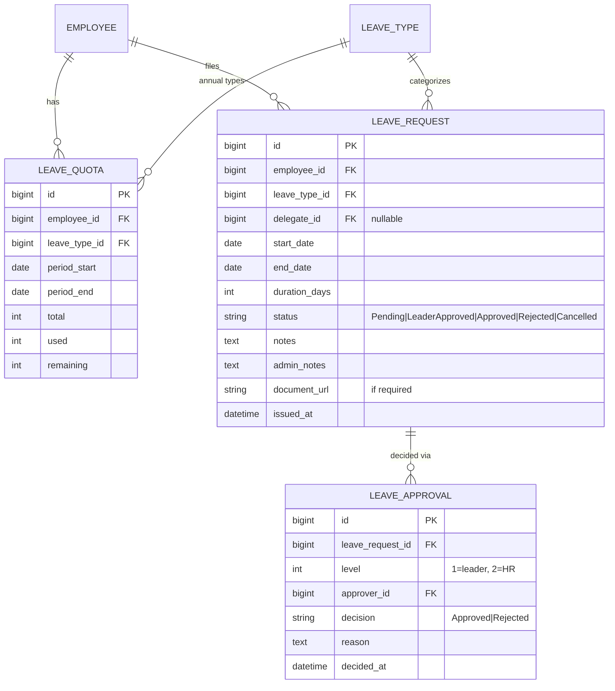
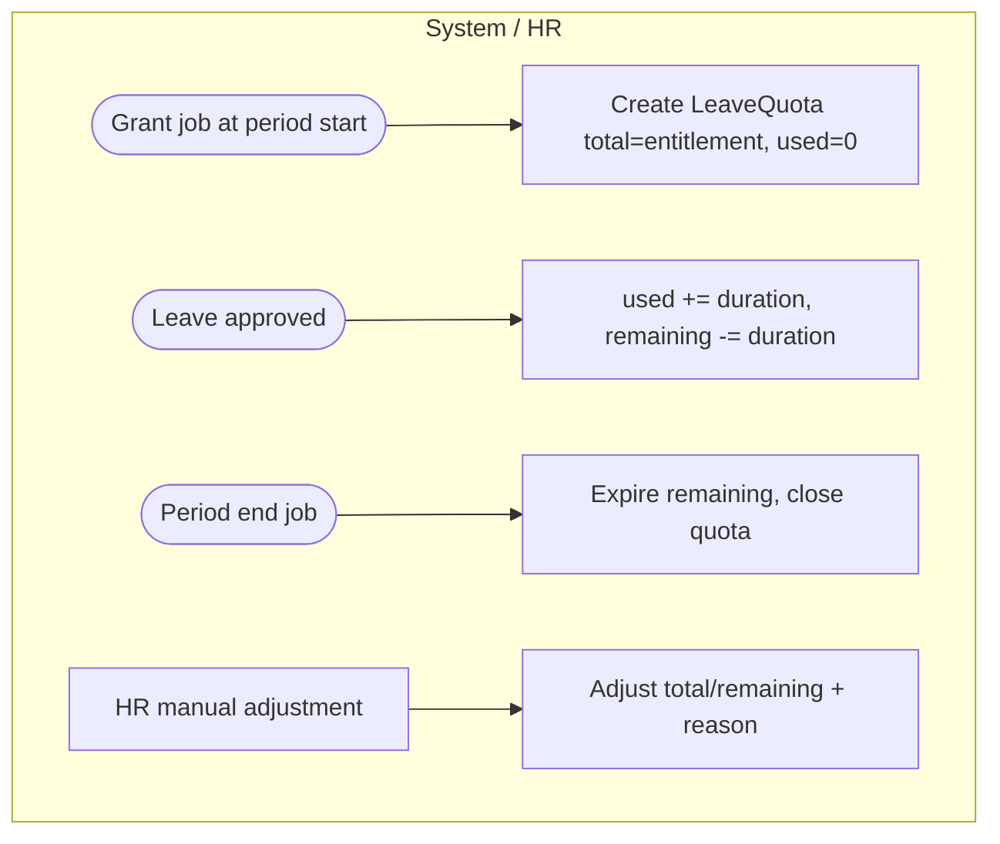
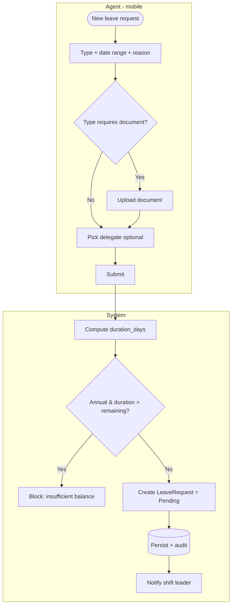
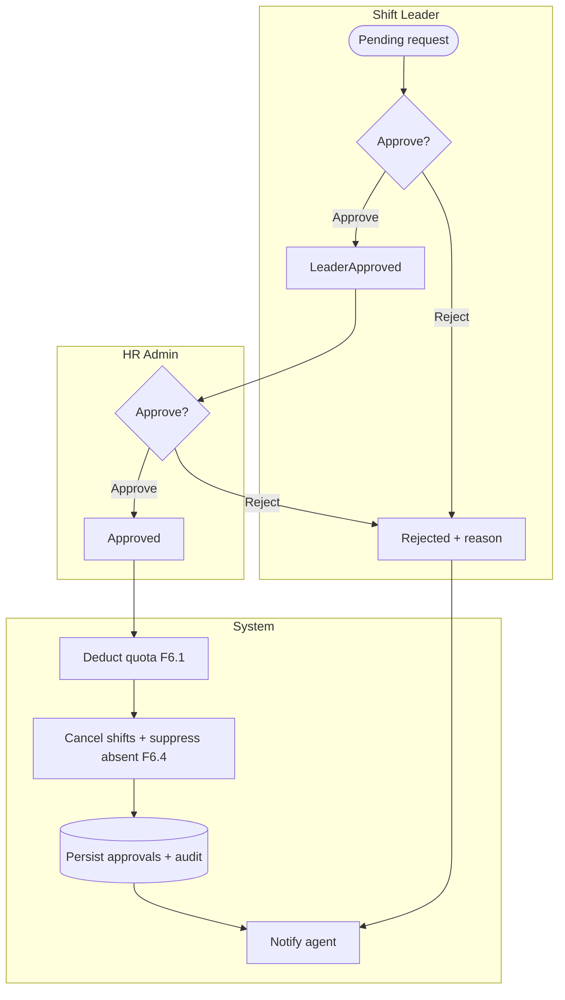
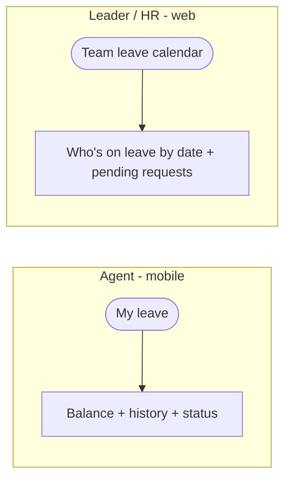

# E6 — Leave Management · Feature Document

> **Epic:** E6 Leave Management · **Status:** Draft v1 · **Parent:** [EPICS.md](../../EPICS.md)
> Annual leave quotas, agent leave requests with documents, two-level (leader → HR) approval, and integration with scheduling/attendance.

---

## 1. Goal & outcome

Let agents request leave from mobile, track their **annual quota** (cuti tahunan), route requests through **shift-leader then HR** approval, and ensure approved leave **cancels scheduled shifts and never reads as "absent"** in attendance. Annual entitlement is a **lump grant per period that expires at period end**; over-balance annual requests are **blocked**.

## 2. Actors & roles

| Actor | Involvement |
|---|---|
| **Agent** | Requests leave (mobile), uploads documents, names a delegate, views balance/history. |
| **Shift Leader** | First-level approver for their company's agents. |
| **HR / Super Admin** | Second-level approver; manages quotas/grants; handles no-leader escalation. |
| **System** | Enforces balance, runs the two-level flow, cancels shifts, suppresses absent, audits, notifies. |

## 3. Scope

**In scope:** leave quotas/balances, leave request (+ documents, delegate), two-level approval, leave↔schedule/attendance integration, leave calendar & balances.
**Out of scope:** leave-type definitions (E2 master). Payroll effect of unpaid leave (E8 context). Overtime (E7).

## 4. Domain entities

**Invariants:**
- **INV-1:** annual (`is_tahunan`) requests deduct from the active `LeaveQuota`; a request **cannot exceed `remaining`** (blocked).
- **INV-2:** **two-level approval** — `Pending → LeaderApproved → Approved`; a reject at either level ends it (`Rejected`).
- **INV-3:** an **Approved** leave **cancels overlapping scheduled shifts** (E4) and **suppresses "Absent"** in attendance (E5) for those days.
- **INV-4:** annual quota is a **lump grant per period**, **expires at `period_end`** (no carryover).
- **INV-5:** leave types flagged `is_document_required` (E2) require a document upload before submission.

## 5. Features

| ID | Feature | PRD |
|----|---------|-----|
| **F6.1** | Leave Quota & Balances | [leave-quota-balances.md](prds/leave-quota-balances.md) |
| **F6.2** | Leave Request (documents, delegate) | [leave-request.md](prds/leave-request.md) |
| **F6.3** | Two-Level Approval Workflow | [leave-approval.md](prds/leave-approval.md) |
| **F6.4** | Leave–Schedule/Attendance Integration | [leave-schedule-integration.md](prds/leave-schedule-integration.md) |
| **F6.5** | Leave Calendar & Balance Views | [leave-calendar-views.md](prds/leave-calendar-views.md) |

## 6. Platform / clients

| Surface | Who | What |
|---|---|---|
| **Mobile app** | Agent | Request leave, upload docs, pick delegate, view balance & status. |
| **Web / mobile** | Shift Leader | First-level approve/reject for their company. |
| **Web console** | HR / Super Admin | Second-level approval, quota grants/adjustments, reporting. |

---

### F6.1 — Leave Quota & Balances

Grant each agent their annual entitlement as a **lump sum per period** (anniversary or calendar year), track `used`/`remaining`, and **expire** unused days at period end.

**Entities:** `LeaveQuota`. **Depends on:** E2 (annual leave type, entitlement source).

---

### F6.2 — Leave Request (documents, delegate)

Agent submits a request: type, date range, computed duration, optional **delegate** (who covers), and a **document** when the type requires it. Annual requests pre-check balance.

**Entities:** `LeaveRequest`. **Depends on:** E2 (leave types), F6.1 (balance).

---

### F6.3 — Two-Level Approval Workflow

Shift leader approves first; then HR confirms. Reject at either level ends the request. On final approval, the quota is deducted and downstream integration (F6.4) fires.

**Entities:** `LeaveApproval`, `LeaveRequest`. **Depends on:** F3.4 (leader scope / HR escalation).

---

### F6.4 — Leave–Schedule/Attendance Integration

On approval, overlapping **scheduled shifts (E4) are cancelled/marked leave**, and attendance (E5) **does not mark those days Absent**. Cancelling/shortening an approved leave restores the schedule state.

**Entities:** updates `Schedule` (E4), informs `Attendance` (E5). **Depends on:** E4, E5.

---

### F6.5 — Leave Calendar & Balance Views

Agent sees their balance + request history (mobile); leader/HR see a team leave calendar (who's off when) for planning coverage.

**Entities:** reads `LeaveQuota`, `LeaveRequest`. **Depends on:** F6.1–F6.3.

---

## 7. Decisions & open questions

**Resolved (2026-05-29):**
- ✅ **Annual lump grant** per period; tracked total/used/remaining (matches legacy `employee_leave_quotas`).
- ✅ **Expire at period end** (no carryover).
- ✅ **Two-level approval**: shift leader → HR (escalate to HR if no leader).
- ✅ **Block** annual requests beyond remaining balance.

**Resolved — open-items review (2026-05-29), see [EPICS.md §8](../../EPICS.md):**
- ✅ **Duration** = working days **excluding public holidays**.
- ✅ **Period basis** = **calendar year**.
- ✅ **Probation** = **pro-rated** annual leave (also pro-rate mid-year joiners).
- ✅ **Non-annual types** (sick/maternity/unpaid) = **per-type quotas** (`LeaveQuota` generalized to one per employee/leave_type/period).
- ✅ **Half-day leave** = not in v1 (full days only).
- ✅ **Delegate** = informational/notified (no enforced coverage).

**Still open (confirm with SWP):**
1. Exact "working day" definition for 24/7 shift workers (rostered days vs standard business days) used in duration counting.
