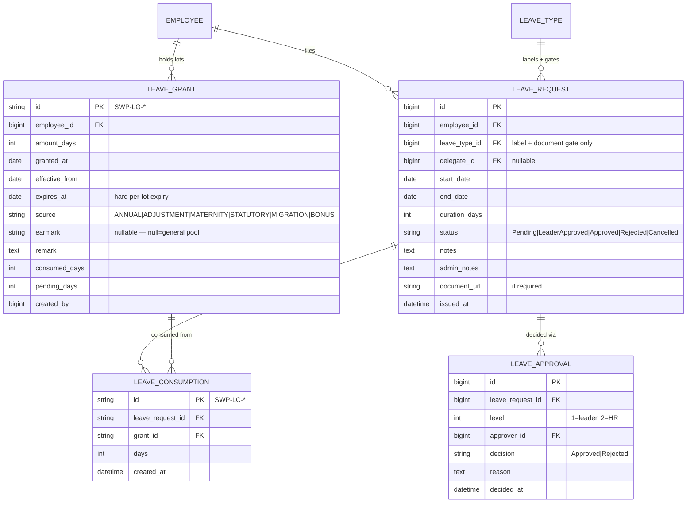
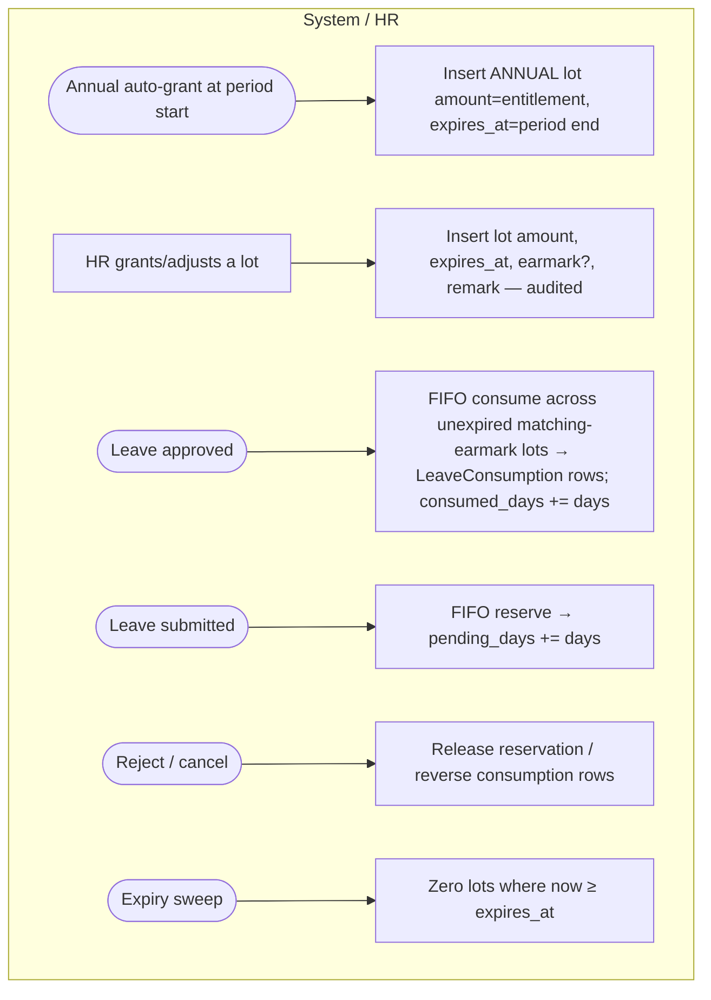
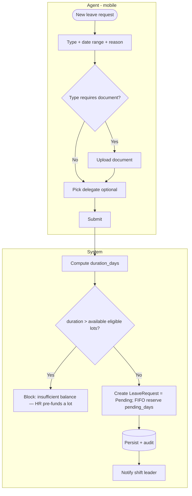
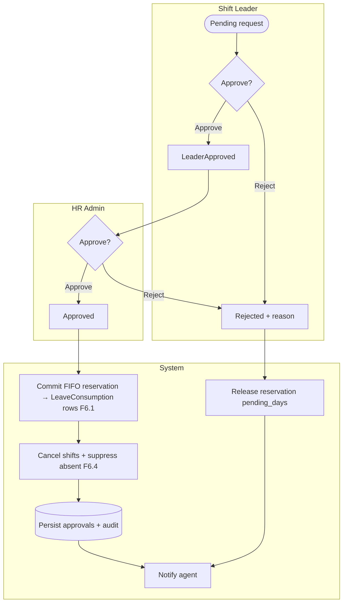

# E6 — Leave Management · Feature Document

> **Epic:** E6 Leave Management · **Status:** Draft v1 · **Parent:** [EPICS.md](../../EPICS.md)
> A per-employee leave-balance ledger (grant-lots), agent leave requests with documents, two-level (leader → HR) approval, and integration with scheduling/attendance.

---

## 1. Goal & outcome

Let agents request leave from mobile, track their **leave balance** as a single **per-employee pool of grant-lots** (cuti), route requests through **shift-leader then HR** approval, and ensure approved leave **cancels scheduled shifts and never reads as "absent"** in attendance. Entitlement is granted as **lots, each with its own hard expiry (no carryover)**; consumption is **FIFO by soonest expiry**; over-balance requests are **blocked** (HR pre-funds a lot instead of allowing a negative balance). `leave_type` is a **label + document gate + calendar color**, not a balance axis *(grant-lot model, resolved 2026-06-08 — see §7)*.

## 2. Actors & roles

| Actor | Involvement |
|---|---|
| **Agent** | Requests leave (mobile), uploads documents, names a delegate, views balance/history. |
| **Shift Leader** | First-level approver for their company's agents. |
| **HR / Super Admin** | Second-level approver; **grants leave-lots** (annual auto-grant, manual adjustments, statutory/maternity pre-funding); handles no-leader escalation. |
| **System** | Allocates FIFO across lots, enforces no-negative balance, runs the two-level flow, cancels shifts, suppresses absent, expires lots, audits, notifies. |

## 3. Scope

**In scope:** leave balance ledger (grant-lots + consumptions), leave request (+ documents, delegate), two-level approval, leave↔schedule/attendance integration, leave calendar & balances.
**Out of scope:** leave-type definitions (E2 master). Payroll effect of unpaid leave (E8 context). Overtime (E7).

## 4. Domain entities

**Invariants:**
- **INV-1:** *(grant-lot model, supersedes the per-`LeaveQuota` form — 2026-06-08)* a request **allocates from the single per-employee pool of `LeaveGrant` lots**, FIFO by soonest `expires_at`, across only **unexpired, matching-earmark** lots; it **cannot exceed available** (`Σ amount − consumed − pending` over eligible lots) — over-balance is **blocked** (HR pre-funds a lot instead). Allocation is recorded as `LeaveConsumption` rows, one per lot drawn.
- **INV-2:** **two-level approval** — `Pending → LeaderApproved → Approved`; a reject at either level ends it (`Rejected`).
- **INV-3:** an **Approved** leave **cancels overlapping scheduled shifts** (E4) and **suppresses "Absent"** in attendance (E5) for those days.
- **INV-4:** *(grant-lot model, supersedes "expire at period_end" — 2026-06-08)* **each `LeaveGrant` lot has a hard per-lot `expires_at`** and is zeroed by the expiry sweep when `now ≥ expires_at`; **no year-end global expiry, no carryover minting**. An `ANNUAL` lot's `expires_at` = the entitlement period end.
- **INV-5:** leave types flagged `is_document_required` (E2) require a document upload before submission. `leave_type` is otherwise a **label + document gate + calendar color** — **not a balance axis**.
- **INV-6:** balance **never goes negative** — allocation only ever draws available lots; the over-balance path is "HR adds a lot," never a negative remaining.
- **INV-7:** **earmark isolation** — an earmarked lot (e.g. `MATERNITY`) is consumed **only** by a request of that purpose and is invisible to ordinary FIFO; unearmarked lots form the flat pool.

## 5. Features

| ID | Feature | PRD |
|----|---------|-----|
| **F6.1** | Leave Balance Ledger (grant-lots) | [leave-quota-balances.md](prds/leave-quota-balances.md) |
| **F6.2** | Leave Request (documents, delegate) | [leave-request.md](prds/leave-request.md) |
| **F6.3** | Two-Level Approval Workflow | [leave-approval.md](prds/leave-approval.md) |
| **F6.4** | Leave–Schedule/Attendance Integration | [leave-schedule-integration.md](prds/leave-schedule-integration.md) |
| **F6.5** | Leave Calendar & Balance Views | [leave-calendar-views.md](prds/leave-calendar-views.md) |

## 6. Platform / clients

| Surface | Who | What |
|---|---|---|
| **Mobile app** | Agent | Request leave, upload docs, pick delegate, view balance & status. |
| **Web / mobile** | Shift Leader | First-level approve/reject for their company. |
| **Web console** | HR / Super Admin | Second-level approval, leave-lot grants/adjustments (incl. statutory/maternity pre-funding), reporting. |

---

### F6.1 — Leave Balance Ledger (grant-lots)

Hold each agent's balance as a single **per-employee pool of `LeaveGrant` lots**. The annual entitlement is one auto-granted `ANNUAL` lot; HR also grants adjustment/bonus/statutory/maternity lots. Each lot carries its own **hard `expires_at`** (no carryover). Consumption is **FIFO by soonest expiry**, recorded as `LeaveConsumption` rows; an expiry sweep zeroes lapsed lots. Earmarked lots are drawn **only** by a request of that purpose.

**Entities:** `LeaveGrant`, `LeaveConsumption`. **Depends on:** E2 (leave type label/gate), E2 (`employment_agreements.annual_leave_entitlement_days` as the annual auto-grant source).

---

### F6.2 — Leave Request (documents, delegate)

Agent submits a request: type, date range, computed duration, optional **delegate** (who covers), and a **document** when the type requires it. Annual requests pre-check balance.

**Entities:** `LeaveRequest`, reserves on `LeaveGrant.pending_days`. **Depends on:** E2 (leave types), F6.1 (balance/allocation).

---

### F6.3 — Two-Level Approval Workflow

Shift leader approves first; then HR confirms. Reject at either level ends the request. On final approval, the FIFO reservation is **committed** (pending → consumed across lots) and downstream integration (F6.4) fires.

**Entities:** `LeaveApproval`, `LeaveRequest`, `LeaveConsumption`. **Depends on:** F3.4 (leader scope / HR escalation).

---

### F6.4 — Leave–Schedule/Attendance Integration

On approval, overlapping **scheduled shifts (E4) are cancelled/marked leave**, and attendance (E5) **does not mark those days Absent**. Cancelling/shortening an approved leave restores the schedule state.

**Entities:** updates `Schedule` (E4), informs `Attendance` (E5). **Depends on:** E4, E5.

---

### F6.5 — Leave Calendar & Balance Views

Agent sees their balance + request history (mobile); leader/HR see a team leave calendar (who's off when) for planning coverage.

**Entities:** reads `LeaveGrant` (balance), `LeaveRequest`. **Depends on:** F6.1–F6.3.

---

## 7. Decisions & open questions

**Resolved (2026-05-29):**
- ✅ **Annual lump grant** per period; tracked total/used/remaining (matches legacy `employee_leave_quotas`). *(superseded 2026-06-08 — annual entitlement is now a single `ANNUAL` grant-lot in the per-employee ledger; see the Resolved 2026-06-08 block.)*
- ✅ **Expire at period end** (no carryover). *(superseded 2026-06-08 — replaced by hard per-lot `expires_at`.)*
- ✅ **Two-level approval**: shift leader → HR (escalate to HR if no leader).
- ✅ **Block** annual requests beyond remaining balance. *(kept — restated as no-negative allocation across grant-lots, 2026-06-08.)*

**Resolved — open-items review (2026-05-29), see [EPICS.md §8](../../EPICS.md):**
- ✅ **Duration** = working days **excluding public holidays**.
- ✅ **Period basis** = **calendar year**. *(superseded 2026-06-08 — balance is per-lot; an `ANNUAL` lot's `expires_at` = period end, but there is no global calendar-year balance period.)*
- ✅ **Probation** = **pro-rated** annual leave (also pro-rate mid-year joiners).
- ✅ **Non-annual types** (sick/maternity/unpaid) = **per-type quotas** (`LeaveQuota` generalized to one per employee/leave_type/period). *(superseded 2026-06-08 — `leave_type` is no longer a balance axis; long/statutory types = HR pre-funds an earmarked lot drawn by a request of that purpose.)*
- ✅ **Half-day leave** = not in v1 (full days only).
- ✅ **Delegate** = informational/notified (no enforced coverage).

**Resolved (2026-05-31) — coverage & UX, from design review:**
- ✅ **Coverage model (domain separation):** *Placement* (E3) = long-term site assignment; *delegation* (E6) = an occasional, **informational suggestion** by the agent; *coverage* of a leave gap = **scheduling (E4)** — approved leave clears the agent's shifts → those become **open/uncovered slots** the **shift leader backfills** by re-rostering an already-placed **same-company + service-line** agent. The delegate is shown to the leader as a **non-binding suggested** backfill.
- ✅ **Uncovered-post flag:** the team leave calendar (F6.5) **and** the E4 schedule surface the resulting uncovered slots ("perlu pengganti"). **No auto-substitution and no cross-company borrowing in v1** — the leader decides.
- ✅ **Coverage clash = service-line-aware** (F6.5 LV-4): flag a day only when ≥2 agents of the *same* service line are off at one site.
- ✅ **Delegate eligibility:** agent self-service at request time; **not constrained** to company/line in v1.
- ✅ **Quota grant UX:** annual quota auto-grants at period start (LQ-1); HR also has a **manual "Terbitkan Kuota Tahunan"** trigger/repair (period · default entitlement per type · pro-rata · preview count) and a per-employee **adjust modal requiring a reason** (LQ-6, audited). *(restated 2026-06-08 — the auto-grant now writes a single `ANNUAL` lot; "adjust" and pre-funding both insert/adjust a `LeaveGrant` lot with `amount_days`, `expires_at`, optional `earmark`, `remark`, audited.)*

**Resolved (2026-06-08) — leave balance = per-employee grant-lot ledger** *(supersedes the per-type-quota / calendar-year-expiry model above; mirrors [EPICS.md §8](../../EPICS.md))*:
- ✅ **One pool per employee.** `leave_type` is only a **label + document gate (`requires_document`) + calendar color** — no longer a balance axis. All ordinary types draw the one pool.
- ✅ **Grants are lots** (`LeaveGrant`, `SWP-LG-*`): one row per insert, each with its own `expires_at`. Columns: `id, employee_id, amount_days, granted_at, effective_from, expires_at, source (ANNUAL|ADJUSTMENT|MATERNITY|STATUTORY|MIGRATION|BONUS), earmark (nullable), remark, consumed_days, pending_days, created_by, created_at/updated_at`. Remaining-per-lot = `amount − consumed − pending`.
- ✅ **Hard per-lot expiry, no carryover.** A lot expires at its own `expires_at` (expiry sweep zeroes it). No year-end global expiry, no carryover minting (INV-4).
- ✅ **Consumption = FIFO by soonest `expires_at`**, across eligible lots, recorded per-lot in `LeaveConsumption` (`SWP-LC-*`): `id, leave_request_id (FK), grant_id (FK), days, created_at`. Replaces the single `balance_quota_id` snapshot on `LeaveRequest`. Cancel/restore reverses the exact consumption rows (INV-1).
- ✅ **No negative balance** (INV-6, keeps LQ-5). Over-quota → HR adds a lot (pre-fund), never a negative balance.
- ✅ **Long / statutory leave = HR pre-funds a lot** — e.g. maternity: HR inserts `source=MATERNITY, earmark=MATERNITY, remark, expires_at`; the employee then requests against it. No bypass flag, no separate table.
- ✅ **Optional earmark** (INV-7). Unearmarked lots = the flat pool (ordinary FIFO). Earmarked lots are consumed **only** by a request of that purpose and are invisible to ordinary FIFO. Balance UI = total pool (unearmarked) + a line per earmarked lot with its expiry. Balance = Σ(`amount − consumed − pending`) over lots where `now < expires_at`, split unearmarked-vs-earmarked.
- **Invariant remaps:** LQ-1 → replaced (entitlement granted as lots; annual auto-grant sources `employment_agreements.annual_leave_entitlement_days`, writes one `ANNUAL` lot). LQ-4 → replaced by per-lot hard expiry. LQ-5 → kept (no-negative, at allocation). LQ-7 → dropped (lots, not per-type rows). LQ-2/LQ-3 → restated as FIFO reserve/commit/release on consumption rows. LQ-6 → HR grants/adjusts a lot (amount, `expires_at`, earmark, remark), audited.

**Still open (confirm with SWP):**
1. Exact "working day" definition for 24/7 shift workers (rostered days vs standard business days) used in duration counting.
