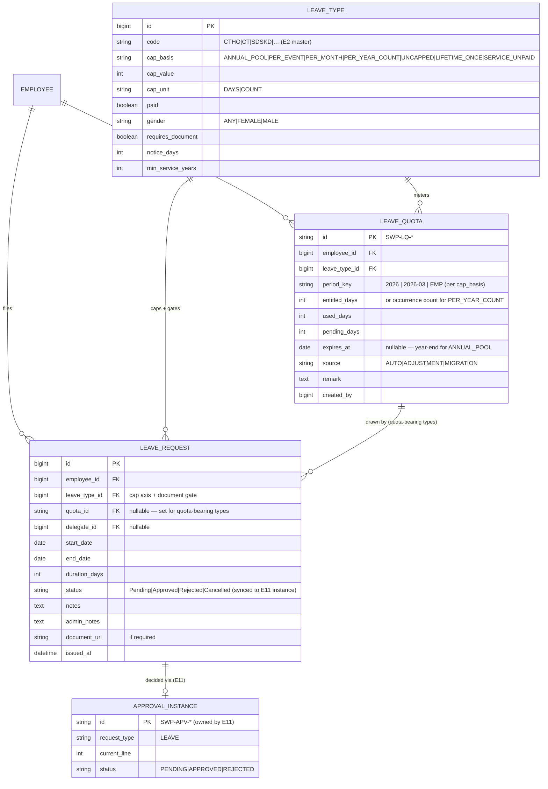
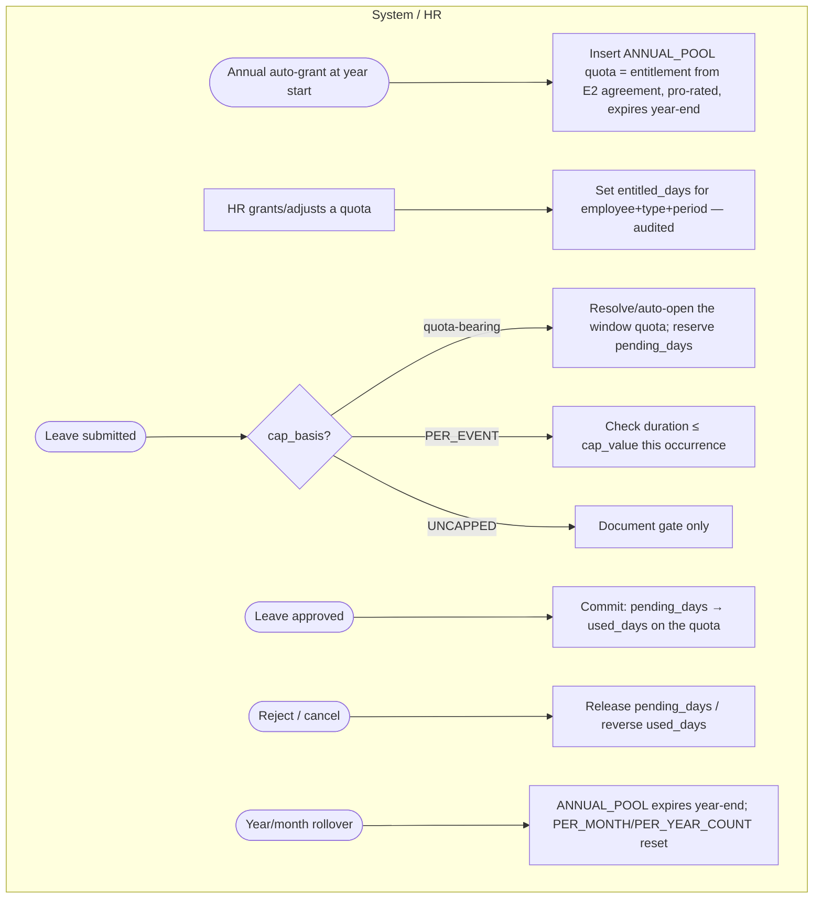
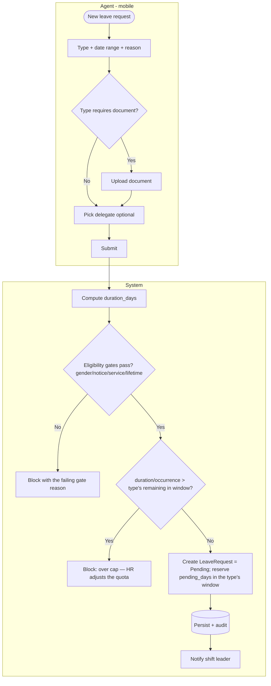
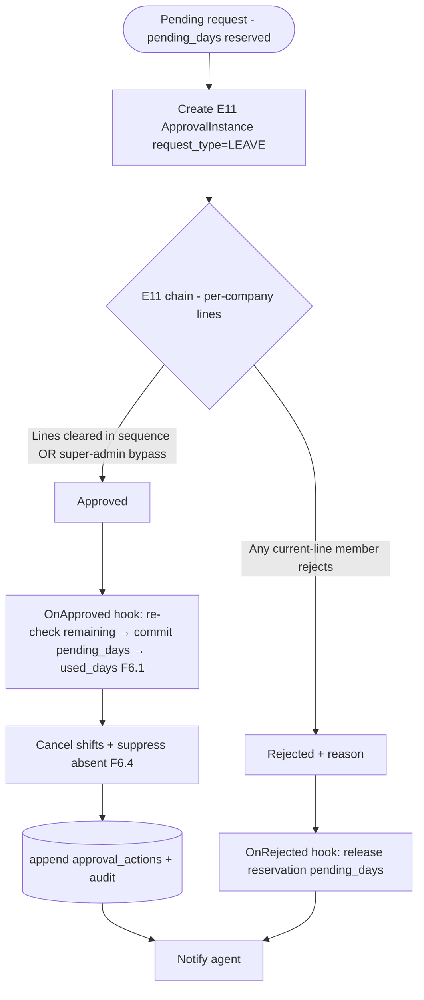
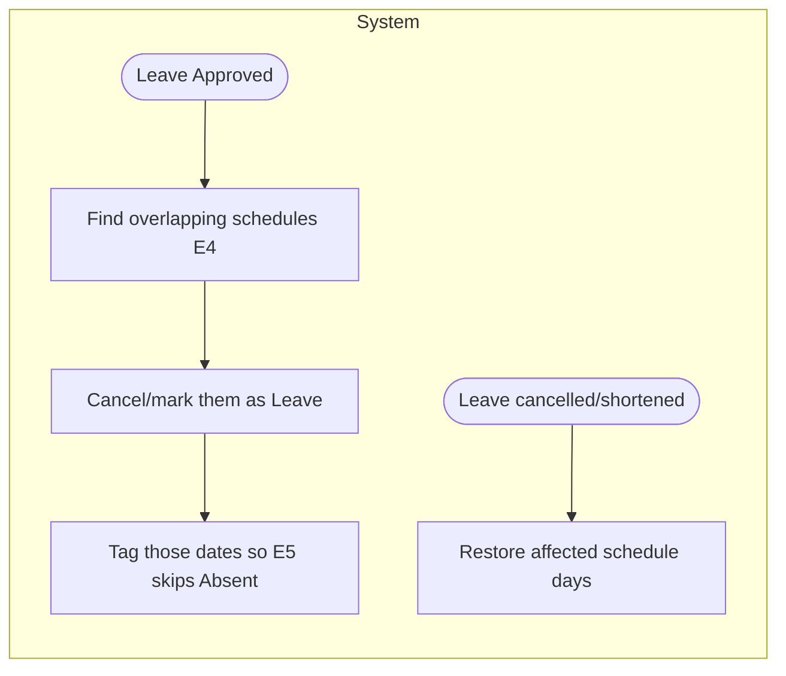

# E6 — Leave Management · Feature Document

> **Epic:** E6 Leave Management · **Status:** Draft v1 · **Parent:** [EPICS.md](../../EPICS.md)
> A **per-type** leave ledger (each leave type carries its own entitlement/cap mechanics), agent leave requests with documents, **approval via the E11 configurable engine** (per-company chain), and integration with scheduling/attendance.

---

## 1. Goal & outcome

Let agents request leave from mobile, track their **leave entitlement per leave type** (cuti), route requests through the **per-company E11 approval chain**, and ensure approved leave **cancels scheduled shifts and never reads as "absent"** in attendance. **`leave_type` is the cap axis:** each type carries its own **`cap_basis`** — `ANNUAL_POOL` (the one accruing, year-end-expiring, no-carryover pool, sourced from the E2 agreement), `PER_EVENT`, `PER_MONTH`, `PER_YEAR_COUNT`, `UNCAPPED`, `LIFETIME_ONCE`, or `SERVICE_UNPAID`. A request is metered against **its own type's window** — statutory event/sick/religious leave **never depletes the annual pool** (Indonesian law: Pasal 93 vs Pasal 79 UU 13/2003 / PP 35/2021). Over-cap requests are **blocked**; balance never goes negative *(per-type ledger, resolved 2026-06-12 — supersedes the 2026-06-08 grant-lot/one-pool model; see §7)*. The active catalog is the **18-code SWP `Fitur Ijin` set** defined in [E2 operational-master-data §5a](../E2-identity/prds/operational-master-data.md).

## 2. Actors & roles

| Actor | Involvement |
|---|---|
| **Agent** | Requests leave (mobile), uploads documents, names a delegate, views balance/history. |
| **Approval line members** | Approve/reject leave where they sit on the agent company's **E11 approval line** (routing by membership, not role — may be the on-site shift leader, lead, HR, …). |
| **HR / Super Admin** | Manages the **leave-type catalog + per-type quotas** (annual auto-grant from the E2 agreement, manual adjustments); configures the E11 template; super admin may **bypass**. |
| **System** | Meters each request against its **leave type's `cap_basis` window**, enforces no-negative balance + eligibility gates (gender/notice/service/lifetime), **creates an E11 approval instance** + fires the commit/integrate hook on approval, cancels shifts, suppresses absent, expires annual quotas, audits, notifies. |

## 3. Scope

**In scope:** per-type leave entitlement ledger (`LeaveQuota` windows by `cap_basis`), leave request (+ documents, delegate), approval **via E11** (leave contributes the commit/integrate hook), leave↔schedule/attendance integration, leave calendar & balances.
**Out of scope:** leave-type definitions (E2 master). Payroll effect of unpaid leave (E8 context). Overtime (E7).

## 4. Domain entities

**Invariants:** *(per-type ledger, resolved 2026-06-12 — supersedes the grant-lot forms)*
- **INV-1:** a request is metered **against its own leave type's `cap_basis` window** — it draws/charges **only** that type's entitlement and **never** another type's (statutory/sick/religious leave never depletes the annual pool). It **cannot exceed the type's cap** in that window — over-cap is **blocked**. Quota-bearing bases (`ANNUAL_POOL`, `PER_MONTH`, `PER_YEAR_COUNT`, `LIFETIME_ONCE`, `SERVICE_UNPAID`) draw a `LeaveQuota` row (`remaining = entitled − used − pending`); `PER_EVENT` caps `duration_days ≤ cap_value` per occurrence (no standing row); `UNCAPPED` is bounded only by the document gate.
- **INV-2:** approval is **routed through the E11 engine** (per-company configurable chain) *(reworked 2026-06-14)* — `LeaveRequest.status` tracks the E11 instance (`Pending → Approved | Rejected`); leave contributes the `OnApproved` hook (re-check + commit quota + integrate) and `OnRejected` (release reservation). *(Supersedes the old fixed two-level `Pending → LeaderApproved → Approved`.)*
- **INV-3:** an **Approved** leave **cancels overlapping scheduled shifts** (E4) and **suppresses "Absent"** in attendance (E5) for those days.
- **INV-4:** **`ANNUAL_POOL` quota expires at its `period_key` year-end — no carryover.** `PER_MONTH` quotas reset each calendar month; `PER_YEAR_COUNT` each year; `LIFETIME_ONCE`/`SERVICE_UNPAID` never reset (one-time per employment). The annual entitlement sources `employment_agreements.annual_leave_entitlement_days` (E2), pro-rated for probation/mid-year joiners.
- **INV-5:** leave types flagged `requires_document` (E2) require a document upload before submission. `leave_type` is the **entitlement/cap axis** (`cap_basis` + gates), not merely a label.
- **INV-6:** balance **never goes negative** — a request only ever charges available entitlement in the window; the over-cap path is block-then-(HR adjusts the quota), never a negative remaining.
- **INV-7:** **request-time eligibility gates** — `gender ≠ ANY` requires a matching `employee.gender`; `notice_days` requires `start_date − today ≥ notice_days`; `min_service_years` requires sufficient tenure; `LIFETIME_ONCE` requires no prior approved request of that type; `paid = false` (e.g. `CLTP`) marks the days **unpaid** for payroll (E8).

## 5. Features

| ID | Feature | PRD |
|----|---------|-----|
| **F6.1** | Leave Entitlement Ledger (per-type quotas) | [leave-quota-balances.md](prds/leave-quota-balances.md) |
| **F6.2** | Leave Request (documents, delegate) | [leave-request.md](prds/leave-request.md) |
| **F6.3** | Leave Approval (via the E11 engine) | [leave-approval.md](prds/leave-approval.md) |
| **F6.4** | Leave–Schedule/Attendance Integration | [leave-schedule-integration.md](prds/leave-schedule-integration.md) |
| **F6.5** | Leave Calendar & Balance Views | [leave-calendar-views.md](prds/leave-calendar-views.md) |

## 6. Platform / clients

| Surface | Who | What |
|---|---|---|
| **Mobile app** | Agent | Request leave, upload docs, pick delegate, view balance & status + chain timeline. |
| **Web / mobile** | Approval line members | Approve/reject the current line of a leave instance (E11 inbox). |
| **Web console** | HR / Super Admin | Configure the E11 template, leave-type catalog + per-type quota grants/adjustments, reporting; super admin may bypass. |

---

### F6.1 — Leave Entitlement Ledger (per-type quotas)

Meter each agent's entitlement **per leave type**, the way the type's `cap_basis` dictates. Quota-bearing types hold a `LeaveQuota` row per (employee, type, window): `ANNUAL_POOL` = one yearly row from the E2 agreement (expires year-end, no carryover); `PER_MONTH` = a row per calendar month (cap resets); `PER_YEAR_COUNT` = a yearly occurrence counter; `LIFETIME_ONCE`/`SERVICE_UNPAID` = a once-per-employment row. `PER_EVENT` and `UNCAPPED` types hold **no standing row** — the former caps `duration_days ≤ cap_value` per occurrence, the latter is bounded only by its document gate. A request **reserves** in its window at submit (`pending_days`), **commits** at approve (`used_days`), **releases** on reject/cancel.

**Entities:** `LeaveQuota`. **Reads:** `LeaveType` (`cap_basis`/`cap_value`/gates, E2). **Depends on:** E2 (`employment_agreements.annual_leave_entitlement_days` as the `ANNUAL_POOL` source).

---

### F6.2 — Leave Request (documents, delegate)

Agent submits a request: type, date range, computed duration, optional **delegate** (who covers), and a **document** when the type requires it. Annual requests pre-check balance.

**Entities:** `LeaveRequest`, reserves on the type's `LeaveQuota.pending_days` (quota-bearing types). **Depends on:** E2 (leave types + cap mechanics), F6.1 (window/metering).

---

### F6.3 — Leave Approval (via the E11 engine)

*(Reworked 2026-06-14.)* Leave routes through the **E11 configurable approval engine** (per-company chain), not a fixed two-level flow. On submit, leave reserves `pending_days` and creates an E11 instance. On the engine's **terminal approve** (last line cleared or super-admin bypass), leave's `OnApproved` hook **re-checks** remaining, **commits** the reservation, and fires integration (F6.4); on **terminal reject**, the `OnRejected` hook **releases** the reservation.

**Entities:** `LeaveRequest` (status synced to the E11 instance), `LeaveQuota`. Approval routing/trail = **E11** (`ApprovalInstance`, `ApprovalAction`); the old `LeaveApproval` table is removed. **Depends on:** E11 (engine), F6.1 (commit/re-check hook), F6.4 (integration).

---

### F6.4 — Leave–Schedule/Attendance Integration

On approval, overlapping **scheduled shifts (E4) are cancelled/marked leave**, and attendance (E5) **does not mark those days Absent**. Cancelling/shortening an approved leave restores the schedule state.

**Entities:** updates `Schedule` (E4), informs `Attendance` (E5). **Depends on:** E4, E5.

---

### F6.5 — Leave Calendar & Balance Views

Agent sees their balance + request history (mobile); leader/HR see a team leave calendar (who's off when) for planning coverage.

**Entities:** reads `LeaveQuota` (per-type balance), `LeaveRequest`. **Depends on:** F6.1–F6.3.

---

## 7. Decisions & open questions

**Resolved (2026-05-29):**
- ✅ **Annual lump grant** per period; tracked total/used/remaining (matches legacy `employee_leave_quotas`). *(superseded 2026-06-08 — annual entitlement is now a single `ANNUAL` grant-lot in the per-employee ledger; see the Resolved 2026-06-08 block.)*
- ✅ **Expire at period end** (no carryover). *(superseded 2026-06-08 — replaced by hard per-lot `expires_at`.)*
- ~~✅ **Two-level approval**: shift leader → HR (escalate to HR if no leader).~~ — **superseded 2026-06-14**: leave routes through the **E11 configurable approval engine** (per-company chain; no-template → super-admin fallback); see F6.3 + [leave-approval PRD](prds/leave-approval.md).
- ✅ **Block** annual requests beyond remaining balance. *(kept — restated as no-negative allocation across grant-lots, 2026-06-08.)*

**Resolved — open-items review (2026-05-29), see [EPICS.md §8](../../EPICS.md):**
- ✅ **Duration** = working days **excluding public holidays**.
- ✅ **Period basis** = **calendar year**. *(superseded 2026-06-08 — balance is per-lot; an `ANNUAL` lot's `expires_at` = period end, but there is no global calendar-year balance period.)*
- ✅ **Probation** = **pro-rated** annual leave (also pro-rate mid-year joiners).
- ✅ **Non-annual types** (sick/maternity/unpaid) = **per-type quotas** (`LeaveQuota` generalized to one per employee/leave_type/period). *(superseded 2026-06-08, then **reinstated and extended 2026-06-12** — `leave_type` is again the cap axis, now with an explicit `cap_basis` taxonomy per type; see the Resolved 2026-06-12 block.)*
- ✅ **Half-day leave** = not in v1 (full days only).
- ✅ **Delegate** = informational/notified (no enforced coverage).

**Resolved (2026-05-31) — coverage & UX, from design review:**
- ✅ **Coverage model (domain separation):** *Placement* (E3) = long-term site assignment; *delegation* (E6) = an occasional, **informational suggestion** by the agent; *coverage* of a leave gap = **scheduling (E4)** — approved leave clears the agent's shifts → those become **open/uncovered slots** the **shift leader backfills** by re-rostering an already-placed **same-company** agent. The delegate is shown to the leader as a **non-binding suggested** backfill.
- ✅ **Uncovered-post flag:** the team leave calendar (F6.5) **and** the E4 schedule surface the resulting uncovered slots ("perlu pengganti"). **No auto-substitution and no cross-company borrowing in v1** — the leader decides.
- ✅ **Coverage clash = dropped** (2026-06-12): no clash highlight. The team calendar shows who is off when; the leader judges coverage. *(Was service-line-aware; service line removed project-wide, and raw-headcount clash was not wanted.)*
- ✅ **Delegate eligibility:** agent self-service at request time; **not constrained** to company in v1.
- ✅ **Quota grant UX:** annual quota auto-grants at period start (LQ-1); HR also has a **manual "Terbitkan Kuota Tahunan"** trigger/repair (period · default entitlement per type · pro-rata · preview count) and a per-employee **adjust modal requiring a reason** (LQ-6, audited). *(restated 2026-06-08 — the auto-grant now writes a single `ANNUAL` lot; "adjust" and pre-funding both insert/adjust a `LeaveGrant` lot with `amount_days`, `expires_at`, optional `earmark`, `remark`, audited.)*

**Resolved (2026-06-12) — leave entitlement = per-type ledger (`leave_type` is the cap axis)** *(supersedes the entire 2026-06-08 grant-lot/one-pool block below; mirrors [EPICS.md §8](../../EPICS.md). Driver: SWP's `Fitur Ijin` policy — 18 distinct types each with its own statutory cap; under Indonesian law event/sick/religious leave is **separate from** the 12-day annual (Pasal 93 vs Pasal 79 UU 13/2003 / PP 35/2021), so it cannot draw one pool)*:
- ✅ **`leave_type` carries its own cap mechanics** (`cap_basis`, `cap_value`, `cap_unit`, `paid`, `gender`, `requires_document`, `notice_days`, `min_service_years`, `lead/trail_days`) — defined in [E2 operational-master-data §5a](../E2-identity/prds/operational-master-data.md) and seeded as the **18-code catalog**.
- ✅ **`cap_basis` taxonomy** drives metering: `ANNUAL_POOL` (sole accruing pool, year-end expiry, no carryover, from the E2 agreement) · `PER_EVENT` (fixed days/occurrence) · `PER_MONTH` (resets monthly) · `PER_YEAR_COUNT` (occurrence count/year) · `UNCAPPED` (doc-bounded) · `LIFETIME_ONCE` (once/employment) · `SERVICE_UNPAID` (eligibility-gated, unpaid, once).
- ✅ **`LeaveQuota` (`SWP-LQ-*`) is reinstated, generalized per-type**: `id, employee_id, leave_type_id, period_key (year | year-month | EMP), entitled_days, used_days, pending_days, expires_at (nullable), source (AUTO|ADJUSTMENT|MIGRATION), remark, created_by`. One row per (employee, type, window) for quota-bearing bases; `PER_EVENT`/`UNCAPPED` hold no row. Replaces `LeaveGrant`/`LeaveConsumption`.
- ✅ **Each type meters in its own window** (INV-1) — a request never charges another type's entitlement; the annual pool is never depleted by statutory/sick/religious leave.
- ✅ **No negative balance** (INV-6); over-cap → block, HR adjusts the type's quota. **Eligibility gates** (gender/notice/service/lifetime-once) enforced at request time (INV-7). `paid=false` → unpaid for payroll E8.
- ✅ **Reserve/commit/release** on `pending_days`/`used_days` (submit/approve/reject-cancel). `ANNUAL_POOL` expires year-end; `PER_MONTH`/`PER_YEAR_COUNT` reset on rollover.
- **Invariant remaps:** LQ-1 → annual auto-grant writes one `ANNUAL_POOL` quota from `employment_agreements.annual_leave_entitlement_days`. LQ-2/LQ-3 → reserve/commit/release on `pending_days`/`used_days`. LQ-4 → per-`cap_basis` window expiry/reset (annual year-end, no carryover). LQ-5/LQ-6 kept (no-negative; HR adjusts a quota, audited). LQ-7 → reinstated (one quota per type/window).

<strong>Superseded — Resolved (2026-06-08) — leave balance = per-employee grant-lot ledger</strong> (kept for history; replaced 2026-06-12)

- ✅ **One pool per employee.** `leave_type` is only a **label + document gate (`requires_document`) + calendar color** — no longer a balance axis. All ordinary types draw the one pool.
- ✅ **Grants are lots** (`LeaveGrant`, `SWP-LG-*`): one row per insert, each with its own `expires_at`. Columns: `id, employee_id, amount_days, granted_at, effective_from, expires_at, source (ANNUAL|ADJUSTMENT|MATERNITY|STATUTORY|MIGRATION|BONUS), earmark (nullable), remark, consumed_days, pending_days, created_by, created_at/updated_at`. Remaining-per-lot = `amount − consumed − pending`.
- ✅ **Hard per-lot expiry, no carryover.** A lot expires at its own `expires_at` (expiry sweep zeroes it). No year-end global expiry, no carryover minting (INV-4).
- ✅ **Consumption = FIFO by soonest `expires_at`**, across eligible lots, recorded per-lot in `LeaveConsumption` (`SWP-LC-*`): `id, leave_request_id (FK), grant_id (FK), days, created_at`. Replaces the single `balance_quota_id` snapshot on `LeaveRequest`. Cancel/restore reverses the exact consumption rows (INV-1).
- ✅ **No negative balance** (INV-6, keeps LQ-5). Over-quota → HR adds a lot (pre-fund), never a negative balance.
- ✅ **Long / statutory leave = HR pre-funds a lot** — e.g. maternity: HR inserts `source=MATERNITY, earmark=MATERNITY, remark, expires_at`; the employee then requests against it. No bypass flag, no separate table.
- ✅ **Optional earmark** (INV-7). Unearmarked lots = the flat pool (ordinary FIFO). Earmarked lots are consumed **only** by a request of that purpose and are invisible to ordinary FIFO. Balance UI = total pool (unearmarked) + a line per earmarked lot with its expiry. Balance = Σ(`amount − consumed − pending`) over lots where `now < expires_at`, split unearmarked-vs-earmarked.
- **Invariant remaps:** LQ-1 → replaced (entitlement granted as lots; annual auto-grant sources `employment_agreements.annual_leave_entitlement_days`, writes one `ANNUAL` lot). LQ-4 → replaced by per-lot hard expiry. LQ-5 → kept (no-negative, at allocation). LQ-7 → dropped (lots, not per-type rows). LQ-2/LQ-3 → restated as FIFO reserve/commit/release on consumption rows. LQ-6 → HR grants/adjusts a lot (amount, `expires_at`, earmark, remark), audited.

**Still open (confirm with SWP):**
1. Exact "working day" definition for 24/7 shift workers (rostered days vs standard business days) used in duration counting.
