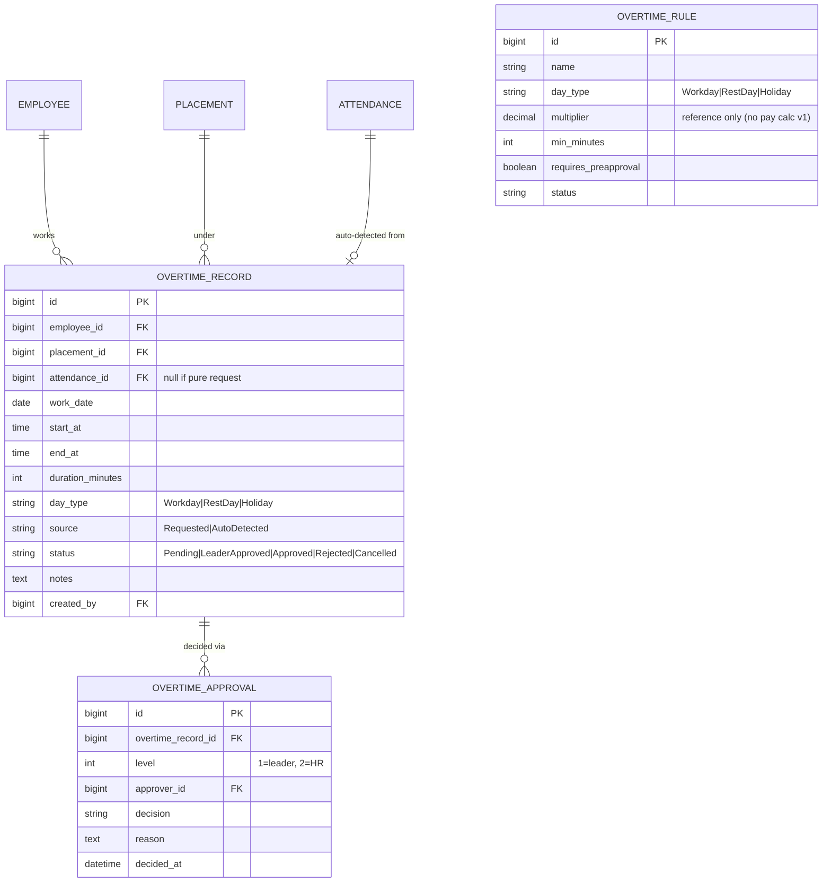
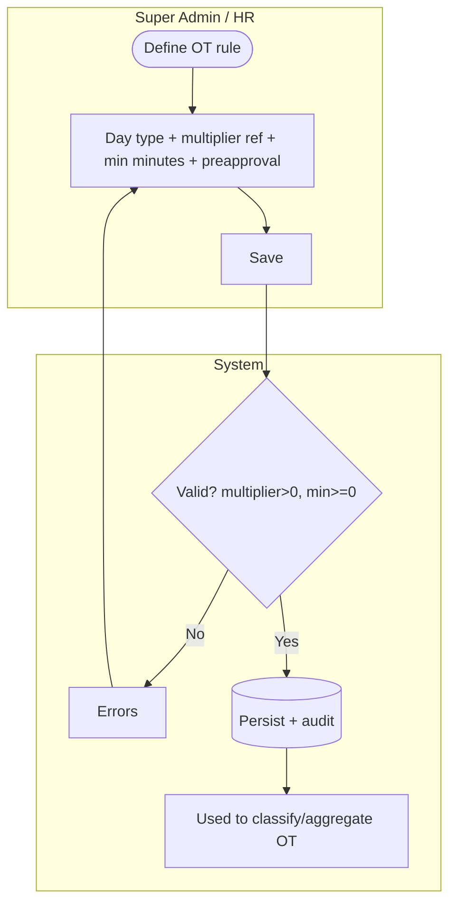
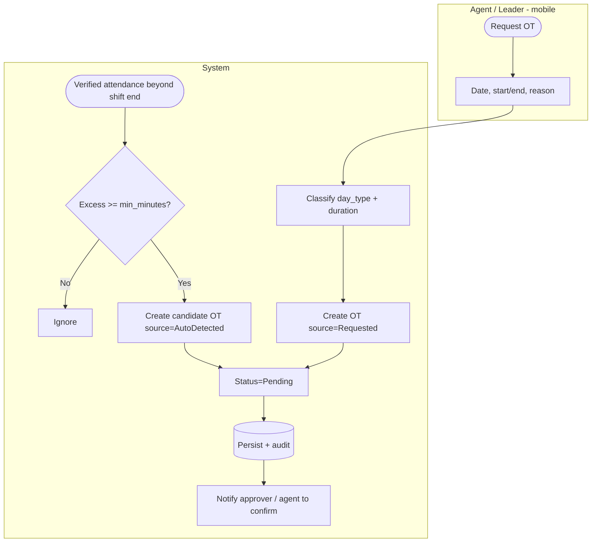
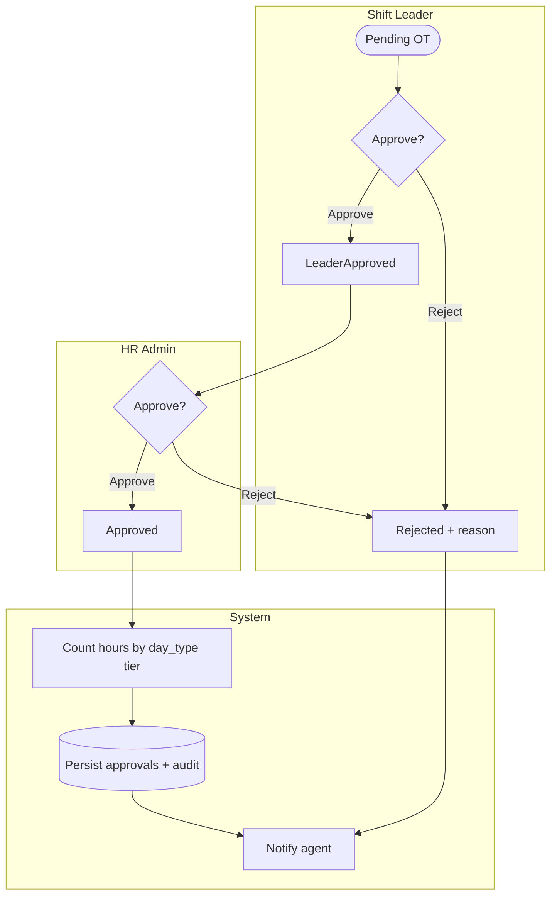
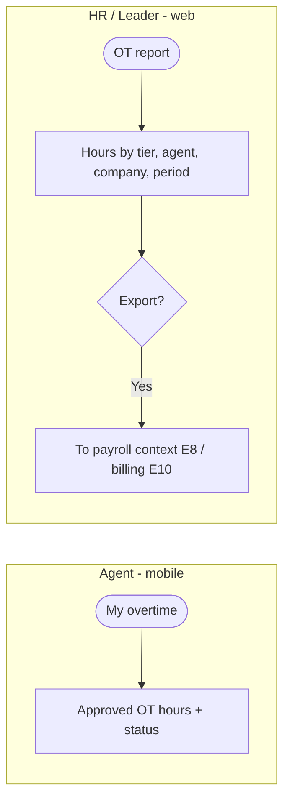

# E7 — Overtime Tracking · Feature Document

> **Epic:** E7 Overtime Tracking · **Status:** Draft v1 · **Parent:** [EPICS.md](../../EPICS.md)
> Capture overtime (pre-request + auto-detect from attendance), classify hours into day-type tiers, approve leader → HR, and record hours (no pay calc in v1).

---

## 1. Goal & outcome

Track overtime hours for placed agents: agents/leaders can **pre-request** OT, and the system **auto-detects** work beyond the scheduled shift from verified attendance (E5). OT is classified into **day-type tiers** (workday / rest day / public holiday) per configurable rules, approved through **shift leader → HR**, and recorded as **hours** (the regulation multipliers are stored as reference for a future payroll run; **no monetary calc in v1**).

## 2. Actors & roles

| Actor | Involvement |
|---|---|
| **Agent** | Requests OT, confirms auto-detected OT, views own OT (mobile). |
| **Shift Leader** | First-level approver for their company's OT. |
| **HR / Super Admin** | Second-level approver; manages OT rules + holiday calendar; reporting. |
| **System** | Auto-detects OT from attendance, classifies day type, runs the two-level flow, records hours, audits. |

## 3. Scope

**In scope:** OT rules (tiered), OT capture (request + auto-detect), two-level approval, OT records & reporting (hours by tier).
**Out of scope:** actual OT **pay** computation/payroll runs (E8 read-only / future); attendance capture (E5); leave (E6).

## 4. Domain entities

**Invariants:**
- **INV-1:** every OT record is classified into a **day_type** (Workday / RestDay / Holiday), derived from the schedule (E4) + the public-holiday calendar (§6b).
- **INV-2:** OT is recorded as **hours/minutes only**; the rule `multiplier` is stored as reference, **not applied to pay** in v1.
- **INV-3:** **two-level approval** — `Pending → LeaderApproved → Approved`; reject at either level ends it.
- **INV-4:** auto-detected OT is a **candidate** requiring confirmation/approval; it never counts until approved.
- **INV-5:** OT below a rule's `min_minutes` is **not counted** (ignored or flagged).

## 5. Features

| ID | Feature | PRD |
|----|---------|-----|
| **F7.1** | Overtime Rules (day-type tiers) | [overtime-rules.md](prds/overtime-rules.md) |
| **F7.2** | Overtime Capture (request + auto-detect) | [overtime-capture.md](prds/overtime-capture.md) |
| **F7.3** | Two-Level Approval Workflow | [overtime-approval.md](prds/overtime-approval.md) |
| **F7.4** | Overtime Records & Reporting | [overtime-records.md](prds/overtime-records.md) |

## 6. Platform / clients

| Surface | Who | What |
|---|---|---|
| **Mobile app** | Agent | Request OT, confirm auto-detected OT, view own OT. |
| **Web / mobile** | Shift Leader | Level-1 approve/reject for their company. |
| **Web console** | HR / Super Admin | Level-2 approval, OT rules + holiday calendar, reporting/export. |

## 6b. Cross-epic note

Day-type classification needs:
- **Public-holiday calendar** — a small master (propose in E2 or here) listing public holidays.
- **Rest-day logic** — a "rest day" = a day the agent has **no scheduled shift** (their weekly off). Working then = rest-day OT.
Both flagged as open items (§7).

---

### F7.1 — Overtime Rules (day-type tiers)

Admin-defined rules with **tiered multipliers by day type** (workday / rest day / holiday) — **global only** (one rule per day type), plus a minimum-duration threshold and a pre-approval flag. Multipliers are stored as **reference** (future payroll); v1 records hours.

**Entities:** `OvertimeRule`. **Depends on:** holiday calendar (§6b).

---

### F7.2 — Overtime Capture (request + auto-detect)

Two paths into an OT record: an agent/leader **pre-requests** OT, or the system **auto-detects** worked time beyond the scheduled shift end from **verified attendance** (E5) and raises a candidate. Both classify day type and enter the approval flow.

**Entities:** `OvertimeRecord` (create). **Depends on:** F7.1, E5 (verified attendance), E4 (shift end).

---

### F7.3 — Two-Level Approval Workflow

Shift leader approves first, then HR confirms (same pattern as leave). Auto-detected candidates may require the agent to confirm before/at level 1. Only approved OT counts in reporting.

**Entities:** `OvertimeApproval`, `OvertimeRecord`. **Depends on:** F3.4 (leader scope / HR escalation).

---

### F7.4 — Overtime Records & Reporting

Approved OT recorded as **hours by day-type tier**, viewable per agent (mobile) and aggregated per company/position/period for HR — feeding future payroll (E8) and client billing/reporting (E10).

**Entities:** reads `OvertimeRecord`, `OvertimeRule`. **Depends on:** F7.1–F7.3, E8/E10.

---

## 7. Decisions & open questions

**Resolved (2026-05-29):**
- ✅ **Capture = request + auto-detect** (from verified attendance beyond shift end).
- ✅ **Hours only** — record OT hours; multipliers stored as reference, **no pay calc** in v1.
- ✅ **Two-level approval** (shift leader → HR).
- ✅ **Day-type tiers** (workday / rest day / holiday), **global only** (one rule per day type). *(Service-line scoping + precedence dropped 2026-06-12 — service line removed project-wide.)*

**Resolved — open-items review (2026-05-29), see [EPICS.md §8](../../EPICS.md):**
- ✅ **Public-holiday calendar** = **HR-maintained in-app** master (recurring + one-off); shared with E6 duration counting.
- ✅ **Rest-day** = a day the agent has **no scheduled shift**.
- ✅ **Auto-detected OT** = **agent confirms, then leader approves**.
- ✅ **`min_minutes`** = **60**.
- ✅ **Pre-approval** = worked-without-request OT still approvable after the fact (flagged).
- ✅ Holiday tier beats Rest-day when both apply; cross-midnight OT → start date.
