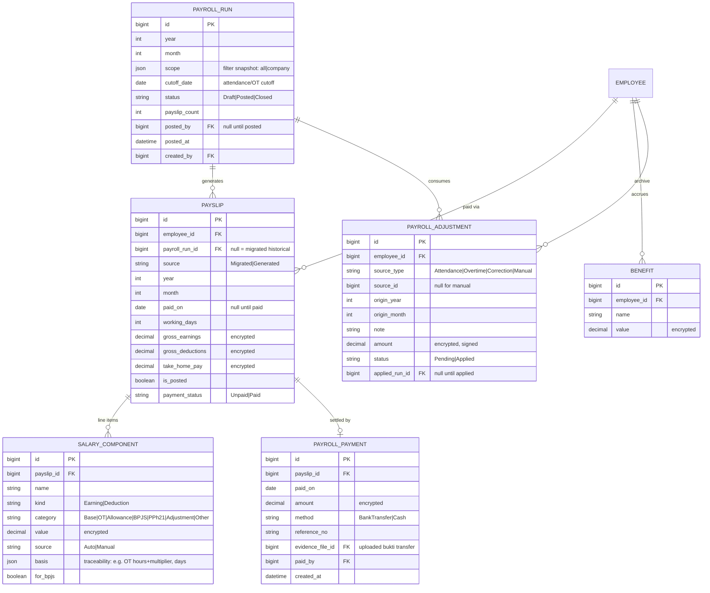
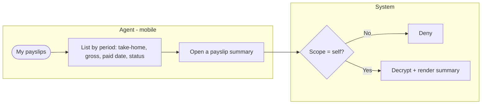
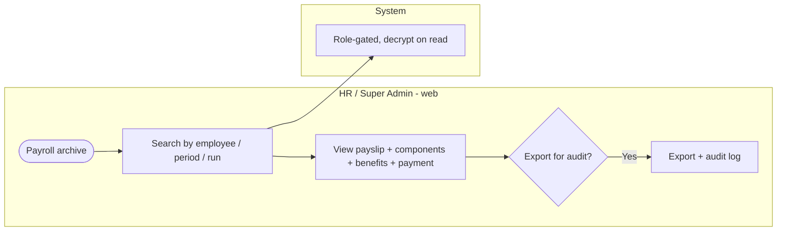
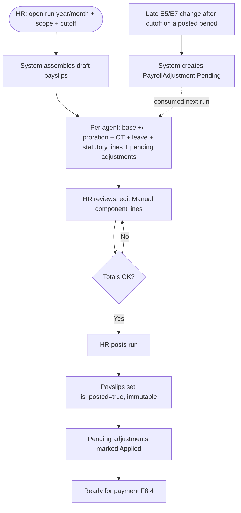
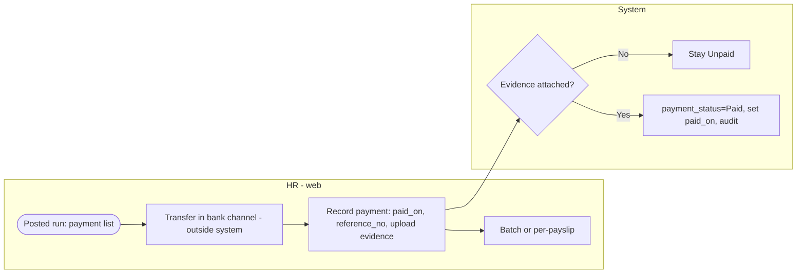

# E8 — Payroll (historical archive + compute-assist runs) · Feature Document

> **Epic:** E8 Payroll · **Status:** Draft v2 · **Parent:** [EPICS.md](../../EPICS.md)
> Two jobs: **(1)** preserve and display **migrated historical** payroll (read-only), and **(2)** run a **monthly compute-assist payroll** — the system computes each agent's pay from E2/E5/E6/E7, HR reviews and posts immutable payslips, then records the **manually executed** bank transfer with evidence. **No external API** (no bank / BPJS / tax-authority integration) in v1.

> **Scope change (2026-06-11):** v1 was *data-only* (no active runs). Ratified to **active compute-assist payroll** — see [EPICS.md §8 E8](../../EPICS.md). Migrated history stays read-only and immutable; new runs add F8.3/F8.4.

---

## 0. Two money flows — keep separate (anchor)

The differentiator of an outsourcing business is two **distinct** money flows; this epic owns only the second.

| Flow | Direction | Unit | Owner |
|---|---|---|---|
| **Client billing** | client → SWP (revenue) | **hours** (rate applied **outside** the system) | E5 verified attendance → E10 billable report |
| **Agent payroll** | SWP → agent (cost) | **monthly wage** (base + additions − deductions) | **E8 (this epic)** |

**Agent payroll is NOT computed from billable hours.** Billable hours invoice the *client*. An agent is paid a **monthly salary** (E2 `EmploymentAgreement.base_salary`), modulated per period by verified attendance, approved OT, and leave. This matches Indonesian alih-daya practice (monthly UMR/UMP-based wage) and the legacy model (`gaji_pokok` monthly + `total_hari_kerja` working-days), **not** an hourly wage. See INV-6.

## 1. Goal & outcome

1. **History (continuity):** migrate SWP's existing payroll and surface it read-only — agents see their own past payslip summaries (mobile); HR keeps the full archive (components + benefits) for compliance.
2. **Compute-assist runs (new):** each month HR opens a **payroll run** scoped to a population; the system **assembles** per-agent pay from authoritative upstream data (E2 base, E5 verified attendance, E6 leave, E7 approved OT), HR reviews/adjusts editable component lines, **posts** to generate **immutable** payslips, then records the **manual** transfer + uploads evidence. Late-verified upstream changes after cutoff carry forward as next-period adjustments — posted payslips never change.

**Explicitly out for v1:** bank/BPJS/tax integration; an automatic statutory (BPJS/PPh21) calculation engine (statutory amounts are entered as **editable component lines**, assisted by stored config); client invoicing (stays hours-only, outside).

## 2. Actors & roles

| Actor | Involvement |
|---|---|
| **Agent** | Views own payslip summaries — migrated + generated (mobile, read-only). |
| **HR / Super Admin** | Runs payroll (open → review → post), edits component lines, records payment + uploads transfer evidence; full archive read + export. |
| **System** | Assembles pay from E2/E5/E6/E7; enforces read-only history, immutability of posted payslips, encryption, scope; carries late changes forward as adjustments; audits. |

> Finance sub-role: **none in v1** — HR performs payroll runs and payments (consistent with EPICS §8). A dedicated Finance role is a future option.

## 3. Scope

**In scope:** migrated payslip history (agent summary + HR archive, read-only); **monthly compute-assist payroll run** (assemble → review/adjust → post immutable payslips); **payment recording** (manual transfer reference + evidence upload, per payslip or batch); **prior-period carry-forward adjustments**; encrypted comp at rest; audit + export.

**Out of scope (v1):** automatic BPJS/PPh21 calculation engine (statutory lines are HR-entered/editable); bank / BPJS / tax-authority API integration; client invoicing & rate application (E10 hours-only, outside); editing a **posted** payslip; multi-currency (IDR only).

## 4. Domain entities

**Invariants:**
- **INV-1:** a **posted** payslip is **immutable** — no edits to its totals or component lines after `is_posted` (migrated payslips are posted on import). Corrections flow forward via `PayrollAdjustment`, never by editing a posted payslip.
- **INV-2:** all monetary fields (`*_earnings`, `*_deductions`, `take_home_pay`, component `value`, payment `amount`, benefit `value`, adjustment `amount`) are **encrypted at rest**; access is role-gated; decrypt on read for authorized viewers only.
- **INV-3:** an agent sees **only their own** payslip **summaries** (take-home, gross earnings, gross deductions, working days, period, payment status) — **not** the component breakdown.
- **INV-4:** the full breakdown (`SALARY_COMPONENT`) + benefits are **HR/Super Admin only**.
- **INV-5:** payroll math is **agent-pay only inside SWP** — **no client invoicing / rate application** in E8 (that stays outside, hours-only per E10).
- **INV-6:** the agent pay base is the **monthly** `EmploymentAgreement.base_salary` (E2), **not** an hourly rate. Attendance/OT/leave **modulate** the monthly amount (proration + additions/deductions); they do not define an hourly wage.
- **INV-7:** a payroll run **assembles** from authoritative upstream data (E2/E5/E6/E7) at run time; only **verified** attendance (E5) and **Approved** OT (E7) are eligible (consistent with E5/E10 "verified-only").
- **INV-8:** payment is **manual** — the system records a transfer reference + evidence; it does **not** move money. A payslip is `Paid` only once a `PayrollPayment` with evidence exists.

## 5. Features

| ID | Feature | PRD |
|----|---------|-----|
| **F8.1** | Payslip History & Summaries (read-only; migrated + generated) | [payslip-history.md](prds/payslip-history.md) |
| **F8.2** | Payroll Archive & Retention (HR) | [payroll-archive.md](prds/payroll-archive.md) |
| **F8.3** | Compute-Assist Payroll Run (assemble → review → post) | [payroll-run.md](prds/payroll-run.md) |
| **F8.4** | Payment Recording & Transfer Evidence (manual) | [payroll-payment.md](prds/payroll-payment.md) |

## 6. Platform / clients

| Surface | Who | What |
|---|---|---|
| **Mobile app** | Agent | View own payslip summaries (migrated + generated), read-only. |
| **Web console** | HR / Super Admin | Run payroll, review/adjust, post; record payment + upload evidence; full archive + export. |

---

### F8.1 — Payslip History & Summaries (read-only)

Agents view their own payslips at summary level (take-home, gross earnings, gross deductions, working days, pay date, period, **payment status**) — both **migrated** historical and newly **generated** ones (single unified list). HR can view any agent's. No component breakdown at this level.

**Entities:** reads `Payslip`. **Depends on:** E2 (employee), E9 (migrated payslips), F8.3 (generated payslips).

---

### F8.2 — Payroll Archive & Retention (HR)

The full payroll dataset (payslips + their salary-component line items + benefits + payments), preserved for HR lookup, audit, and compliance retention, with export. Covers both migrated and generated payslips; generated ones additionally expose the run + payment trail.

**Entities:** reads `Payslip`, `SalaryComponent`, `Benefit`, `PayrollPayment`. **Depends on:** E9 (migration), E1 (RBAC/audit), F8.3/F8.4.

---

### F8.3 — Compute-Assist Payroll Run

HR opens a monthly run, the system **assembles** each agent's draft payslip from upstream data, HR reviews and adjusts **editable** component lines, then **posts** to generate immutable payslips. Late-verified upstream changes after the cutoff are carried forward as next-period `PayrollAdjustment` lines.

**Assembly (per agent, draft):**
- **Base** = `EmploymentAgreement.base_salary` (E2), prorated only for mid-period join/leave and unpaid absence/leave (full-month workers not prorated). *(default)*
- **Proration / absence** = from **verified** E5 attendance against `AttendanceCode.is_payable`; non-payable codes reduce pay.
- **Overtime** = sum of **Approved** E7 `OvertimeRecord` hours × `OvertimeRule.multiplier` × **hourly base**, where hourly base = `base_salary / 173` *(default — Permenaker formula, configurable)*.
- **Leave** = E6 paid leave (no deduction) vs unpaid leave (deduction).
- **Statutory & allowances** = **editable component lines** (BPJS employee portion, PPh21, allowances) — assisted by stored config but **HR-entered/editable**, not an auto-engine.
- **Prior-period adjustments** = any `PayrollAdjustment(status=Pending)` for the agent appended as `Adjustment` lines.
- Totals: `gross_earnings`, `gross_deductions`, `take_home_pay` recomputed live in draft.

**Eligibility:** only **verified** attendance (E5) and **Approved** OT (E7) (INV-7). Pending/unverified upstream records are excluded from the draft and, if verified after cutoff, become adjustments.

**Entities:** writes `PayrollRun`, `Payslip`, `SalaryComponent`, `PayrollAdjustment`. Reads E2 `EmploymentAgreement`, E5 `Attendance`/`AttendanceCode`, E6 leave, E7 `OvertimeRecord`/`OvertimeRule`. **Depends on:** E1 (RBAC/audit), E2, E5, E6, E7.

---

### F8.4 — Payment Recording & Transfer Evidence (manual)

After a run is posted, HR executes transfers in their own bank channel (outside the system) and records each payment with a reference and **uploaded bukti transfer**. A payslip becomes `Paid` only when a `PayrollPayment` with evidence exists (INV-8). Supports per-payslip and batch recording.

**Entities:** writes `PayrollPayment`, updates `Payslip.payment_status`/`paid_on`. **Depends on:** F8.3, E1 (audit + file storage).

---

## 7. Decisions & open questions

**Resolved (2026-05-29) — history layer:**
- ✅ Migrated payroll is **read-only** and **immutable** (HR may annotate via an audited note; no edits).
- ✅ Agents view **own payslip summaries** (mobile); HR has the full archive; **summary-level** for agents, components HR-only.
- ✅ **No forward payroll-input export** from E8 (E5/E7 exports feed external client-billing; E8 owns agent pay).

**Resolved (2026-06-11) — active payroll (see [EPICS §8 E8](../../EPICS.md)):**
- ✅ **Flip to compute-assist payroll** — system assembles from E2/E5/E6/E7, HR posts **immutable** payslips. (Reverses the 2026-05-29 "data-only v1".)
- ✅ **Monthly wage base**, not hourly (INV-6) — consistent with E2 `base_salary` (locked 2026-06-07) and legacy.
- ✅ **Manual payment** — system records transfer reference + evidence; no bank API (INV-8).
- ✅ **No statutory auto-engine** — BPJS/PPh21 are **editable component lines** (assisted by config); a full statutory calculator is a future epic.
- ✅ **Late-verified upstream → next-period carry-forward adjustment** (INV-1 protects posted payslips).
- ✅ OT pay = hours × `OvertimeRule.multiplier` × hourly base; **hourly base = base_salary / 173** *(default, configurable — Permenaker)*.
- ✅ Finance sub-role **none in v1** — HR runs payroll.

**Still open:**
1. Payroll **retention period** + whether purge is ever permitted (compliance input).
2. Proration rule for mid-period join/leave — calendar-day vs working-day divisor *(default: calendar-day)*; confirm with payroll.
3. Whether a posted run can be **re-opened before payment** (vs adjustment-only). *(default: no re-open; Draft→Posted is one-way)*.
4. Payslip **PDF** generation/download (deferred from history layer) — still later.
