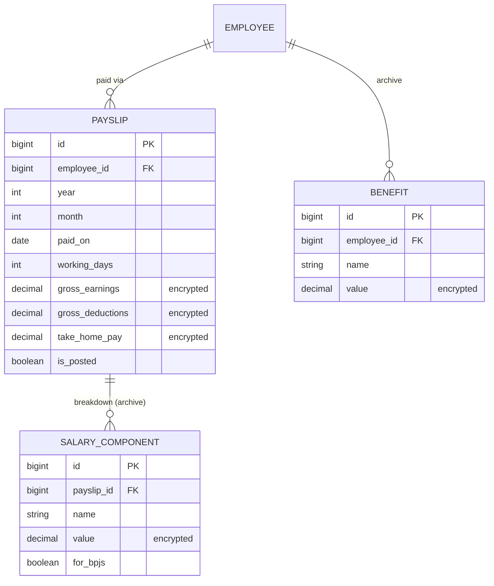
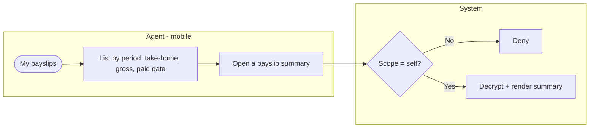
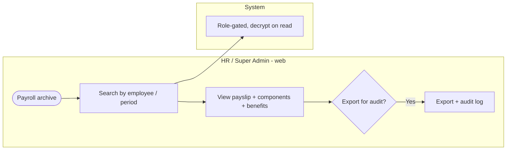

# E8 — Payroll (historical, read-only) · Feature Document

> **Epic:** E8 Payroll Data · **Status:** Draft v1 · **Parent:** [EPICS.md](../../EPICS.md)
> Preserve and display **historical** payroll for continuity — read-only payslip summaries for agents (mobile) and a full HR archive. **No active payroll runs in v1.**

---

## 1. Goal & outcome

Migrate and surface SWP's existing payroll **for history and continuity**, not to run payroll. Agents can view their **own past payslip summaries** (take-home, gross, period) on mobile; HR retains the **full payroll archive** (payslips + component breakdown + benefits) for compliance and lookup. Per decision: **purely historical display, summaries only, no forward payroll-input export** (the attendance/OT exports in E5/E7 serve whatever runs payroll externally).

## 2. Actors & roles

| Actor | Involvement |
|---|---|
| **Agent** | Views own historical payslip summaries (mobile, read-only). |
| **HR / Super Admin** | Full read access to the payroll archive (payslips, components, benefits); exports for audit/compliance. |
| **System** | Enforces read-only + encryption + scope; serves the archive. |

## 3. Scope

**In scope:** read-only payslip summaries (agent + HR), full HR payroll archive (retention/compliance), encrypted comp at rest.
**Out of scope:** **active payroll runs / calculations** (no v1); **forward payroll-input export** (not built — E5/E7 exports cover external payroll inputs); editing payroll (read-only).

## 4. Domain entities

**Invariants:**
- **INV-1:** payroll data is **read-only** in v1 (only created via migration; no in-app creation/edits).
- **INV-2:** all monetary fields are **encrypted at rest**; access is role-gated.
- **INV-3:** an agent sees **only their own** payslip **summaries** (take-home, gross, deductions, period) — **not** the component breakdown.
- **INV-4:** the full breakdown (`SALARY_COMPONENT`) + benefits are **HR/Super Admin only** (archive).
- **INV-5:** **no forward payroll-input export** from E8 (out of scope).

## 5. Features

| ID | Feature | PRD |
|----|---------|-----|
| **F8.1** | Payslip History (read-only summaries) | [payslip-history.md](prds/payslip-history.md) |
| **F8.2** | Payroll Archive & Retention (HR) | [payroll-archive.md](prds/payroll-archive.md) |

## 6. Platform / clients

| Surface | Who | What |
|---|---|---|
| **Mobile app** | Agent | View own payslip summaries (read-only). |
| **Web console** | HR / Super Admin | Full payroll archive: payslips + components + benefits; compliance export. |

---

### F8.1 — Payslip History (read-only summaries)

Agents view their own past payslips at summary level (take-home, gross earnings, gross deductions, working days, pay date, period). HR can view any agent's. No component breakdown at this level.

**Entities:** reads `Payslip`. **Depends on:** E2 (employee), E9 (migrated payslips).

---

### F8.2 — Payroll Archive & Retention (HR)

The full migrated payroll dataset (payslips + their salary-component line items + benefits), preserved read-only for HR lookup, audit, and compliance retention, with export.

**Entities:** reads `Payslip`, `SalaryComponent`, `Benefit`. **Depends on:** E9 (migration), E1 (RBAC/audit).

---

## 7. Decisions & open questions

**Resolved (2026-05-29):**
- ✅ **Purely historical display** — no active payroll runs in v1.
- ✅ **No forward payroll-input export** from E8 (E5/E7 exports feed external payroll).
- ✅ Agents view **own payslip summaries on mobile**; HR has the full archive.
- ✅ **Summary level** for agents (take-home/gross/period); component breakdown is HR-only.

**Resolved — open-items review (2026-05-29), see [EPICS.md §8](../../EPICS.md):**
- ✅ **Payslip access** = view-only in v1 (PDF download later).
- ✅ **Historical payroll** = immutable; HR may annotate via an audited note (no edits).
- ✅ **Finance sub-role** = none in v1 (HR sees payroll).
- ✅ A future real-payroll epic consumes E5/E7 exports + E2 comp; E8 stays read-only.

**Still open (compliance input):**
1. Payroll **retention period** + whether purge is ever permitted.
