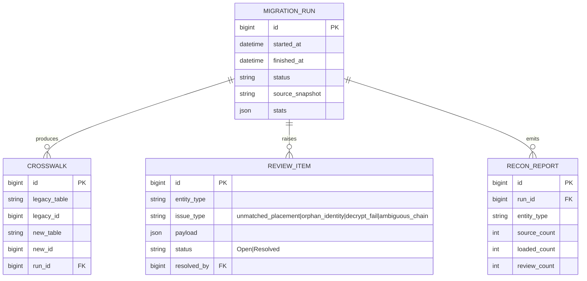
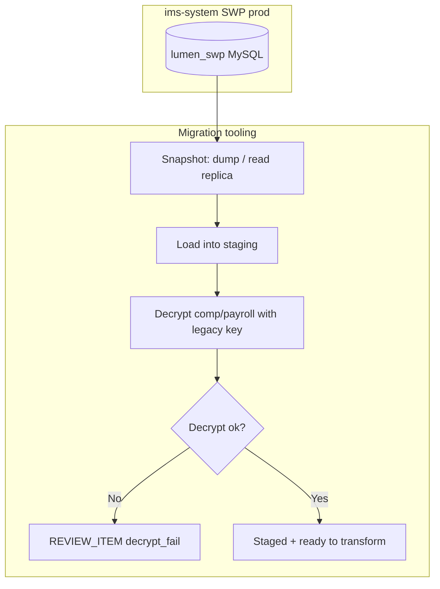
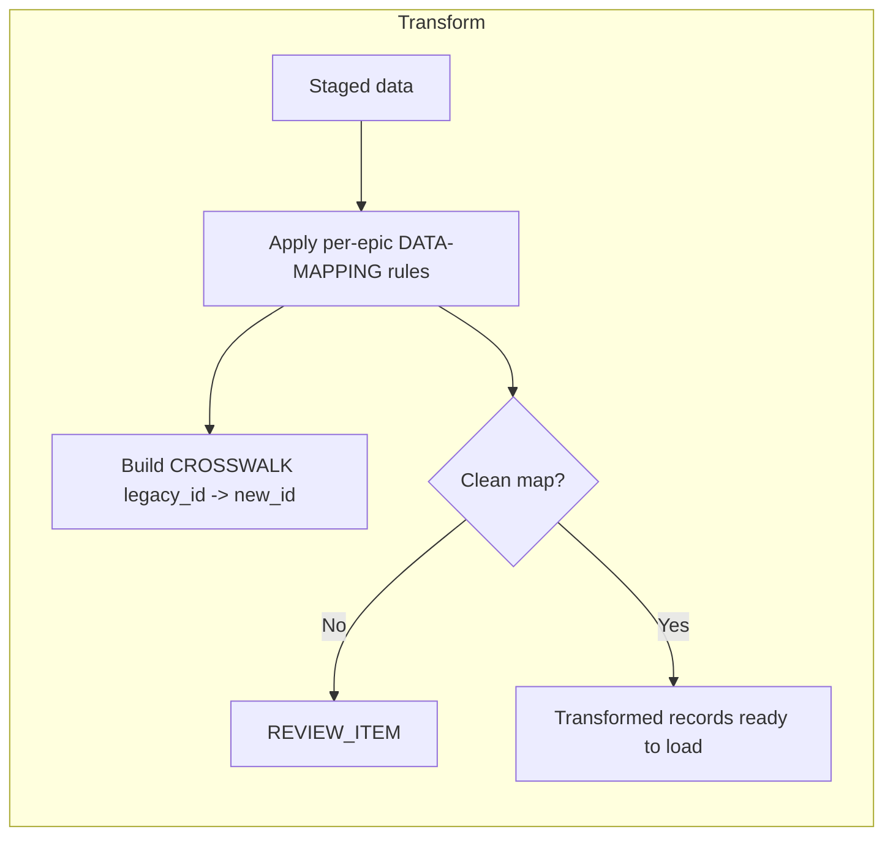
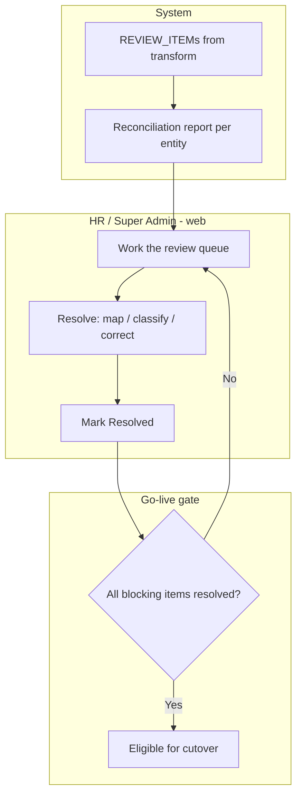
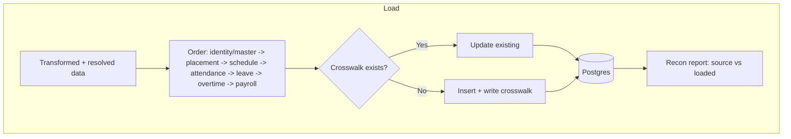
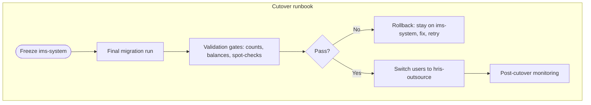

# E9 — Data Migration · Feature Document

> **Epic:** E9 Data Migration · **Status:** Draft v1 · **Parent:** [EPICS.md](../../EPICS.md)
> One-time, big-bang **transform-and-load** of SWP prod (`lumen_swp`, MySQL) into hris-outsource (Postgres), orchestrating the field-level mappings defined per epic.

---

## 1. Goal & outcome

Move **everything** from the legacy SWP production database into the new model, **once**, with confidence: extract a snapshot, transform under the new schema (using each epic's `DATA-MAPPING.md`), reconcile anything that can't be cleanly mapped via a **review queue resolved before go-live**, load in dependency order, validate, then **cut over** in a single switch. Re-runnable and idempotent until the final run.

> Field-level mappings live in each epic's DATA-MAPPING.md: [E2](../E2-identity/DATA-MAPPING.md) · [E3](../E3-placement/DATA-MAPPING.md) · [E4](../E4-shift-scheduling/DATA-MAPPING.md) · [E5](../E5-attendance/DATA-MAPPING.md) · [E6](../E6-leave/DATA-MAPPING.md) · [E7](../E7-overtime/DATA-MAPPING.md) · [E8](../E8-payroll/DATA-MAPPING.md). **E9 owns orchestration, not field semantics.**

## 2. Actors & roles

| Actor | Involvement |
|---|---|
| **Migration engineer / ops** | Runs extraction/transform/load; owns the runbook + rollback. |
| **HR / Super Admin** | Resolves the reconciliation review queue (unmatched placements, identity, ambiguous chains). |
| **System (migration tooling)** | Extract, decrypt, transform, crosswalk, load, validate, report. |

## 3. Scope

**In scope:** extraction & staging, transform + crosswalks, reconciliation/review queue, ordered idempotent load, cutover + validation + rollback.
**Out of scope:** the field-level mappings themselves (per-epic DATA-MAPPING docs); ongoing sync (big-bang, not parallel-run).

## 4. Migration infrastructure

**Invariants:**
- **INV-1:** **idempotent + re-runnable** — every loaded row is keyed by a `CROSSWALK` (legacy_id → new_id); re-runs upsert, never duplicate.
- **INV-2:** **nothing silently dropped** — any unmappable/ambiguous row becomes a `REVIEW_ITEM`.
- **INV-3:** load respects **dependency order** (identity/master → placement → schedule → attendance → leave → overtime → payroll).
- **INV-4:** **big-bang** — the source is frozen for the final run; no two-way sync.
- **INV-5:** decrypt-then-re-encrypt all legacy `DBEncryption` fields using the **available legacy key**; decrypt failures → `REVIEW_ITEM`, never null.

## 5. Features

| ID | Feature | PRD |
|----|---------|-----|
| **F9.1** | Extraction & Staging | [extraction-staging.md](prds/extraction-staging.md) |
| **F9.2** | Transform & Crosswalks | [transform-crosswalks.md](prds/transform-crosswalks.md) |
| **F9.3** | Reconciliation & Review Queue | [reconciliation-review.md](prds/reconciliation-review.md) |
| **F9.4** | Load & Idempotent Re-runs | [load-idempotent.md](prds/load-idempotent.md) |
| **F9.5** | Cutover, Validation & Rollback | [cutover-validation.md](prds/cutover-validation.md) |

## 6. Platform / clients

| Surface | Who | What |
|---|---|---|
| **Migration tooling (CLI/job)** | Engineer / ops | Extract, transform, load, validate; runbook. |
| **Web console** | HR / Super Admin | Reconciliation review queue; validation/recon reports. |
| **Mobile** | — | Not applicable. |

---

### F9.1 — Extraction & Staging

Take a consistent snapshot of `lumen_swp` (dump or read replica), land it in a **staging area**, and **decrypt** the `DBEncryption` fields with the legacy key — without touching the live legacy system.

**Entities:** staging tables, `MigrationRun`. **Depends on:** legacy key (E9 INV-5), DB access.

---

### F9.2 — Transform & Crosswalks

Apply each epic's mapping to staged data: remap identity, split `employee_contracts` into EmploymentAgreement + Placement, dedupe shifts, derive links (schedule→placement, attendance→schedule), classify (day_type) — writing a **CROSSWALK** for every legacy_id → new_id. Position copies straight across as free-text (no classification step).

**Entities:** `Crosswalk`, transformed records. **Depends on:** F9.1, per-epic mappings.

---

### F9.3 — Reconciliation & Review Queue

Anything ambiguous — free-text `placement` → ClientCompany, orphan identities, ambiguous renewal chains, decrypt failures — becomes a **review item** that HR resolves **before go-live**. Each run emits a reconciliation report (counts in/out/queued).

**Entities:** `ReviewItem`, `ReconReport`. **Depends on:** F9.2.

---

### F9.4 — Load & Idempotent Re-runs

Load transformed records into Postgres in **dependency order**, keyed by crosswalk so re-runs **upsert** (no duplicates). Supports repeated dry-runs against staging before the final run.

**Entities:** target tables (E2–E8), `Crosswalk`. **Depends on:** F9.2, F9.3.

---

### F9.5 — Cutover, Validation & Rollback

The big-bang switch: freeze legacy, run the final migration, run **validation gates** (counts, spot-checks, balances), get **go/no-go**, switch traffic to hris-outsource — with a documented **rollback** if validation fails.

**Entities:** `MigrationRun` (final), validation results. **Depends on:** F9.1–F9.4.

---

## 7. Decisions & open questions

**Resolved (2026-05-29):**
- ✅ **Big-bang** one-time cutover (freeze → migrate → validate → switch); no parallel-run.
- ✅ **Legacy encryption key available** — decrypt comp/payroll, re-encrypt in Postgres.
- ✅ **Direct DB dump / read replica** of `lumen_swp` for extraction.
- ✅ **Review queue resolved before go-live** for unmatched/ambiguous records.

**Resolved — open-items review (2026-05-29), see [EPICS.md §8](../../EPICS.md):**
- ✅ **History window** = migrate **everything** incl. full attendance (plan a larger migration + validation window).
- ✅ **Blocking review items** = `decrypt_fail`, `orphan_identity`, `unmatched_placement`; non-blocking = `ambiguous_chain`. *(`unclassified_service_line` removed 2026-06-12 — service line dropped project-wide; position is free-text, copied verbatim, never queued.)*
- ✅ **Placement-string matching** = exact + alias list + fuzzy-with-manual-confirm.
- ✅ **Post-cutover** = keep `lumen_swp` read-only ~6–12 months.

**Still open (sized during dry-runs / ops):**
1. Maintenance-window length + rehearsal schedule.
2. Exact validation-gate thresholds + required sign-offs.
3. Timing of HR's manual role-enum classification relative to cutover.
