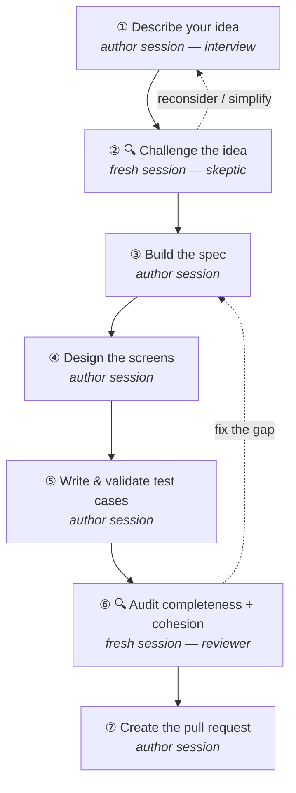

# Product → Engineering Development Workflow

> How the **product team** turns a raw idea into **settled documentation + design + test cases** that the
> **engineering team** can build — by *talking to an AI agent*, not by writing specs. Two checkpoints are
> run by an **independent fresh-session agent** so the work is challenged and audited by eyes that didn't
> write it.
>
> **The product team's job:** describe the idea → let an independent agent **challenge** it → approve what
> the agent writes → sign off the test cases → let an independent agent **audit** it → have the agent
> create the pull request. The agent does all the technical work (spec, screens, test cases, IDs, git, PR).
> You never open a spec template or a terminal.
>
> **Audience:** SWP HRIS product team (non-technical friendly). **Status:** v4 · 2026-06-17.
> **Source of truth:** this file; the static `index.html` and the PDF are renders of it.
>
> Authorities the agent obeys for you (you don't need to read these): [`CLAUDE.md`](../../CLAUDE.md) ·
> [`docs/EPICS.md §8`](../EPICS.md) (product decisions) · [`docs/design/DESIGN-SYSTEM.md`](../design/DESIGN-SYSTEM.md) ·
> [`docs/eng/ENGINEERING.md`](../eng/ENGINEERING.md) · [`docs/api/CONVENTIONS.md`](../api/CONVENTIONS.md).

---

## 0. The mental model (read this first)

This repository is the single place where a feature is born, challenged, specified, designed, tested,
audited, and built. The docs *are* the spec, the `.pen` file *is* the design, and code is generated
against both. One rule governs it:

> **Nothing reaches engineering that isn't traceable.** Every feature flows
> *epic → feature → PRD → acceptance criteria → test cases → design frame*, each carrying stable IDs the
> code and tests cite back. **The AI agent guarantees this for you** and proves it's testable; **two
> independent review sessions** make sure the idea is worth building and the documents fit the existing
> system.

So the burden is **not** on the product team to know the format. The author agent interviews you and
writes everything; two **independent fresh-session agents** pressure-test it.

> **Why a fresh session for the reviews?** The agent that interviewed you and wrote the spec is invested
> in its own work and blind to its own gaps. Opening a **new Claude Code session** for the challenge (②)
> and the audit (⑥) gives a reviewer that has *only* read the repo and the documents — not your
> conversation — so the critique is genuinely independent. **Independence is the point — don't skip it.**

**Who does what (decided 2026-06-17):**

| | Product team — *you describe & approve* | Engineering — *builds* |
|---|---|---|
| **Specs** | answer the interview; approve the **FEATURE + PRD** the agent writes | — |
| **Design** | approve the **screens** the agent designs in `brainstorm.pen` | — |
| **Test cases** | the agent generates **& validates `TC-#`** from the docs; you approve coverage | implements them as **automated tests** |
| **Independent review** | run the **Challenge** (②) and **Audit** (⑥) sessions; act on the verdicts | — |
| **Pull request** | the agent **creates the PR** for your branch; you approve | reviews, completes, merges |
| **API contract** | *(you never touch this)* | authors `openapi.yaml` from the PRD |
| **Data mapping** | *(you never touch this)* | legacy → new crosswalk (`DATA-MAPPING.md`) |
| **Code** | — | builds web / mobile / backend |

The agent **runs all git** — you never use a terminal.

---

## 1. One-time setup

You do this **once**, and an engineer can help you in 5 minutes. After this you only ever talk to the agent.

1. Get the project onto your machine and open it in **Claude Code** (the AI agent). *(An engineer can
   clone the repo — `git clone <repo-url>` — confirm the **Pencil** design tool is connected so the agent
   can draw screens, and confirm the agent can open pull requests via the `gh` CLI.)*
2. That's it. From here on, **you never type a git command or edit a file** — you paste the prompts in
   §3 and answer the agent's questions. (For the two review steps you open a *new* Claude Code session in
   the same project folder — still no terminal.)

> **You don't need to read** `EPICS.md`, `CONVENTIONS.md`, or the design system. The agent reads them
> for you at the start of every session.

---

## 2. The unit of work: one feature → one branch → one pull request

Each idea becomes one **feature**, which the agent puts on its own **branch** and turns into one **pull
request**. **The agent creates and manages the branch and opens the pull request — you don't.** Two
independent review sessions bracket the build.

```mermaid
flowchart LR
  M0([main]) --> CH[🔍 Challenge the idea<br/>independent session]
  CH --> BR[the agent makes a branch]
  BR --> C1["spec — FEATURE + PRD"]
  C1 --> C2["design — .pen frames"]
  C2 --> C3["test cases — TC-#"]
  C3 --> AU[🔍 Audit completeness + cohesion<br/>independent session]
  AU --> DP{{the agent CREATES the pull request}}
  DP -->|engineering takes it| C4["API contract + code + automated tests"]
  C4 --> G[checks pass] --> M1([merge → main])
  CH -.reconsider.-> M0
  AU -.fix the gap.-> C1
```



The **pull request is the hand-off line**: the idea is challenged first, then the agent writes the spec,
designs the screens, writes & validates the test cases; an independent session audits the result; then the
agent **creates the pull request**. Engineering picks it up on the **same branch**, adds the API contract,
the data mapping, and the code, automates the test cases, then marks it Ready and merges.

---

## 3. The seven steps (what you actually do)

Seven prompts. Five go to the **author agent** (your main session); **two — ② Challenge and ⑥ Audit — go to
a fresh, independent Claude Code session**. The agent drives; you describe, answer, and approve.



Behind the scenes the agent decides *where* the idea belongs — new feature / change to an existing one /
a recorded decision. You don't; the Challenge session (②) double-checks that placement.

---

### ① Describe your idea — *the agent interviews you*

> **What you do:** paste this, fill in the one line, then just answer the questions it asks.

```text
I'm on the SWP HRIS product team and I have an idea I want to turn into a spec for engineering.
Be my product analyst and INTERVIEW me — don't expect me to know the format, the IDs, or the structure.

First, quietly read the project context so you understand what already exists: CLAUDE.md,
docs/EPICS.md (especially the §8 decisions), docs/design/DESIGN-SYSTEM.md, and the existing
FEATURE.md / PRDs for the area my idea touches. Don't dump any of that back at me.

Then interview me to understand what I want:
- Ask ONE question at a time, in plain everyday language — no technical jargon, no IDs, no schemas.
- Whenever you can, give me concrete examples or a few options to pick from, so it's easy to answer.
- Cover, over the conversation: the problem and who has it; which user it's for (super admin /
  HR / shift leader / agent); where in the app it lives; the step-by-step happy path; the rules and
  limits; what can go wrong; what each screen should show; what information is involved; and whether
  this already exists in the current/old system.
- If an answer is vague, gently dig deeper. Don't move on until you genuinely understand.

My idea, in my own words: <DESCRIBE YOUR IDEA HOWEVER YOU LIKE — one sentence or a paragraph>

When you have enough, STOP and show me, in plain language:
  1. a short summary of what we're building and for whom;
  2. where it fits (brand-new, or a change to something that exists);
  3. the list of screens we'll need;
  4. anything you still need me to decide.
Then wait for me to say "go".
```

**Done when** the agent shows a plain-language summary you agree with. **Copy that summary** — you'll
paste it into the next step.

---

### ② 🔍 Challenge the idea — *independent fresh session*

> **What you do: open a NEW Claude Code session** (so it hasn't seen your interview), paste this, and paste
> the idea + the summary from step ①. Read the verdict; if it says simplify or reconsider, refine before
> you build.

```text
This is a FRESH session — you have NOT seen my earlier conversation, which is the point: I want an
independent, skeptical review of an idea BEFORE we spend effort specifying it.

Read the project context: CLAUDE.md, docs/EPICS.md (especially the §8 decisions and the existing
epics/features), and the FEATURE.md / PRDs of the area this touches.

Here is the idea and the plan so far:
<PASTE the idea + the plain-language summary the author agent gave you in step ①>

Now CHALLENGE it hard, like a tough product lead — don't be agreeable. Tell me, with specifics:
- Is the problem real and worth solving now? Who actually feels the pain, and how often?
- What's the SIMPLEST version that delivers most of the value? What can we cut?
- Does this DUPLICATE or CONFLICT with something that already exists — an existing feature, a §8
  decision, or an always-true rule (invariant)? Cite the specific one.
- What does it BREAK or complicate elsewhere (scheduling, attendance, leave, overtime, payroll, migration)?
- What's MISSING from the idea — an unhandled case, a role, a state, a labour-law constraint?
- What's the riskiest assumption, and how could we cheaply test it?

End with a clear verdict: BUILD AS-IS / BUILD SIMPLER (say how) / RECONSIDER (say why), plus a sharpened
one-paragraph problem statement I can take back to refine the spec.
```

**Done when** you have a verdict. Fold its points into the idea (back to ① if it changed a lot), then
continue in your **author session**.

---

### ③ Build the spec — *the agent writes it, you approve*

> **What you do:** back in your author session, paste this (mention any change the Challenge produced).

```text
Go. Create the engineering specification from everything I told you (incorporating the points from the
independent challenge: <paste the verdict / what changed, or say "no changes">). Do ALL the technical
structuring yourself — I shouldn't have to think about formats, IDs, or git.

On your own, without me touching anything:
- create the feature branch and manage it (run the git yourself — I will never use the terminal);
- add the feature to the right area's FEATURE.md — the workflow diagram, the things involved, and the
  rules that must always hold — matching the exact structure of the features already there;
- write the full PRD in the house format (context, the users, the business rules, the information the
  feature needs, the acceptance criteria as clear Given/When/Then scenarios, and the edge cases) —
  allocate all the IDs yourself;
- ground every rule in our locked decisions (EPICS.md §8) and Indonesian labour law where relevant;
- DO NOT touch the API / OpenAPI files or the legacy data-mapping — engineering owns those, not us.

Then show me a PLAIN-LANGUAGE summary: what the feature does, the key rules you wrote, the acceptance
criteria in everyday terms, and any assumption you had to make. Ask me to confirm or correct before we
design the screens.
```

**Done when** the plain-language summary matches what you meant.

---

### ④ Design the screens — *the agent draws them, you look*

```text
Now design the screens for this feature in our design file. Use the Pencil design tools (the design
file is special — only you can edit it, through those tools). Follow our design system exactly: reuse
the components that already exist, use our standard colours and spacing, keep ALL text in Bahasa
Indonesia, and design EVERY state a real screen needs — normal, loading, empty, error, and no-access —
so nothing is left undesigned. Start by copying an existing similar screen, then adapt it.

When you're done, show me screenshots of each screen and each state, and tell me in plain language what
the user does on each one. Keep a note of the screen ids so engineering can find them. Then ask me to
approve the look or tell you what to change.
```

**Done when** the screenshots look right to you.

---

### ⑤ Write & validate the test cases — *the agent proves it's testable*

> **What you do:** paste this **after the spec and screens are settled**.

```text
Now that the spec and the screens are settled, generate the TEST CASES from the documentation — this is
how we prove the feature is fully testable before engineering builds it.

Read the finished FEATURE.md and the PRD (especially the business rules, the acceptance criteria, and
the edge cases). Then:
- write a test-case document next to the PRD at docs/epics/E<#>-<name>/prds/<slug>.test-cases.md, with a
  numbered list of test cases (TC-#). For each: a clear title; the type (happy path / edge / negative);
  the preconditions; the steps in plain language; the expected result; the screen + state it exercises;
  and a trace back to what it checks (which business rule BR-#, which acceptance scenario, which C-#).
- cover EVERYTHING: every business rule, every acceptance-criteria scenario, every edge case, and every
  screen state must have at least one test case.

Then VALIDATE the test cases against the documentation and tell me, in plain language:
- a coverage table — each BR-# / acceptance scenario / C-# and the test case(s) that cover it;
- anything NOT yet covered (a gap), and whether the gap is a missing test or a hole in the spec/design;
- any test case you can't decide from the docs (the rule is ambiguous) — flag it so we settle it.

If you find gaps in the spec or design, list them and ask me how to resolve them before we finalise.
```

**Done when** the coverage table has no gaps and the test cases match what you meant.

---

### ⑥ 🔍 Audit completeness & cohesion — *independent fresh session*

> **What you do: open a NEW Claude Code session** in the same project folder (the documents are already on
> the branch). Paste this. It reads the documents fresh — not how they were written — and checks they are
> complete and fit the existing system. Fix whatever it lists, then finish.

```text
This is a FRESH session — you have NOT seen how these documents were written, which is the point: I want
an INDEPENDENT audit of the documentation for feature F<#.#>, for COMPLETENESS and for COHESION with the
existing system. Be a strict reviewer; assume nothing is right until you've checked it against the files.

Read: the new FEATURE.md entry, the PRD (prds/<slug>.md), the test cases (prds/<slug>.test-cases.md), AND
the things they must fit into — docs/EPICS.md §8 (the authoritative decision log), the sibling features in
the same epic, the invariants (INV-#), docs/api/CONVENTIONS.md, and docs/design/DESIGN-SYSTEM.md.

Produce a report with PASS/FAIL per item and, for each FAIL, the exact fix:

COMPLETENESS
- PRD has all sections in the house order; every business rule (BR-#) is testable and tied to an
  acceptance-criteria scenario; every edge case (C-#) is captured.
- Every BR-# / acceptance scenario / C-# / screen state has at least one test case (TC-#) — no gap.
- Every screen has all its states designed (no dead-flow); frame ids are recorded.
- Nothing is left as an unresolved "TBD" that should have been decided.

COHESION WITH THE EXISTING SYSTEM
- Nothing contradicts EPICS.md §8 (quote the exact decision it would violate, if any).
- No clash with an existing feature, an invariant (INV-#), or the role/permission model; IDs don't collide.
- Consistent with the API conventions and the design system (tokens, no-dead-flow, Bahasa, Asia/Jakarta).
- Integration points with other epics (scheduling, attendance, leave, overtime, payroll, migration) are
  named and consistent — flag anything this feature affects but doesn't mention.
- Labour-law facts (PKWT/PKWTT, alih-daya) are correct.

End with one line: READY FOR ENGINEERING, or a numbered list of what must be fixed first.
```

**Done when** the audit says **READY FOR ENGINEERING**. If it lists fixes, do them in your author session,
then re-run the audit.

---

### ⑦ Create the pull request — *the agent opens it for engineering*

```text
Send this to engineering by CREATING the pull request for our branch. First, do a final self-check: the
rules, the acceptance criteria, the edge cases, every screen state, AND the test cases are all present,
fully cover each other, the independent audit passed, and nothing contradicts EPICS.md §8. Fix any gap.

Then:
- commit the spec documents, the design, and the test cases with clear messages;
- PUSH the branch and CREATE the pull request (open it as a Draft) titled with the feature name. Write
  the description in plain language PLUS the technical detail engineers need: the problem, the rules, the
  acceptance criteria, the test-case coverage (how many TC-#, and what they cover), the screen ids, and a
  note that the independent challenge + audit passed;
- state clearly in the PR that engineering owns the API contract, the data mapping, and the code, and
  that they implement our TC-# test cases as automated tests.

Finally, give me the pull-request link and one short paragraph: what you handed over and what happens next.
```

**Done** when the agent gives you the pull-request link. Engineering takes it from here.

---

## 4. "Ready for engineering" — the checks behind the hand-off

Two layers make a feature ready: the **independent audit** (Step ⑥, the real gate) and the author agent's
**own self-check** (Step ⑦, belt-and-suspenders). Both confirm:

- [ ] The idea survived the **Challenge** (②) — worth building, scoped right, no duplication/conflict.
- [ ] The idea is placed in the right area (new feature / change / decision).
- [ ] `FEATURE.md` has the feature: its workflow, the things involved, and the always-true rules.
- [ ] The **PRD** is complete: problem, users, business rules, data needed, **acceptance criteria** (Given/When/Then), and edge cases.
- [ ] Every screen exists with **all** states (normal, loading, empty, error, no-access) — no dead-flow.
- [ ] **Test cases** (`TC-#`) exist and are **validated**: full coverage, no gaps.
- [ ] **Cohesion** confirmed by the independent audit: nothing contradicts `EPICS.md §8`, invariants, existing features, the API conventions, or the design system; integration points named.
- [ ] Any rule/policy that changed is a **dated decision**; copy is Bahasa; dates `Asia/Jakarta`; labour-law facts right.

**Then engineering adds (not your concern):** the API contract, the legacy data-mapping, the typed client,
the code, and the **automated tests that implement your `TC-#`**.

---

## 5. Engineering pickup

Engineering takes the pull request and implements on the **same branch** — owning the API contract and the
data-mapping, and **turning the product's `TC-#` test cases into automated tests**.

> **Engineering template prompt — implement from settled docs**

```text
Implement feature F<#.#> from its settled documentation. CODE task — follow docs/eng/ENGINEERING.md and
docs/eng/WEB-STACK.md exactly.

1. Read the PRD (docs/epics/E<#>-<name>/prds/<slug>.md) — the Gherkin AC is your acceptance contract —
   the FEATURE.md (entities, INV-#), and the product test cases (prds/<slug>.test-cases.md, the TC-#).
2. AUTHOR THE API CONTRACT the product side deliberately left to you: write/extend
   docs/api/E<#>-<name>/openapi.yaml (OpenAPI 3.1) from the PRD — paths/verbs, schemas, and:
     · x-rbac: self.* is a BASELINE (any authenticated employee, scope:self); elevations are
       lead / hr_admin / super_admin; shift_leader is DERIVED from the E3 assignment, never stored.
     · x-design-screens linking each operation to the .pen frame ids recorded in the PRD.
     · errors mapped to BR-#/INV-#; CURSOR pagination only; Idempotency-Key on every write.
   Inherit docs/api/CONVENTIONS.md (don't restate it; extend CONVENTIONS if a rule is missing).
3. If the feature touches persisted legacy data, write/update docs/epics/E<#>-<name>/DATA-MAPPING.md
   (legacy MySQL lumen_swp → Postgres: employee_contracts, companies.role=2 = client, users.id vs
   employees.id, DBEncryption payroll columns) and note any new E9 transform.
4. Regenerate the typed client (Orval). NEVER hand-edit generated files (E2); drift fails CI.
5. Build screens from the cited .pen frames via the Pencil MCP (G0 — never from assumptions); assemble
   from packages/ui + tokens; implement EVERY state variant (B2 no dead-flow); errors via classifyError
   (B1); idempotency keys on mutations (C3).
6. IMPLEMENT THE PRODUCT'S TEST CASES: turn each TC-# into an automated test — critical happy-path TC-#
   as Playwright E2E, rule/edge TC-# (BR-#/C-#) as Vitest against MSW (F1/F2) — and keep the TC-# id in
   the test name so coverage traces straight back to the product test-case doc. Every TC-# must have a
   test; flag any TC-# you cannot automate and why.
7. Cite F#/BR-#/C-#/TC-# + the .pen frame id in each commit. Push to the same branch; flip the PR to
   Ready when `pnpm typecheck && pnpm lint && pnpm test` are green and every TC-# is covered.
```

> **The acceptance criteria + test cases are the contract.** If something is ambiguous during the build,
> the fix is to update the PRD/AC/test case (a small doc commit), not to decide it in code.

---

## 6. Roles & responsibilities (RACI)

| Step | Product | Eng | Driven by |
|---|---|---|---|
| ① Describe & interview | **R/A** | — | author session (asks you) |
| ② 🔍 Challenge the idea | **R/A** | — | **independent fresh session** |
| ③ Build the spec | **A** (approve) | C | author session (writes it) |
| ④ Design the screens | **A** (approve) | C | author session (draws it) |
| ⑤ Write & validate test cases | **A** (approve) | C | author session (generates + validates) |
| ⑥ 🔍 Audit completeness + cohesion | **R/A** | C | **independent fresh session** |
| ⑦ Create the pull request | **A** (approve) | C | author session (opens it) |
| Automate the `TC-#` test cases | — | **R/A** | engineering |
| API contract · data mapping · code | — | **R/A** | engineering |
| Review + merge | C | **R/A** | engineering |

*R = responsible · A = accountable · C = consulted. The agent is the tool both sides drive; the human
named **A** owns the outcome.*

---

## 7. Quick reference — the prompt library

| Step | Session | You paste… | The agent produces |
|---|---|---|---|
| ① | author | "Describe your idea" | an interview → a plain-language plan |
| ② | **fresh** | "🔍 Challenge the idea" | a skeptical verdict — build / simplify / reconsider |
| ③ | author | "Build the spec" | branch + `FEATURE.md` + PRD, explained plainly |
| ④ | author | "Design the screens" | the `.pen` screens (all states) + screenshots |
| ⑤ | author | "Write & validate test cases" | `<slug>.test-cases.md` (`TC-#`) + a coverage table |
| ⑥ | **fresh** | "🔍 Audit completeness + cohesion" | PASS/FAIL report → **READY FOR ENGINEERING** |
| ⑦ | author | "Create the pull request" | self-check + commits + the **pull request** (link) |
| ⚙ | eng | "Implement from settled docs" | API contract + data-mapping + code + automated tests |

> **Tips.** Run ② Challenge and ⑥ Audit in a **separate Claude Code session** — independence is what makes
> them useful. Do ⑤ test cases and ⑥ audit **only after** the spec and screens are settled. If the agent
> asks something you don't know, "I'm not sure — what do you recommend?" is a fine answer.
